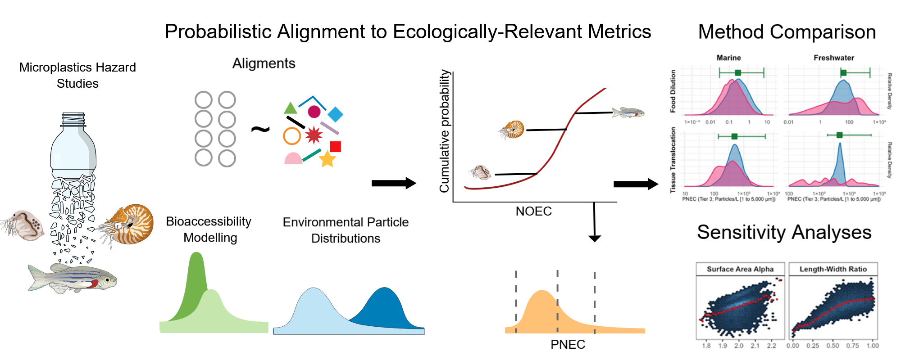
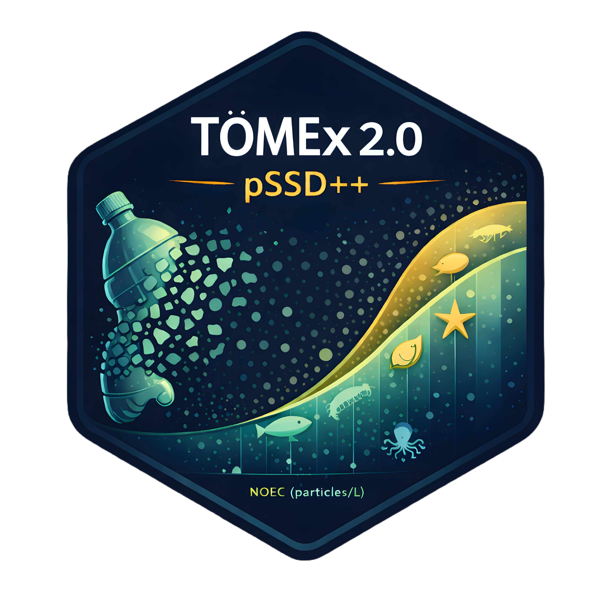

# ToMEx 2.0 — Probabilistic Ecotoxicological Risk Assessment for Microplastics

[](LICENSE)\[ [](https://github.com/ScottCoffin/ToMEx2.0_EcoToxRisk/tree/main/package)

This repository contains the **data, code, and reproducible workflows** supporting the Journal of Hazardous Materials manuscript:

> **A Probabilistic Risk Framework for Microplastics Integrating Uncertainty Across Toxicological and Environmental Variability: Development and Application to Marine and Freshwater Ecosystems**

[Full text](https://www.sciencedirect.com/science/article/pii/S0304389425039421)

**Authors:** Scott Coffin, Lidwina Bertrand, Kazi Towsif Ahmed, Luan de Souza Leite, Win Cowger, Mariella Siña, Andrew Barrick, Anna Kukkola, Bethanie Carney Almroth, Ezra Miller, Andrew Yeh, Stephanie Kennedy, Magdalena M. Mair



------------------------------------------------------------------------

## Project overview

This project develops and applies **PSSD++**, an extension of traditional Species Sensitivity Distributions designed for **microplastics**, explicitly propagating uncertainty arising from:

-   Effect–response metric (ERM) alignment
-   Intra-species variability
-   Particle trait distributions
-   Bioaccessibility and tissue translocation
-   Monte Carlo and Sobol global sensitivity analysis

The framework enables probabilistic derivation of **tiered ecological thresholds** for marine and freshwater ecosystems using the ToMEx 2.0 toxicity database.

------------------------------------------------------------------------

## Associated resources

-   **Source toxicity database:** <https://github.com/SCCWRP/ToMEx_AquaticOrganisms>
-   **R package:** `PSSDplusplus` (bundled in this repository)

------------------------------------------------------------------------

## Repository structure (high-level)

| Path | Purpose |
|-----------------------------|-------------------------------------------|
| `scripts/ToMEx2_EcoTox.Rmd` | Main manuscript analysis (figures, tables, thresholds) |
| `scripts/monte carlo/` | Monte Carlo ERM alignment + Sobol sensitivity |
| `scripts/characteristics and NMDS/` | Environmental trait comparisons and ordinations |
| `scripts/translocation/` | Tissue translocation GLM |
| `scripts/illustrative_example/` | Pedagogical ERM alignment example |
| `package/` | `PSSDplusplus` R package |
| `data/input/` | Required input datasets |
| `data/output/`, `output/` | Generated results and manuscript figures |

------------------------------------------------------------------------

## Quick start: PSSDplusplus package



The **PSSDplusplus** R package provides a streamlined interface to the probabilistic SSD workflow used in the manuscript.

### Installation

``` r
remotes::install_github(
  "ScottCoffin/ToMEx2.0_EcoToxRisk",
  subdir = "package",
  build_vignettes = FALSE
)
```

(Vignettes are computationally intensive and disabled by default.)

### Minimal reproducible example

``` r
library(PSSDplusplus)
run_pssd_reprex(sim = 2, n_sim = 2, workers = 1, overwrite_cache = TRUE)
```

### Optional: build the vignette

``` r
remotes::install_github(
  "ScottCoffin/ToMEx2.0_EcoToxRisk",
  subdir = "package",
  build_vignettes = TRUE
)
vignette("pssdplusplus-walkthrough", package = "PSSDplusplus")
```

------------------------------------------------------------------------

## Reproducing the manuscript analyses

Two options are provided:

### Option A — Recommended (fast)

Download pre-computed Monte Carlo and PSSD++ outputs from Zenodo: <https://doi.org/10.5281/zenodo.16740504>

Place files as described under **Large files**, then knit:

``` r
scripts/ToMEx2_EcoTox.Rmd
```

### Option B — Full recomputation

Run the full Monte Carlo workflow (may exceed 12 hours):

1.  `scripts/monte carlo/EcoTox_MonteCarlo.Rmd`
2.  `scripts/ToMEx2_EcoTox.Rmd`

------------------------------------------------------------------------

## System requirements

-   R ≥ 4.1
-   Windows, macOS, or Linux
-   ≥16 GB RAM and multi-core CPU recommended for full MC runs

------------------------------------------------------------------------

## Large files and data availability

Several outputs exceed GitHub size limits and are excluded via `.gitignore`.

-   **Zenodo archive:** <https://doi.org/10.5281/zenodo.16740504>

-   **Key directories:**

    -   `scripts/monte carlo/output/`
    -   `data/output/`
    -   `output/pssd_cache/`

File-level details are listed in the Zenodo record and inline comments.

------------------------------------------------------------------------

## Submitting issues

Bug reports, questions, and reproducibility issues are welcome and should be submitted via the GitHub Issues tracker for this repository.

To help us respond efficiently, please include the following when opening an issue:

-   A concise description of the problem or question
-   The relevant script, function, or workflow (e.g., ToMEx2_EcoTox.Rmd, EcoTox_MonteCarlo.Rmd, or PSSDplusplus)
-   Your R version and operating system
-   Any error messages, warnings, or tracebacks (copied verbatim)
-   Whether you are using Zenodo precomputed outputs (Option A) or full recomputation (Option B)

For computationally intensive workflows, we strongly recommend first testing with reduced settings (e.g., small n_sim, sim, or single-core execution) before reporting issues observed only at scale.

Issues related to scientific interpretation, methodological choices, or manuscript content are also appropriate, but please clearly distinguish these from technical bugs.

## Citation

If you use this code or framework, please cite:

> Coffin, S., Bertrand, L., Ahmed, K. T., de Souza Leite, L., Cowger, W., Siña, M., Barrick, A., Kukkola, A., Carney Almroth, B., Miller, E., Yeh, A., LaPlaca, S. B., & Mair, M. A Probabilistic Risk Framework for Microplastics Integrating Uncertainty Across Toxicological and Environmental Variability: Development and Application to Marine and Freshwater Ecosystems. Journal of Hazardous Materials (in review). Preprint available at: https://papers.ssrn.com/sol3/papers.cfm?abstract_id=5440537

------------------------------------------------------------------------

## License

MIT License. See `LICENSE`.

------------------------------------------------------------------------
