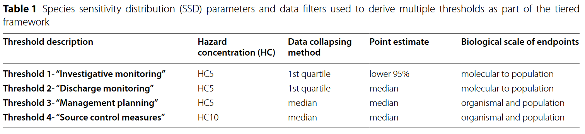

#Setup

```{r, setup, include=FALSE}
#knitr::opts_knit$set(root.dir = "G:/My Drive/MooreInstitute/Projects/ToMEx2.0_EcoToxRisk")
```

```{r, include=FALSE}
knitr::opts_chunk$set(fig.width=10, fig.height=8, fig.path='output/figures',
                      warning=FALSE, message=FALSE,time_it = TRUE) 
```

## Libraries
```{r Libraries, include = FALSE}
library(tidyverse)
library(calecopal)
library(ssdtools)
library(DT)
library(plotly)
library(gridExtra)
library(grid)
library(wesanderson)
library(ggdark)
library(broom)
library(knitr)
library(kableExtra)
library(viridis)
library(ggrepel)
library(scales)
library(gt)
library(ggsci)
library(openxlsx)
library(ggpubr)
library(psych) # To use the geometric.mean function
library(Matrix)
library(mc2d)
library(trapezoid)
library(reshape2)
getwd()

```

```{r Set Particle Size, include = FALSE}
###define sizes for filtering and alignment##
# smaller size bin
small_tier_lower_size <- 1 #um
small_tier_upper_size <- 5000 #um #size to align to
upper.tissue.trans.size.um <- 88 #um #set size for filtering data and x2M
# larger size bin
large_tier_lower_size <- 1 #um
large_tier_upper_size <- 5000 #um

nboot = 10 #number of bootstrap iterations for the traditional SSD (keep at 10 for beta testing, but use 1000 for final)
```

```{r Aesthetics, include = FALSE}
#Theme
theme.type <- dark_theme_bw(base_size = 15) +
  #theme_bw(base_size = 15) +
              theme(plot.title = element_text(hjust = 0.5),
                    plot.subtitle = element_text(hjust = 0.5))

#Fill
fill.type <-  scale_fill_nejm()

#Color
color.type <- scale_color_nejm()

#ggplot themes
theme.light <- theme_minimal(base_size = 15) +
  theme(legend.position = c(0.2, 0.85),
        legend.title = element_text(size = 16, face = "bold"),
        legend.text = element_text(size = 14),
        legend.title.align = 0.5,
        legend.text.align = 0.5,
     #   legend.box.background = element_rect(color = "black", linetype =
      #                                         "solid", size = 1),
  #legend.background = element_rect(fill = "gray90", size = 0.5, linetype =
                   #                  "solid"),  # Light gray background forlegend
        plot.title = element_text(hjust = 0.5),     # Center the main title
        plot.subtitle = element_text(hjust = 0.5),
        plot.caption = element_text(hjust = 0.5),   # Center the caption
        axis.title.x = element_text(hjust = 0.5, size = 18),  # Center the x-axis title
        axis.text = element_text(size = 16),
        axis.title.y = element_text(vjust = 0.5, size = 18))   # Center the y-axis title (vertically))   # Center the subtitle)

theme.dark <- dark_theme_minimal(base_size = 15) +
  theme(legend.position = c(0.2, 0.85),
        legend.title = element_text(size = 16, face = "bold"),
        legend.text = element_text(size = 14),
        legend.title.align = 0.5,
        legend.text.align = 0.5,
     #   legend.box.background = element_rect(color = "black", linetype =
      #                                         "solid", size = 1),
  #legend.background = element_rect(fill = "gray90", size = 0.5, linetype =
                   #                  "solid"),  # Light gray background forlegend
        plot.title = element_text(hjust = 0.5),     # Center the main title
        plot.subtitle = element_text(hjust = 0.5),
        plot.caption = element_text(hjust = 0.5),   # Center the caption
        axis.title.x = element_text(hjust = 0.5, size = 18),  # Center the x-axis title
        axis.text = element_text(size = 16),
        axis.title.y = element_text(vjust = 0.5, size = 18))   # Center the y-axis title (vertically))   # Center the subtitle)
```

```{r}
source("functions.R")
source("alignment_functions.R")
```

### Data Import
```{r Data Import, include = FALSE}
#Load aoc_z into dataframe. This file is generated from aq_mp_tox_shiny repo / ToMEx2.0_Onboarding / ToMEx2.0_Data_Tidying.R

#aoc_z <- readRDS(file = "G:/My Drive/MooreInstitute/Projects/ToMEx2.0_EcoToxRisk/data/input/aoc_z_tomex2.RDS") %>% 
  #rename columns so they fir the OG script
getwd()

aoc_z <- readRDS("../data/input/aoc_z_tomex2.RDS") %>%  #dataset is prepped in shiny repo
  rename(environment = env_f) %>% 
  filter(!doi %in% c("10.1016/j.marpolbul.2021.112369", "10.3390/nano11030649")) %>%  #filter out Capolupo et al. (2021) and Richardson et al. (2021) because they were retracted
  mutate(AF.total = af.time * af.noec) #calculate composite AF
  #select(-rowid)# %>% #existing rowid is actually replicated (not sure how)
  #mutate(rowid = row_number())

#aoc_z$rowid <- sapply(seq_len(nrow(aoc_z)), function(x) uuid::UUIDgenerate())

# ToMEx 2.0 data file (no alignments)
## dataset prepared in RShiny repo and imported ##
tomex2.0 <- read_rds("monte carlo/ref data/tomex2_input.rds")

# LEgacy file from May, 2024 for beta-testing
#tomex2.0 <- read_rds("ref data/tomex2_input_May2024.rds")

# auxiliary data necessary for ToMEX 2.0 data tidying
bodysize_addons <- read_csv("monte carlo/ref data/gape_size.csv", show_col_types = FALSE) #copied from aq_mp_tox_shiny main folder
```

### Data Cleanup
A large number of values is getting filtered out during alignments. This should not be the case. We can debug by looking at missing values for the parameters that are relevant to alignments.
```{r}
aoc_simple <- aoc_z %>%
   filter(!environment %in% c("Terrestrial", "Not Reported"),
         Group != "Bacterium",
         Group != "Plant",
         effect.metric != "HONEC",
         exp_type_f == "Particle Only",
         tier_zero_tech_f == "Red Criteria Passed",
         tier_zero_risk_f == "Red Criteria Passed", #All thresholds must pass technical and risk red criteria
         risk.13 != 0 #Drop studies that received a score of 0 for endpoints criteria (this also drops studies that have not yet been scored) - KEEP THIS AFTER THE RED CRITERIA FILTERS  
         ) %>% 
  ungroup()# %>% 
  #select(c(rowid, max.size.ingest.mm, dose.particles.mL.master, particle.surface.area.um2,
         #  particle.surface.area.um2.min, particle.surface.area.um2.max, polydispersity)) 

# for polydisperse data, we need the particle.surface.area.um2.min and max to be filled out. For monodisperse data, just the particle.surface.area.um2 is needed.

aoc_simple_check <- aoc_simple %>% 
   mutate(data_available = case_when(
    # Condition for polydisperse: particle.surface.area.um2.min and .max cannot be NA
    polydispersity == "polydisperse" & !is.na(particle.surface.area.um2.min) & !is.na(particle.surface.area.um2.max) ~ TRUE,
    # Condition for monodisperse: particle.surface.area.um2 cannot be NA
    polydispersity == "monodisperse" & !is.na(particle.surface.area.um2) ~ TRUE,
    # Otherwise, data is not available according to the criteria
    TRUE ~ FALSE
  )) %>% 
  drop_na(dose.particles.mL.master)

aoc_simple_check %>% 
  filter(!data_available)
```

## Summary Statistics
```{r}
## how many studies/data points/species exist in starting and final databases?
aoc_z %>%
  mutate(
    data_available = case_when(
      # Condition for polydisperse: particle.surface.area.um2.min and .max cannot be NA
      polydispersity == "polydisperse" &
        !is.na(particle.surface.area.um2.min) &
        !is.na(particle.surface.area.um2.max) ~ TRUE,
      # Condition for monodisperse: particle.surface.area.um2 cannot be NA
      polydispersity == "monodisperse" &
        !is.na(particle.surface.area.um2) ~ TRUE,
      # Otherwise, data is not available according to the criteria
      TRUE ~ FALSE
    )
  ) %>%
  mutate(
    thresholds1_2 = case_when(
      data_available == TRUE &
        !environment %in% c("Terrestrial", "Not Reported") &
        Group != "Bacterium" &
        Group != "Plant" &
        effect.metric != "HONEC" &
        !is.na(effect.metric) &
        exp_type_f == "Particle Only" &
        tier_zero_tech_f == "Red Criteria Passed" &
        tier_zero_risk_f == "Red Criteria Passed" & # All thresholds must pass technical and risk red criteria
        risk.13 != 0 ~ TRUE,
      # Otherwise, do not meet thresholds1_2 criteria
      TRUE ~ FALSE
    )
  ) %>%
  mutate(
    thresholds3_4 = case_when(
      thresholds1_2 == TRUE &
        risk.13 != 1 &
        bio_f %in% c("Organism", "Population") 
    ~ TRUE,
      # Otherwise, do not meet thresholds3_4 criteria
      TRUE ~ FALSE
    )
  ) %>%
   pivot_longer(
    cols = c(thresholds1_2, thresholds3_4),
    names_to = "threshold",
    values_to = "value"
  ) %>%
  group_by(threshold, value
           , environment
           ) %>%
  #group_by(thresholds1_2, thresholds3_4) %>%
  summarise(
    n_species = n_distinct(Species),
    n_studies = n_distinct(doi),
    n_datapoint = n()
  )


```


#Framework Summary



The figure above displays the working threshold framework for the ambient threshold group for the Microplastics Health Effects Workshop. 

The current framework for generating SSDs includes the following parameters:

Data pertaining to only aquatic organisms are included (marine and freshwater).  

All taxa are included with the exception of bacterium and plants.  

HONEC (Highest Observed No Effect Concentration) are excluded.  

Assessment factors are applied to convert all other effect metrics into NOECs:


Reference: Wigger et al. 2020 (doi: 10.1002/ieam.4214)  

Assessment factors are applied to convert acute data into chronic:  


Green rows are from Wigger et al. 2020. Grey rows were agreed upon by the ambient threshold working group.

Reference: Wigger et al. 2020 (doi: 10.1002/ieam.4214)

Note: Values may be slightly different than those presented in the shiny app as concentrations are converted from particles/mL to particles/L ahead of calculations.


# ERM/SSD Calculations
The following script utilizes the above equations to calculate *a priori* effect thresholds for each of the ERM of interest for each species in the database, then calculates species sensitivity distributions using each ERM.

*Data Filtering by Quality*
```{r}
## First filter data with global filters
aoc_intermediate <- aoc_z %>% 
   ### quality score filters applied below for thresholds ###
  # filter(!environment %in% c("Terrestrial", "Not Reported"),
  #        Group != "Bacterium",
  #        Group != "Plant",
  #        effect.metric != "HONEC",
  #        tier_zero_tech_f == "Red Criteria Passed",
  #        tier_zero_risk_f == "Red Criteria Passed", #All thresholds must pass technical and risk red criteria
  #        risk.13 != 0 #Drop studies that received a score of 0 for endpoints criteria (this also drops studies that have not yet been scored) - KEEP THIS AFTER THE RED CRITERIA FILTERS  
  #        ) %>% 
  #Remove 26C temperature treatment data from Jaimukar et al. 2018
  filter(!(article == 42 & media.temp == 26)) %>% 
  mutate(max.size.ingest.um = 1000 * max.size.ingest.mm) #makes it less confusing below

### NEED TO DETERMINE FILTERING PROTOCOL FOR CASES IN WHICH SPECIES HAVE MANY LOECS OR NOECS FOR SAME DOSE FOR SLIGHTLY SIMILIAR ENDPOINTS - E.G., MYTILUS GALLOPROVENCIALIS ###


#### Ecologically Relevant Metric calculations ####

#examine available data as histogram
Group_size <- aoc_intermediate %>% 
  ggplot(aes(x = size.length.um.used.for.conversions, fill = Group)) +
  geom_histogram(bins = 25) +
  scale_fill_manual(values = cal_palette(name = "superbloom1", type = "continuous", n = 15)) +
  labs(title = "Filtered Data by Group") +
  ylab("# of observations")+
  xlab("Length (um)") +
  theme.type +
  scale_x_log10()

endpoint_size <- aoc_intermediate %>% 
  ggplot(aes(x = size.length.um.used.for.conversions, fill = lvl1_f)) +
  geom_histogram(bins = 25) +
   scale_fill_manual(name = "General Endpoint", values = cal_palette(name = "superbloom3", type = "continuous", n = 15)) +
  xlab("Particle Length (um)") +
  ylab("# of observations")+
  labs(title = "Filtered Data by General Endpoint") +
  theme.type +
  scale_x_log10()

#arrange histograms
grid.arrange(Group_size, endpoint_size)
```

### Alignment

#### Parameters
```{r}
R.ave.water.marine <- 0.77 # average length to width ratio of microplastics in marine environment (Kooi et al. 2021)
H_W_ratio.water.marine = 0.77 # H:W ratio across all environments/particle types
R.ave.water.freshwater <- 0.67 # average length to width ratio of microplastics in freshwater environment (Kooi et al. 2021)
H_W_ratio.water.freshwater = 0.67 # H:W ratio across all environments/particle types
R.ave.sediment.marine <- 0.75 # average length to width ratio of microplastics in marine environment (Kooi et al. 2021)
H_W_ratio.sediment.marine = 0.75 # H:W ratio across all environments/particle types
R.ave.sediment.freshwater <- 0.70 # average length to width ratio of microplastics in freshwater environment (Kooi et al.
# 2021)
H_W_ratio.sediment.freshwater = 0.70 # H:W ratio across all environments/particle types

p.ave.marine = 1.10 #average density in marine surface water
alpha.marine = 2.07 #table s4 for marine surface water. length
a.sa.marine = 1.50 #marine surface area power law
a.v.marine = 1.48 #a_V for marine surface water volume
a.m.marine = 1.32 # upper limit fora_m for mass for marine surface water in table S4 
a.ssa.marine = 1.98 # A_SSA for marine surface water

p.ave.freshwater = 1.04 #average density in freshwater surface water
alpha.freshwater = 2.64 #table s4 for freshwater surface water. length
a.sa.freshwater = 2.00 #freshwater surface area power law
a.v.freshwater = 1.68 #a_V for freshwater surface water volume
a.m.freshwater = 1.65 # upper limit fora_m for mass for freshwater surface water in table S4 
a.ssa.freshwater = 2.71 # A_SSA for freshwater surface water

beta_log10_body_length = 0.9341 # Jâms, et al 2020 Nature paper
body_length_intercept = 1.1200 # Jâms, et al 2020 Nature paper


#join alpha values for each data point
aoc_intermediate_alphas <- aoc_intermediate %>% 
   # define environment-specific alpha parameters #
    mutate(alpha = case_when(environment == "Marine" ~ alpha.marine,
                             environment == "Freshwater" ~ alpha.freshwater),
           a.sa = case_when(environment == "Marine" ~ a.sa.marine,
                            environment == "Freshwater" ~ a.sa.freshwater),
           a.v = case_when(environment == "Marine" ~ a.v.marine,
                            environment == "Freshwater" ~ a.v.freshwater),
           a.m = case_when(environment == "Marine" ~ a.m.marine,
                           environment == "Freshwater" ~ a.m.freshwater),
           a.ssa = case_when(environment == "Marine" ~ a.ssa.marine,
                           environment == "Freshwater" ~ a.ssa.freshwater),
           R.ave = case_when(environment == "Marine" ~ R.ave.water.marine,
                             environment == "Freshwater" ~ R.ave.water.freshwater),
           H_W_ratio = case_when(environment == "Marine" ~ H_W_ratio.water.marine,
                             environment == "Freshwater" ~ H_W_ratio.water.freshwater),
           p.ave = case_when(environment == "Marine" ~ p.ave.marine,
                             environment == "Freshwater" ~ p.ave.freshwater)
           )
```

#### Functions
```{r}
###function to derive correction factor (CF) from Koelmans et al (equation 2)
CFfnx = function(a, #default alpha from Koelmans et al (2020)
                 x2D, #set detault values to convert ranges to (1-5,000 um) #5mm is upper defuault 
                 x1D, #1 um is lower default size
                 x2M, x1M){
  CF = (x2D^(1-a)-x1D^(1-a))/(x2M^(1-a)-x1M^(1-a)) 
  return(CF)}

#### equations for mu_x_poly (note that there are three depending on certain alphas for limits of equation)
mux_polyfnx<- function(a.x, x_UL, x_LL) {
  # Validate inputs
  if (length(a.x) != length(x_UL) || length(a.x) != length(x_LL)) {
    stop("a.x, x_UL, and x_LL must have the same length.")
  }
  
  # Initialize result vector
  mux.poly <- numeric(length(a.x))
  
  # Loop through each element to handle row-by-row logic
  for (i in seq_along(a.x)) {
    if (is.na(a.x[i]) || is.na(x_UL[i]) || is.na(x_LL[i])) {
      # Handle NA values
      mux.poly[i] <- NA
    } else if (a.x[i] == 1) {
      # Special case: a.x == 1
      if (x_UL[i] > 0 && x_LL[i] > 0) {
        mux.poly[i] <- (x_UL[i] - x_LL[i]) / log(x_UL[i] / x_LL[i])
      } else {
        mux.poly[i] <- NA  # Invalid input for log
      }
    } else if (a.x[i] == 2) {
      # Special case: a.x == 2
      epsilon <- 1e-10  # Small value to avoid division by zero
      if (x_UL[i] > 0 && x_LL[i] > 0) {
        mux.poly[i] <- log(x_UL[i] / x_LL[i]) /
          ((x_LL[i] + epsilon)^-1 - (x_UL[i] + epsilon)^-1)
      } else {
        mux.poly[i] <- NA  # Invalid input for log
      }
    } else {
      # General case: a.x != 1 and a.x != 2
      if (x_UL[i] > 0 && x_LL[i] > 0) {
        mux.poly[i] <- ((1 - a.x[i]) / (2 - a.x[i])) *
          ((x_UL[i]^(2 - a.x[i]) - x_LL[i]^(2 - a.x[i])) /
             (x_UL[i]^(1 - a.x[i]) - x_LL[i]^(1 - a.x[i])))
      } else {
        mux.poly[i] <- NA  # Invalid input for power calculations
      }
    }
  }
  
  # Return the result
  return(mux.poly)
}


# #generalizable if a.x =2 or not
# mux.polyfnx_generalizable = Vectorize(function(a.x, x_UL, x_LL){
#   if(a.x == 1){ # in case a.x = 1
#     mux.poly = (x_UL - x_LL)/(log(x_UL/x_LL))
#     return(mux.poly)}
#   if(a.x == 2){ # in case a.x = 2
#      mux.poly = (log10(x_UL/x_LL))/(x_LL^(-1) - x_UL^-1)
#      return(mux.poly)}
#   else{ #in case alpha is not 2 or 1
#     mux.poly = ((1-a.x)/(2-a.x)) * ((x_UL^(2-a.x) - x_LL^(2-a.x))/(x_UL^(1-a.x) - x_LL^(1-a.x)))
#     return(mux.poly)}
#   },
#   vectorize.args = "a.x") # if Vectorize isn't here, the if else won't work
# ## ^^ Note that the above generalizable function doesn't play well with mutate(case_when), likely due to some bug with dplyr. I don't have a solution to this, so a special equation will need to be used when those values are used...
# 
# #in case alpha is not 1 or 2
# mux.polyfnx = function(a.x, x_UL, x_LL){
#     mux.poly = ((1-a.x)/(2-a.x)) * ((x_UL^(2-a.x) - x_LL^(2-a.x))/(x_UL^(1-a.x) - x_LL^(1-a.x)))
#     return(mux.poly)}
# 
# ##### If alpha does equal 2 #####
# mux.polyfnx2 = function(a.x, x_UL,x_LL){
#   mux.poly = (log(x_UL/x_LL))/(x_LL^(-1) - x_UL^-1)
#   return(mux.poly)}
# 
# ##### If alpha equals 1 #####
# mux.polyfnx1 = function(a.x, x_UL, x_LL){
#      mux.poly = (x_UL - x_LL)/(log(x_UL/x_LL)) #natural log
#     return(mux.poly)}

### Calculating max ingestible parameters ###
## function to calcualte min and max ingestible surface area ##
# SAfnx = function(a, # length
#                  b, # width
#                  c){ # height\
#   # a, b, and c are equivalent to 1/2th of the length, width, and height, respectively
#   a <- 0.5 * a
#   b <- 0.5 * b
#   c <- 0.5 * c
#   SA = 4*pi*(((a*b)^1.6 + (a*c)^1.6 + (b*c)^1.6) / 3)^(1/1.6)
#   return(SA)}
# 
# #cylinder equation for SA. S = 2pi*r*h + 2pi*r^2, where r = width/2 and h = length 
# SAfnx_fiber = function(width, length){
#   radius = width / 2
#   SA = 2*pi*radius*length + 2*pi*radius^2
#   return(SA)
# }

## max ingestible volume ##

# volumefnx = function(R, L){
#   volume = 0.111667 * pi * R^2 * L^3 #assumes height = 0.67 * Width, and Width:Length ratio is 'R' (compartment-specific)
#   return(volume)}

# volumefnx_poly = function(width, length){
#   height = width #0.67 * width
#   volume = (4/3) * pi * (length/2) * (width/2) * (height/2) #assumes height = 0.67 * Width 
#   return(volume)}

# #max ingestible mass (only used for mu_mono calculations)
# massfnx = function(R, L, p){
#   mass = p * #density (g/cm^3)
#     0.111667 * pi * R^2 * L^3 * # volume (um^3): assumes height = 0.67 * Width, and Width:Length ratio is 'R' (compartment-specific)
#     1/1e12 * 1e6 #correction factor
#   return(mass)}

# massfnx_poly = function(width, length, p){
#   height = width # 0.67 * width
#   volume = (4/3) * pi * (length/2) * (width/2) * (height/2) #assumes height = 0.67 * Width 
#   mass = p * #density (g/cm^3)
#     volume * # volume (um^3): assumes height = 0.67 * Width, and Width:Length ratio is 'R' (compartment-specific)
#     1/1e12 * 1e6 #correction factor
#   return(mass)}

#max ingestible specific surface area
SSAfnx = function(sa, #surface area, calcaulted elsewhere
                  m){ #mass, calculated elsewhere
  SSA = sa/m
    return(SSA)}

#max ingestible specific surface area
SSA.inversefnx = function(sa, #surface area, calcaulted elsewhere
                  m){ #mass, calculated elsewhere
  SSA.inverse = m / sa
    return(SSA.inverse)}
```

#### Calculate

Here we will calculate two aligned exposure concentrations: surface area (1 - 83 um), and volume (1 - 5,000 um). For both, the upper aligned value is the smaller of either the nominal size listed or the mouth size of the species.

```{r}
align_data <- function(df,
                       x1M_set_input = 1, #um lower size for all alignments
                       x1D_set_input = 1, #um lower size for all alignments
                       x2D_set_input = 5000, #um
                       upper.tissue.trans.size.um_input = 88,
                       R.ave.marine_input = 0.77, # average length to width ratio of microplastics in marine environment (Kooi et al. 2021)
                       H_W_ratio.marine_input = 0.77, # H:W ratio assumed same as width:length ratio (Kooi et al. 2021)
                       R.ave.freshwater_input = 0.67, # average length to width ratio of microplastics in freshwater environment (Kooi et al. 2021)
                       H_W_ratio.freshwater_input = 0.67, # H:W ratio assumed same as width:length ratio (Kooi et al. 2021)
                       R.ave.sediment.marine_input = 0.75, # average length to width ratio of microplastics in marine environment (Kooi et al. 2021)
                       R.ave.sediment.freshwater_input = 0.70, # average length to width ratio of microplastics in freshwater environment (Kooi et al. 2021)
                       p.ave.marine_input = 1.10, #average density in marine surface water
                       alpha.marine_input = 2.07, #table s4 for marine surface water. length
                       a.sa.marine_input = 1.50, #marine surface area power law
                       a.v.marine_input = 1.48, #a_V for marine surface water volume
                       a.m.marine_input = 1.32, # upper limit fora_m for mass for marine surface water in table S4 
                       a.ssa.marine_input = 1.98, # A_SSA for marine surface water
                       p.ave.freshwater_input = 1.04, #average density in freshwater surface water
                       alpha.freshwater_input = 2.64, #table s4 for freshwater surface water. length
                       a.sa.freshwater_input = 2.00, #freshwater surface area power law
                       a.v.freshwater_input = 1.68, #a_V for freshwater surface water volume
                       a.m.freshwater_input = 1.65, # upper limit fora_m for mass for freshwater surface water in table S4 
                       a.ssa.freshwater_input = 2.71, # A_SSA for freshwater surface water
                       beta_log10_body_length_input = 0.9341, # Jâms, et al 2020 Nature paper
                       body_length_intercept_input = 1.1200 # Jâms, et al 2020 Nature paper
                       ){ #10 #um #set size for x2M)
  
  # Check if columns exist and conditionally create them
    if (!"dose.mg.kg.sed.measured" %in% names(df)) {
      df <- df %>%
        mutate(dose.mg.kg.sed.measured = measured.dose.mg.kg.sediment)
    }
  
  if (!"dose.mg.kg.sed.nominal" %in% names(df)) {
    df <- df %>%
      mutate(dose.mg.kg.sed.nominal = nominal.dose.mg.kg.sediment)
  }
  
  if (!"dose.particles.kg.sed.nominal" %in% names(df)) {
    df <- df %>%
      mutate(dose.particles.kg.sed.nominal = nominal.dose.particles.kg.sediment)
  }
  
  if (!"environment" %in% names(df)){
    df <- df %>% 
      mutate(environment = env_f)
    }
  
  df <- df %>% 
    ungroup() %>%  #if data grouped - bad things happen
    #assign user  input values
    mutate(x1M_set = x1M_set_input,
           x1D_set = x1D_set_input,
           x2D_set = x2D_set_input,
           upper.tissue.trans.size.um  = upper.tissue.trans.size.um_input,
           beta_log10_body_length = beta_log10_body_length_input,
           body_length_intercept = body_length_intercept_input,
           H_W_ratio.marine = H_W_ratio.marine_input,
           H_W_ratio.freshwater = H_W_ratio.freshwater_input,
           R.ave.marine = R.ave.marine_input,                                 
           R.ave.freshwater = R.ave.freshwater_input, 
           R.ave.sediment.marine = R.ave.sediment.marine_input,
           R.ave.sediment.freshwater = R.ave.sediment.freshwater_input, 
           p.ave.marine = p.ave.marine_input,
           alpha.marine = alpha.marine_input,
           a.sa.marine = a.sa.marine_input, 
           a.v.marine = a.v.marine_input, 
           a.m.marine = a.m.marine_input, 
           a.ssa.marine = a.ssa.marine_input, 
           p.ave.freshwater = p.ave.freshwater_input, 
           alpha.freshwater = alpha.freshwater_input,
           a.sa.freshwater = a.sa.freshwater_input, 
           a.v.freshwater = a.v.freshwater_input, 
           a.m.freshwater = a.m.freshwater_input,                     
           a.ssa.freshwater = a.ssa.freshwater_input)
  
# calculate ERM for each species
aoc_final <- df %>% 
  # define environment-specific alpha parameters #
    mutate(alpha = case_when(environment == "Marine" ~ alpha.marine,
                             environment == "Freshwater" ~ alpha.freshwater),
           a.sa = case_when(environment == "Marine" ~ a.sa.marine,
                            environment == "Freshwater" ~ a.sa.freshwater),
           a.v = case_when(environment == "Marine" ~ a.v.marine,
                            environment == "Freshwater" ~ a.v.freshwater),
           a.m = case_when(environment == "Marine" ~ a.m.marine,
                           environment == "Freshwater" ~ a.m.freshwater),
           a.ssa = case_when(environment == "Marine" ~ a.ssa.marine,
                           environment == "Freshwater" ~ a.ssa.freshwater),
           R.ave = case_when(environment == "Marine" ~ R.ave.marine,
                             environment == "Freshwater" ~ R.ave.freshwater),
           H_W_ratio = case_when(environment == "Marine" ~ H_W_ratio.marine,
                             environment == "Freshwater" ~ H_W_ratio.freshwater),
           p.ave = case_when(environment == "Marine" ~ p.ave.marine,
                             environment == "Freshwater" ~ p.ave.freshwater)
           ) %>% 
  
  ###############################################################################
  ###### Determine bioaccesible fractions for polydisperse particle mixtures ####
######################################################################################
# define upper size length for ingestion 
  mutate(x2M_ingest = case_when(is.na(max.size.ingest.um) ~ x2D_set, 
                                max.size.ingest.um < x2D_set ~ max.size.ingest.um,
                                max.size.ingest.um > x2D_set ~ x2D_set
                                )) %>%  #set to 5,000 as upper limit or max size ingest, whichever is smaller
  # define upper size length for Translocation 
#set to 88um for upper limit or max size ingest, whichever is smaller
mutate(x2M_trans = case_when(is.na(max.size.ingest.um) ~ upper.tissue.trans.size.um, 
                             max.size.ingest.um  < upper.tissue.trans.size.um ~  max.size.ingest.um,
                             max.size.ingest.um  > upper.tissue.trans.size.um ~ upper.tissue.trans.size.um)) %>% 
  # tag ingestible/translocatable for monodisperse
      mutate(ingestible = case_when(
      polydispersity == "monodisperse" & size.length.um.used.for.conversions <= x2M_ingest ~ "ingestible",
      polydispersity == "monodisperse" & size.length.um.used.for.conversions > x2M_ingest ~ "not ingestible"),
      translocatable = case_when(
        polydispersity == "monodisperse" & size.length.um.used.for.conversions <= x2M_trans ~ "translocatable",
        polydispersity == "monodisperse" & size.length.um.used.for.conversions > x2M_trans ~ "not translocatable")) %>% 
        
  ## assign whether polydisperse data are partially, fully, or not bioavailable
  mutate(ingestible_poly = case_when(
    polydispersity == "polydisperse" & size.length.max.um.used.for.conversions <= x2M_ingest & size.length.min.um.used.for.conversions <= x2M_ingest ~ "ingestible (all)",
    polydispersity == "polydisperse" & size.length.max.um.used.for.conversions > x2M_ingest & size.length.min.um.used.for.conversions <= x2M_ingest ~ "ingestible (some)",
    polydispersity == "polydisperse" & size.length.max.um.used.for.conversions > x2M_ingest & size.length.min.um.used.for.conversions > x2M_ingest ~ "not ingestible"),
    translocatable_poly = case_when(
    polydispersity == "polydisperse" & size.length.max.um.used.for.conversions <= x2M_trans & size.length.min.um.used.for.conversions <= x2M_trans ~ "translocatable (all)",
    polydispersity == "polydisperse" & size.length.max.um.used.for.conversions > x2M_trans & size.length.min.um.used.for.conversions <= x2M_trans ~ "translocatable (some)",
    polydispersity == "polydisperse" & size.length.max.um.used.for.conversions > x2M_trans & size.length.min.um.used.for.conversions > x2M_trans ~ "not translocatable")
      ) %>% 
  # For the partially ingestible/translocatable study, we prepare this data for alignment using a two-step process, in which we first re-calculate #   # the effect concentration (particles/volume) using the Correction Factor equation (Koelmans et al. 2019):
  ####### STEP 1: Re-Calculate Dose  for ingestible/translocatable fractions ####
 # correct for partially translocatable particles
  mutate(CF_bioavailable_trans = case_when(translocatable_poly == "translocatable (some)" ~ CFfnx(a = alpha,
                                                                                                  x1D = size.length.min.um.used.for.conversions,
                                                                                                  x2D = x2M_trans,
                                                                                                  x1M = size.length.min.um.used.for.conversions,
                                                                                                  x2M = size.length.max.um.used.for.conversions),
                                           T ~ 1)) %>% # all other cases retain original dose
  # now correct the dosage (will be fraction )
  mutate(dose.particles.mL.trans = case_when(translocatable_poly == "translocatable (some)" ~ CF_bioavailable_trans * dose.particles.mL.master,
                                             T ~ dose.particles.mL.master)) %>% 
  # correct for partially ingestible particles
    mutate(CF_bioavailable_ingest = case_when(ingestible_poly == "ingestible (some)" ~ CFfnx(a = alpha,
                                                                                             x1D = size.length.min.um.used.for.conversions,
                                                                                             x2D = x2M_ingest,
                                                                                             x1M = size.length.min.um.used.for.conversions,
                                                                                             x2M = size.length.max.um.used.for.conversions),
                                              T ~ 1)) %>% 
  mutate(dose.particles.mL.ingest = case_when(ingestible_poly == "ingestible (some)" ~ CF_bioavailable_ingest * dose.particles.mL.master,
                                             T ~ dose.particles.mL.master)) %>% 
  
  ##### STEP 2: re-assign the min/max sizes of the particle distributions to those that are actually bioavailable within the exposure mixture,             ## labelling them accordingly for use in translocation or food dilution-associated ERM calculations.
  ##### ----- LENGTH ------ ###
  # no need to correct monodisperse. Min for polydispserse remains same #
    ## polydisperse ##
  mutate(size.length.max.um.trans = case_when(translocatable_poly == "translocatable (some)" ~ x2M_trans,
                                              T ~ size.length.max.um.used.for.conversions),
         size.length.max.um.ingest = case_when(ingestible_poly == "ingestible (some)" ~ x2M_ingest,
                                               T ~ size.length.max.um.used.for.conversions)) %>% 
  ##### ----- WIDTH ------ ###
   ## Monodisperse ##
     mutate(size.width.um.used.for.conversions = case_when(
        is.na(size.width.um.used.for.conversions) & shape_f == "Fiber" ~ 15, # assume 15 um width for fibers unless already known (kooi et al. 2021)
        is.na(size.width.um.used.for.conversions) & shape_f == "Sphere" ~ size.length.um.used.for.conversions, # W = L for spheres
        is.na(size.width.um.used.for.conversions) & shape_f == "Fragment" ~ size.length.um.used.for.conversions * R.ave, #use average width:length ratio for fragments
        is.na(size.width.um.used.for.conversions) & shape_f == "Not Reported" ~ size.length.um.used.for.conversions * R.ave, #Assume fragment
        T ~ size.width.um.used.for.conversions # if available, use as-is
      )) %>% 
  ### Polydisperse ###
    # Min is always same #
  # calculate size parameters using compartment characteristics
    mutate(size.width.min.um.used.for.conversions = case_when(
      shape_f == "sphere" ~ size.length.min.um.used.for.conversions, #all dims same
      shape_f == "fiber" ~ R.ave * size.length.min.um.used.for.conversions, #median holds for all particles (Kooi et al 2021)
      shape_f == "Not Reported" ~ R.ave * size.length.min.um.used.for.conversions, # average width to length ratio in the marine environment (kooi et al 2021)
      shape_f == "fragment" ~ R.ave * size.length.min.um.used.for.conversions)) %>% # average width to length ratio in the marine environment (kooi et al 2021)
  ### Max depends on ingest/trans limits ###
  # TRANS #
    mutate(size.width.max.um.trans = case_when(
    is.na(size.width.max.um.used.for.conversions) & shape_f == "Fiber" ~ 15, # assume 15 um width for fibers unless already known (kooi et al. 2021)
    shape_f == "Sphere" ~ size.length.max.um.trans, # W = L for spheres
    shape_f == "Fragment" ~ size.length.max.um.trans * R.ave, #use average width:length ratio for fragments
    T ~ size.width.max.um.used.for.conversions # if available, use as-is (fibers only)
    )) %>% 
  # INGEST #
   mutate(size.width.max.um.ingest = case_when(
    is.na(size.width.max.um.used.for.conversions) & shape_f == "Fiber" ~ 15, # assume 15 um width for fibers unless already known (kooi et al. 2021)
    shape_f == "Sphere" ~ size.length.max.um.ingest, # W = L for spheres
    shape_f == "Fragment" ~ size.length.max.um.ingest * R.ave, #use average width:length ratio for fragments
    T ~ size.width.max.um.used.for.conversions # if available, use as-is (fibers only)
    )) %>% 
  ###### ------ HEIGHT ----- ##### 
 ## Monodisperse ##
#estimate height based on shape (data doesn't exist in ToMEx for monodisperse, because never reported)
      mutate(size.height.um.used.for.conversions = case_when(
        shape_f == "Sphere" ~ size.length.um.used.for.conversions, # if spherical, height = length
        shape_f != "Sphere" ~ size.width.um.used.for.conversions * H_W_ratio # if not spherical, height = width * H:W ratio
      )) %>% 
  ### Polydisperse ##
  ## Min is always same ##
 mutate(size.height.min.um.used.for.conversions = case_when(
    shape_f == "Sphere" ~ size.length.min.um.used.for.conversions, # if spherical, height = length
    shape_f != "Sphere" ~ size.width.min.um.used.for.conversions * H_W_ratio # if not spherical, height = width * H:W ratio
    )) %>%  # environment AND average height to width ratio (kooi et al 2021)
  # trans #
   mutate(size.height.max.um.trans = case_when(
    shape_f == "Sphere" ~ size.width.max.um.trans, # if spherical, height = length
    shape_f != "Sphere" ~ size.width.max.um.trans * H_W_ratio # if not spherical, height = width * H:W ratio
    )) %>% 
  # Ingest # 
    mutate(size.height.max.um.ingest = case_when(
    shape_f == "Sphere" ~ size.width.max.um.ingest, # if spherical, height = length
    shape_f != "Sphere" ~ size.width.max.um.ingest * H_W_ratio # if not spherical, height = width * H:W ratio
    )) %>% 
  ############ ------ Volume ------ ##########
  ###### re-calculate size, surface area, volume, mass based on user-defined R.ave ####
  #### Monodisperse ##
      # calculate volume for monodisperse particles #
      mutate(particle.volume.um3 = volumefnx(R = R.ave,
                                             length = size.length.um.used.for.conversions, 
                                             width = size.width.um.used.for.conversions,
                                             height = size.height.um.used.for.conversions
      )) %>% 
  #### Polydisperse ##
  mutate(particle.volume.um3.min = volumefnx(R = R.ave, 
                                                 length = size.length.min.um.used.for.conversions,
                                                 width = size.width.min.um.used.for.conversions, 
                                                 height = size.height.min.um.used.for.conversions)) %>% 
  ### Trans ##
      # calculate min and max volume when polydisperse particles are used (being sure to use ingestion-restricted sizes)
       # calculate max volume when polydisperse particles are used (translocation-limited)
  mutate(particle.volume.um3.max.trans = volumefnx(R = R.ave,
                                                   length = size.length.max.um.trans,
                                                   width = size.width.max.um.trans, 
                                                   height = size.height.max.um.trans)) %>%
  ### Ingest  ##
 # calculate max volume when polydisperse particles are used (ingestlocation-limited)
  mutate(particle.volume.um3.max.ingest = volumefnx(R = R.ave,
                                                   length = size.length.max.um.ingest,
                                                   width = size.width.max.um.ingest, 
                                                   height = size.height.max.um.ingest)) %>% 
  ############ ------ Surface Area ------ ##########
      # calculate surface are for monodisperse particles
      mutate(particle.surface.area.um2 = SAfnx(length = size.length.um.used.for.conversions,
                                               width = size.width.um.used.for.conversions,
                                               height = size.height.um.used.for.conversions,
                                               R = R.ave,
                                               H_W_ratio = H_W_ratio)) %>% 
  ##### Polydisperse ###
  # calculate min/max SA for polydisperse mixtures (being sure to use translocation/ingestion-restricted polydisperse upper sizes)
      mutate(particle.surface.area.um2.min = SAfnx(length = size.length.min.um.used.for.conversions,
                                                   width = size.width.min.um.used.for.conversions,
                                                   height = size.height.min.um.used.for.conversions,
                                                   R = R.ave,
                                                   H_W_ratio = H_W_ratio)) %>% 
  ### Trans ## 
        mutate(particle.surface.area.um2.max.trans = SAfnx(R = R.ave,
                                                     H_W_ratio = H_W_ratio,
                                                     length = size.length.max.um.trans,
                                                     width = size.width.max.um.trans, 
                                                     height = size.height.max.um.trans)) %>% 
   ### Ingest ### 
      mutate(particle.surface.area.um2.max.ingest = volumefnx(R = R.ave,
                                                   length = size.length.max.um.ingest,
                                                   width = size.width.max.um.ingest, 
                                                   height = size.height.max.um.ingest)) %>% 
  #calculate mass for monodisperse particles  
  mutate(mass.per.particle.mg = massfnx(v = particle.volume.um3, p = density.g.cm3) * 1e-3) %>%   #equation uses g/cm3    
  #calculate minimum and maximum mass or polydisperse particles
      mutate(mass.per.particle.mg.min = massfnx(v = particle.volume.um3.min, p = density.g.cm3) * 1e-3) %>% #equation uses g/cm3
  # Trans
      mutate(mass.per.particle.mg.max.trans = massfnx(v = particle.volume.um3.max.trans, p = density.g.cm3) * 1e-3) %>%   #equation uses g/cm3
  # Ingest
      mutate(mass.per.particle.mg.max.ingest = massfnx(v = particle.volume.um3.max.ingest, p = density.g.cm3) * 1e-3) %>%   #equation uses g/cm3
   ################################################################
  ########################## ALIGNMENTS ##########################
###################################################################
mutate(mu.p.mono = 1) %>% #mu_x_mono is always 1 for particles to particles
  #### TISSUE TRANSLOCATION ####
 # calculate effect threshold for particles
  mutate(EC_mono_p.particles.mL_trans = dose.particles.mL.trans) %>%
  mutate(mu.p.poly_trans = mux_polyfnx(a.x = alpha, 
                                       x_UL= x2M_trans, #upper translocatable size limit (width of particle)
                                       x_LL = x1M_set)) %>% 
  # polydisperse effect threshold for particles
  mutate(EC_poly_p.particles.mL_trans = (EC_mono_p.particles.mL_trans * mu.p.mono)/mu.p.poly_trans) %>% 
   #calculate CF_bio for all conversions
  mutate(CF_bio_trans = CFfnx(x1M = x1M_set,#lower size bin
                              x2M = x2M_trans, #upper translocatable
                              x1D = x1D_set, #default
                              x2D = x2D_set,  #default
                              a = alpha)) %>%  
  ## Calculate environmentally relevant effect threshold for particles
  mutate(EC_env_p.particles.mL_trans = EC_poly_p.particles.mL_trans * CF_bio_trans) %>%  #aligned particle effect concentraiton (1-5000 um)
  
  #### Surface area ERM ####
##--- environmental calculations ---###
  #calculate lower translocatable surface area
  mutate(x_LL_sa_trans = SAfnx(length = x1D_set, 
                               width = x1D_set, 
                               height = x1D_set),
  #calculate upper translocatable surface area using spherical assumption
         x_UL_sa_trans = SAfnx(length = x2M_trans, 
                               width = x2M_trans, 
                               height = x2M_trans)) %>%  
  #calculate mu_x_poly (env) for surface area
  mutate(mu.sa.poly_trans = mux_polyfnx(a.sa, x_UL_sa_trans, x_LL_sa_trans)) %>% 
  
  ##--- laboratory calculations ---###
  ## define mu_x_mono OR mu_x_poly (lab) for alignment to ERM  #
  #(note that if mixed particles were used, a different equation must be used)
  mutate(mu.sa.mono.trans = case_when(
    polydispersity == "monodisperse" ~ particle.surface.area.um2, # use reported surface area in monodisperse
    polydispersity == "polydisperse" ~  mux_polyfnx(a.x = a.sa, 
                                                    x_LL = particle.surface.area.um2.min,
                                                    x_UL = particle.surface.area.um2.max.trans))) %>% 
  
   #calculate polydisperse effect concentration for surface area (particles/mL)
  mutate(EC_poly_sa.particles.mL_trans = (EC_mono_p.particles.mL_trans * mu.sa.mono.trans)/mu.sa.poly_trans) %>%  
  #calculate environmentally realistic effect threshold
  mutate(EC_env_sa.particles.mL_trans = EC_poly_sa.particles.mL_trans * CF_bio_trans) %>% 
  
  ##### FOOD DILUTION ####
 # calculate effect threshold for particles
  mutate(EC_mono_p.particles.mL_ingest = dose.particles.mL.ingest) %>% 
  mutate(mu.p.poly_ingest = mux_polyfnx(a.x = alpha, #alpha for particles
                                        x_UL= x2M_ingest, #upper ingestible size limit
                                        x_LL = x1M_set)) %>% 
  # polydisperse effect threshold for particles
  mutate(EC_poly_p.particles.mL_ingest = (EC_mono_p.particles.mL_ingest * mu.p.mono)/mu.p.poly_ingest) %>% 
   #calculate CF_bio for all conversions
  mutate(CF_bio_ingest = CFfnx(x1M = x1M_set,#lower size bin
                               x2M = x2M_ingest, #upper ingestible length
                               x1D = x1D_set, #default
                               x2D = x2D_set,  #default upper size range
                               a = alpha)) %>%  
  ## Calculate environmentally relevant effect threshold for particles
  mutate(EC_env_p.particles.mL_ingest = EC_poly_p.particles.mL_ingest * CF_bio_ingest) %>%  #aligned particle effect concentraiton (1-5000 um)
  #### volume ERM ####
##--- environmental calculations ---###
  #calculate lower ingestible volume (assumed spherical)
  mutate(x_LL_v_ingest = volumefnx(length = x1D_set,
                                     width = x1D_set,
                                     height = x1D_set),
         # max ingestible volume assumed to be spherical
           x_UL_v_ingest = volumefnx(length = x2M_ingest, 
                                     width = x2M_ingest,
                                     height = x2M_ingest)) %>%
  # calculate mu.v.poly
  mutate(mu.v.poly_ingest = mux_polyfnx(a.v, x_UL_v_ingest, x_LL_v_ingest)) %>% 
  ##--- laboratory calculations ---###
  ## define mu_x_mono OR mu_x_poly (lab) for alignment to ERM  #
  #(note that if mixed particles were used, a different equation must be used)
  mutate(mu.v.mono.ingest = case_when(
    polydispersity == "monodisperse" ~ particle.volume.um3, # use reported volume in monodisperse
    polydispersity == "polydisperse" ~ mux_polyfnx(a.x = a.v, 
                                                   x_LL = particle.volume.um3.min,
                                                   x_UL = particle.volume.um3.max.ingest))) %>% 
  
  #calculate polydisperse effect concentration for volume (particles/mL)
  mutate(EC_poly_v.particles.mL_ingest = (EC_mono_p.particles.mL_ingest * mu.v.mono.ingest)/mu.v.poly_ingest) %>%  
    #calculate environmentally realistic effect threshold
  mutate(EC_env_v.particles.mL_ingest = EC_poly_v.particles.mL_ingest * CF_bio_ingest) %>% 
  
   ###### CLEANUP #####
 mutate(translocatable = ifelse(size.length.um.used.for.conversions > x2M_trans, 
                                   "not translocatable", 
                                   "translocatable")) %>% 
    mutate(ingestible = ifelse(size.length.um.used.for.conversions > x2M_ingest, 
                               "not ingestible", 
                               "ingestible")) %>% 
    
    #rowwise() %>%
    mutate(unique_id = row_number()) %>% 
  ##### EASY ID ###
  mutate(particles.mL.ox.stress = EC_env_sa.particles.mL_trans,
         particles.mL.food.dilution = EC_env_v.particles.mL_ingest) %>% 
  mutate(particles.mL.food.dilution = case_when(
    Group == "Algae" ~ NA,
    T ~ particles.mL.food.dilution
    )) %>% 
  # ensure particles are within valid range
  filter(size.length.um.used.for.conversions >= x1D_set) 

aoc_final
}
```

###### Save Aligned dataset
```{r}
#saveRDS(aoc_final,"G:/My Drive/MooreInstitute/Projects/ToMEx2.0_EcoToxRisk/data/output/aoc_final.RDS")

## dataset for thresholds
aoc_final <- aoc_intermediate_alphas %>% 
  filter(!environment %in% c("Terrestrial", "Not Reported"),
         Group != "Bacterium",
         Group != "Plant",
         effect.metric != "HONEC"#,
        # tier_zero_tech_f == "Red Criteria Passed",
#         tier_zero_risk_f == "Red Criteria Passed", #All thresholds must pass technical and risk red criteria
 #        risk.13 != 0 #Drop studies that received a score of 0 for endpoints criteria (this also drops studies that have not yet been scored) - KEEP THIS AFTER THE RED CRITERIA FILTERS  
         ) 

# save dataset for quality score hypothesis testing below
aoc_aligned_no_filters <- align_data(aoc_final)

saveRDS(aoc_aligned_no_filters,
        "../data/output/aoc_aligned_no_filters.RDS")
```


####Test to see if same thresholds attained in main risk calculation
##### SSD Functions
```{r message=FALSE, warning=FALSE}
#### define function for SSD generation for tier 1 ####
SSD_function_t1 <- function(filtered.data, hcxlcl){
  set.seed(99)
  #data collapse
collapsed <- filtered.data %>% 
  group_by(Species, Group) %>% 
  summarize(Conc = quantile(dose_new, 0.25))

 if(n_distinct(collapsed$Species) > 5){
#fit distributions
dists <- ssd_fit_dists(collapsed, left = "Conc", dists = c( "llogis", 
                                                            "lnorm", 
                                                            #"lnorm_lnorm",
                                                            #"weibull",
                                                            "lgumbel" ,
                                                            "gamma"#,
                                                           #"burrIII3"
                                                            ), 
                       computable = FALSE, silent = FALSE) 
autoplot(dists)

#use average distribution with weighthing based on AICC
preds <- predict(dists, average = TRUE, 
                 ic = "aicc",
                 nboot = nboot, ci= TRUE) 
#report HC metrics of interest
hc5lcl <- c(preds$lcl[hcxlcl]) #CI05
 } else {
hc5lcl <- NA   
 }

#values to extract
print(hc5lcl)
}

#### define function for SSD generation for tier 2 ####
SSD_function_t2 <- function(filtered.data, hcx){
  set.seed(99)
  #data collapse
collapsed <- filtered.data %>% 
  group_by(Species, Group) %>% 
  summarize(Conc = quantile(dose_new, 0.25))

 if(n_distinct(collapsed$Species) > 5){
#fit distributions
dists <- ssd_fit_dists(collapsed, left = "Conc", 
                       dists = c( "llogis", "lnorm", "gamma",
                                  #"weibull",
                                  "lgumbel"
                                  ), computable = FALSE, silent = FALSE) 
#use average distribution with weighthing based on AICC
preds <- predict(dists, average = TRUE,
                 ic = "aicc",
                 nboot = nboot, ci= TRUE) 
#report HC metrics of interest
hcx_est <- c(preds$est[hcx]) #HC5
hcx05cl <- c(preds$lcl[hcx]) #CI05
hcx95cl <- c(preds$ucl[hcx]) #CI95
#values to extract
list(hcx_est = hcx_est,
     hcx05cl = hcx05cl,
     hcx95cl = hcx95cl)
 } else {
list(hcx_est = NA,
     hcx05cl = NA,
     hcx95cl = NA)
 }
}

#### define function for SSD generation for tiers 3 and 4 ####
SSD_function_t3_4 <- function(filtered.data, hcx){
  set.seed(99)
  #data collapse
collapsed <- filtered.data %>% 
  #filter specific things for tiers 3 and 4
   filter(risk.13 != 1,
         bio_f %in% c("Organism", "Population")) %>% 
  group_by(Species, Group) %>% 
  summarize(Conc = quantile(dose_new, 0.50))
#fit distributions
 if(n_distinct(collapsed$Species) > 5){
dists <- ssd_fit_dists(collapsed, left = "Conc", dists = c( "llogis", "lnorm", #"burrIII3",
                                                            "gamma",
                                                           # "weibull",
                                                            "lgumbel"), computable = FALSE, silent = FALSE) 
#use average distribution with weighthing based on AICC
preds <- predict(dists, average = TRUE, 
                 ic = "aicc", 
                 nboot = nboot, ci= TRUE) 
#report HC metrics of interest
hcx_est <- c(preds$est[hcx]) #HC5
hcx05cl <- c(preds$lcl[hcx]) #CI05
hcx95cl <- c(preds$ucl[hcx]) #CI95
#values to extract
list(hcx_est = hcx_est,
     hcx05cl = hcx05cl,
     hcx95cl = hcx95cl)
 } else {
  list(hcx_est = NA,
     hcx05cl = NA,
     hcx95cl = NA)
}
}
```


##### Base Thresholds (using marine alphas for freshwater and marine species combined)
```{r warning=FALSE}

#### STEP 1 ###
## first filter data as desired
#filter out risk criteria (not done above)#
aoc_risk_paper <- aoc_final %>% 
  drop_na(effect.metric) %>% 
   filter(
     tier_zero_tech_f == "Red Criteria Passed",
         tier_zero_risk_f == "Red Criteria Passed", #All thresholds must pass technical and risk red criteria
         risk.13 != 0 #Drop studies that received a score of 0 for endpoints criteria (this also drops studies that have not yet been)
   ) 
   ## not applying this, as was not included in original framework
 # distinct(Species, doi, dose.particles.mL.master, poly_f, shape_f, .keep_all = T) 

#### STEP 2 ###
### align data using function defined above ####
## just use marine values for everything
aoc_marine_alphas_aligned <- align_data(df = aoc_risk_paper,
                                        alpha.freshwater_input = 2.07,
                                        a.sa.freshwater_input = 1.5,
                                        a.v.freshwater_input  = 1.48,
                                        a.m.freshwater_input = 1.32,
                                        a.ssa.freshwater_input = 1.98,
                                        R.ave.freshwater_input = 0.77,
                                        H_W_ratio.freshwater_input = 0.77,
                                        p.ave.freshwater_input = 1.1)


#### STEP 3 - Run SSDs ###
derive_thresholds <- function(aligned_data){
  
aligned_data <- aligned_data %>%  mutate(AF.total = af.time * af.noec)
  
####---- TISSUE TRANSLOCATION ------#####
filtered.data.small.default_t1.2 <- aligned_data %>% 
          mutate(dose_new = particles.mL.ox.stress / AF.total) %>%  
         drop_na(dose_new) %>% #this removes NA effect metrics
  mutate(dose_new = dose_new * 1000) %>% #convert particles/mL to particles/L
  filter(dose_new > 0) %>% 
  filter(between(size.length.um.used.for.conversions, x1D_set, x2M_trans),
         shape_f != "Not Reported",
         poly_f != "Not Reported",
         !environment %in% c("Terrestrial", "Not Reported"),
         Group != "Bacterium",
         Group != "Plant",
         effect.metric != "HONEC") 

filtered.data.small.default_t3.4 <- filtered.data.small.default_t1.2 %>% 
 filter(risk.13 != 1,
         bio_f %in% c("Organism", "Population"))

# get thresholds
small.default.t1 <- SSD_function_t1(filtered.data = filtered.data.small.default_t1.2, hcxlcl = 5)
small.default.t2 <- SSD_function_t2(filtered.data = filtered.data.small.default_t1.2, hcx = 5)
small.default.t3 <- SSD_function_t3_4(filtered.data = filtered.data.small.default_t3.4, hcx = 5)
small.default.t4 <- SSD_function_t3_4(filtered.data = filtered.data.small.default_t3.4, hcx = 10)

####---- Food Dilution ------#####
filtered.data.large.default_t1.2 <- aligned_data %>% 
   # remove algae, as food dilution MOE doesn't make sense for algae
  filter(Group != "Algae") %>% 
         mutate(dose_new = particles.mL.food.dilution / AF.total) %>%  
         drop_na(dose_new) %>% 
         mutate(dose_new = dose_new * 1000) %>% #convert particles/mL to particles/L
  filter(dose_new > 0) %>% 
  filter(between(size.length.um.used.for.conversions, x1D_set, x2M_ingest),
         poly_f != "Not Reported",
         shape_f != "Not Reported",
         !environment %in% c("Terrestrial", "Not Reported"),
         Group != "Bacterium",
         Group != "Plant",
         effect.metric != "HONEC")

filtered.data.large.default_t3.4 <- filtered.data.large.default_t1.2 %>% 
 filter(risk.13 != 1,
         bio_f %in% c("Organism", "Population"))

# get thresholds
large.default.t1 <- SSD_function_t1(filtered.data = filtered.data.large.default_t1.2, hcxlcl = 5)
large.default.t2 <- SSD_function_t2(filtered.data = filtered.data.large.default_t1.2, hcx = 5)
large.default.t3 <- SSD_function_t3_4(filtered.data = filtered.data.large.default_t3.4, hcx = 5)
large.default.t4 <- SSD_function_t3_4(filtered.data = filtered.data.large.default_t3.4, hcx = 10)

base_thresholds <- tibble(
  "Tier" = c('Tier1', 'Tier2', 'Tier3', 'Tier4'),
  "Tissue Translocation (Default)" = c(small.default.t1, small.default.t2$hcx_est, small.default.t3$hcx_est, small.default.t4$hcx_est),
  "Food Dilution (Default)" = c(large.default.t1, large.default.t2$hcx_est, large.default.t3$hcx_est, large.default.t4$hcx_est),  "Tissue Translocation (5th %)" = c(NA, small.default.t2$hcx05cl, small.default.t3$hcx05cl, small.default.t4$hcx05cl),
  "Tissue Translocation (95th %)" = c(NA, small.default.t2$hcx95cl, small.default.t3$hcx95cl, small.default.t4$hcx95cl),
  "Food Dilution (5th %)" = c(NA, large.default.t2$hcx05cl, large.default.t3$hcx05cl, large.default.t4$hcx05cl),
  "Food Dilution (95th %)" = c(NA, large.default.t2$hcx95cl, large.default.t3$hcx95cl, large.default.t4$hcx95cl))

return(list(
  data = list(
    filtered.data.small.default_t1.2 = filtered.data.small.default_t1.2,
    filtered.data.small.default_t3.4 = filtered.data.small.default_t3.4,
    filtered.data.large.default_t1.2 = filtered.data.large.default_t1.2,
    filtered.data.large.default_t3.4 = filtered.data.large.default_t3.4
      ),
  base_thresholds = base_thresholds
))
}

## apply function
marine_alpha_thresholds <- derive_thresholds(aoc_marine_alphas_aligned)

marine_alpha_thresholds$base_thresholds

```

```{r}
marine_alpha_thresholds$base_thresholds %>% 
  mutate_if(is.numeric, ~signif(., 2)) %>% 
  mutate(across(where(is.numeric), ~scales::comma(.))) %>% 
  mutate("Food (Marine/Fresh)" = paste0(`Food Dilution (Default)`, " (", `Food Dilution (5th %)`, " to ", `Food Dilution (95th %)`,")"),
         "Tissue (Marine/Fresh)" = paste0(`Tissue Translocation (Default)`, " (", `Tissue Translocation (5th %)`, " to ", `Tissue Translocation (95th %)`,")")) %>% 
  select(Tier, "Food (Marine/Fresh)", "Tissue (Marine/Fresh)")
```


#### Inspect dataframes feeding SSDs
##### Summarized
```{r}
marine_alpha_thresholds$data$filtered.data.small.default_t1.2 %>% 
   group_by(Species, Group) %>%
      summarise(geomeanEffect = exp(mean(log(dose_new))),
                minConcEffect = min(dose_new), meanConcEffect = mean(dose_new, na.rm = T), 
                medianConcEffect = median(dose_new, na.rm = T), SDConcEffect = sd(dose_new, na.rm = T),
                MaxConcEffect = max(dose_new), 
                CI95_LCL = meanConcEffect - 1.96 * sd(dose_new) / sqrt(n()),  
                firstQuartileConcEffect = quantile(dose_new, 0.25, na.rm = TRUE),
                CI95_UCL = meanConcEffect + 1.96 * sd(dose_new) / sqrt(n()),  
                thirdQuartileConcEffect = quantile(dose_new, 0.75), 
                CountEffect = n(), 
                MinEffectType = lvl1_f[which.min(dose_new)], 
                Minlvl2EffectType = lvl2_f[which.min(dose_new)], 
                MinEnvironment = environment[which.min(dose_new)], 
                MinDoi = doi[which.min(dose_new)], 
                MinLifeStage = life_f[which.min(dose_new)], 
                Mininvitro.invivo = vivo_f[which.min(dose_new)]) %>%   #set concentration to minimum observed effect
  arrange(desc(minConcEffect))

```
```{r}
marine_alpha_thresholds$data$filtered.data.small.default_t1.2 %>% 
   group_by(Species, Group, environment) %>% 
  summarize(n_studies = n_distinct(doi),
            n_PODs = n_distinct(dose.particles.mL.master)) %>% 
  arrange(desc(n_PODs))
```


##### Full datatable
###### Food Dilution
```{r}
marine_alpha_thresholds$data$filtered.data.large.default_t1.2 %>% 
  mutate(dose_new_particles_mL = dose_new / 1000) %>% 
  dplyr::select(Group, Species, environment,
                dose_new,
                dose_new_particles_mL,
                AF.total, 
                particles.mL.food.dilution,
                #dose_new,
                dose.particles.mL.ingest,
                EC_env_v.particles.mL_ingest, EC_poly_v.particles.mL_ingest,
                EC_mono_p.particles.mL_ingest, mu.v.mono.ingest,
                 size.height.max.um.ingest,
                    size.width.max.um.ingest,
                    size.length.max.um.ingest,
                particle.volume.um3.min, particle.volume.um3.max,
                R.ave, p.ave, alpha,
                mu.v.poly_ingest,
                x2M_ingest, EC_poly_p.particles.mL_ingest,  CF_bio_ingest ,
                effect.metric, acute.chronic_f,
                max.size.ingest.um, body.length.cm, 
                lvl1_f, lvl2_f,
                poly_f, shape_f, size.length.um.used.for.conversions,
                size.length.min.um.used.for.conversions,
                size.length.max.um.used.for.conversions,
                size.width.um.used.for.conversions, 
                particle.surface.area.um2,  particle.volume.um3,  mass.per.particle.mg, density.g.cm3,
                polydispersity,
                doi, authors, year
                ) %>% 
        mutate_if(is.numeric, ~signif(., 3)) %>% 
  arrange(dose_new_particles_mL) #%>%  
  #filter(grepl("Oncorhynchus", Species))
```

###### Tissue Trans
```{r}
marine_alpha_thresholds$data$filtered.data.small.default_t1.2 %>% 
  mutate(dose_new_particles_mL = dose_new / 1000) %>% 
  dplyr::select(Group, Species, environment,
                dose_new,
                dose_new_particles_mL,
                AF.total, 
                particles.mL.ox.stress,
                #dose_new,
                dose.particles.mL.trans,
                EC_env_sa.particles.mL_trans, EC_poly_sa.particles.mL_trans,
                EC_mono_p.particles.mL_trans, mu.sa.mono.trans,
                 size.height.max.um.trans,
                    size.width.max.um.trans,
                    size.length.max.um.trans,
                particle.volume.um3.min, particle.volume.um3.max,
                R.ave, p.ave, alpha,
                mu.sa.poly_trans,
                x2M_trans, EC_poly_p.particles.mL_trans,  CF_bio_trans ,
                effect.metric, acute.chronic_f,
                 body.length.cm, 
                lvl1_f, lvl2_f,
                poly_f, shape_f, size.length.um.used.for.conversions,
                size.length.min.um.used.for.conversions,
                size.length.max.um.used.for.conversions,
                size.width.um.used.for.conversions, 
                particle.surface.area.um2,  particle.volume.um3,  mass.per.particle.mg, density.g.cm3,
                polydispersity,
                doi, authors, year
                ) %>% 
        mutate_if(is.numeric, ~signif(., 3)) %>% 
  arrange(dose_new_particles_mL) #%>%  
  #filter(grepl("Oncorhynchus", Species))
```

### Split Marine/Freshwater thresholds

```{r message=FALSE, warning=FALSE}
# align using default settings with marine/freshwater values set to species
aoc_aligned <- align_data(df = aoc_risk_paper)

## split freshwater/marine and derive
freshwater_data <- aoc_aligned %>% filter(environment == "Freshwater")
marine_data <- aoc_aligned %>% filter(environment == "Marine")

marine_only_thresholds <- derive_thresholds(aligned_data = marine_data)
freshwater_only_thresholds <- derive_thresholds(aligned_data = freshwater_data)
```

##### MARINE THRESHOLDS #####
```{r}
marine_only_thresholds$base_thresholds %>% 
  mutate_if(is.numeric, ~signif(., 2)) %>% 
  mutate(across(where(is.numeric), ~scales::comma(.))) %>% 
  mutate("Food (Marine)" = paste0(`Food Dilution (Default)`, " (", `Food Dilution (5th %)`, " to ", `Food Dilution (95th %)`,")"),
         "Tissue (Marine)" = paste0(`Tissue Translocation (Default)`, " (", `Tissue Translocation (5th %)`, " to ", `Tissue Translocation (95th %)`,")")) %>% 
  select(Tier, "Food (Marine)", "Tissue (Marine)")
```
##### FRESHWATER THRESHOLDS #####
```{r}
freshwater_only_thresholds$base_thresholds %>% 
  mutate_if(is.numeric, ~signif(., 2)) %>% 
  mutate(across(where(is.numeric), ~scales::comma(.))) %>% 
  mutate("Food (Freshwater)" = paste0(`Food Dilution (Default)`, " (", `Food Dilution (5th %)`, " to ", `Food Dilution (95th %)`,")"),
         "Tissue (Freshwater)" = paste0(`Tissue Translocation (Default)`, " (", `Tissue Translocation (5th %)`, " to ", `Tissue Translocation (95th %)`,")")) %>% 
  select(Tier, "Food (Freshwater)", "Tissue (Freshwater)")
```


**Threshold 1:**
*HC*: HC5
*Data collapsing*: 1st quartile
*Point estimate*: lower 95% (of distribution)
*Biological scale of endpoints*: molecular to population

**Threshold 2:**
*HC*: HC5
*Data collapsing*: 1st quartile
*Point estimate*: median (of distribution)
*Biological scale of endpoints*: molecular to population

**Threshold 3:**
*HC*: HC5
*Data collapsing*: median
*Point estimate*: median
*Biological scale of endpoints*: organismal and population

**Threshold 4:**
*HC*: HC10
*Data collapsing*: median
*Point estimate*: median
*Biological scale of endpoints*: organismal and population

The figure above displays the working threshold framework for the ambient threshold group for the Microplastics Health Effects Workshop. 

The current framework for generating SSDs includes the following parameters:


Data pertaining to only aquatic organisms are included (marine and freshwater).  

All taxa are included with the exception of bacterium and plants.  

HONEC (Highest Observed No Effect Concentration) are excluded.  

Assessment factors are applied to convert all other effect metrics into NOECs:


Reference: Wigger et al. 2020 (doi: 10.1002/ieam.4214)  

Assessment factors are applied to convert acute data into chronic:  


Green rows are from Wigger et al. 2020. Grey rows were agreed upon by the ambient threshold working group.

Reference: Wigger et al. 2020 (doi: 10.1002/ieam.4214)

Note: Values may be slightly different than those presented in the shiny app as concentrations are converted from particles/mL to particles/L ahead of calculations.

## Quality score testing
Do thresholds differ significantly when only studies passing red criteria (technical, risk applicability) are used/not? 

### Functionalize threshold derivation
```{r}
nboot = 10 #ssd bootstraps
n_sim <- 1 #deterministic analysis
R.ave.water.marine <- 0.77 # average length to width ratio of microplastics in marine environment (Kooi et al. 2021)
R.ave.water.freshwater <- 0.67 # average length to width ratio of microplastics in freshwater environment (Kooi et al. 2021)
R.ave.sediment.marine <- 0.75 # average length to width ratio of microplastics in marine environment (Kooi et al. 2021)
R.ave.sediment.freshwater <- 0.70 # average length to width ratio of microplastics in freshwater environment (Kooi et al. 2021)
p.ave.marine = 1.10 #average density in marine surface water
alpha.marine = 2.07 #table s4 for marine surface water. length
a.sa.marine = 1.50 #marine surface area power law
a.v.marine = 1.48 #a_V for marine surface water volume
a.m.marine = 1.32 # upper limit fora_m for mass for marine surface water in table S4 
a.ssa.marine = 1.98 # A_SSA for marine surface water
p.ave.freshwater = 1.04 #average density in freshwater surface water
alpha.freshwater = 2.64 #table s4 for freshwater surface water. length
a.sa.freshwater = 2.00 #freshwater surface area power law
a.v.freshwater = 1.68 #a_V for freshwater surface water volume
a.m.freshwater = 1.65 # upper limit fora_m for mass for freshwater surface water in table S4 
a.ssa.freshwater = 2.71 # A_SSA for freshwater surface water
upper.tissue.trans.size.um <- 88 #um #set size for filtering data and x2M
beta_log10_body_length <- 0.9341
body_length_intercept <- 1.1200
```

RUN THESE IN CONSOLE
```{r}
getwd()
source("functions.R")
##### STEP 1: DERIVE VALUES TO RUN PROBABILISTICALLY #####
source("monte carlo/ssd_functions.R")
## these locations are correct, but for some reason R won't locate them. Run in console
#source("scripts/monte carlo/RDAmaker_functions.R") #get ToMEx1.0 fxn
#source("scripts/monte carlo/ToMEx2.0_Data_Tidying_functions.R")
library(here)
here()
source(here("scripts/monte carlo/RDAmaker_functions.R")) #get ToMEx1.0 fxn
source("monte carlo/ToMEx2.0_Data_Tidying_functions.R") 
```
<!-- RUN THESE IN CONSOLE -->
<!-- ```{r} -->
<!-- getwd() -->
<!-- #### read in input data necessary for functionalized data tidying  -->
<!-- # ToMEx 1.0 data file (no alignments) -->
<!-- aoc <- read_csv("monte carlo/ref data/AquaticOrganisms_Clean_final.csv",  -->
<!--                 guess_max = 10000, show_col_types = FALSE) %>% rowid_to_column() -->

<!-- ## Some alignments are done in these data processing scripts -->
<!-- ## generate ToMEx 1.0 dataset ### -->
<!--   aoc_setup <- ToMEx1.0fxn(aoc = aoc, -->
<!--                            R.ave.water.marine = R.ave.water.marine, -->
<!--                            R.ave.water.freshwater = R.ave.water.freshwater, -->
<!--                            R.ave.sediment.marine = R.ave.sediment.marine, -->
<!--                            R.ave.sediment.freshwater = R.ave.sediment.freshwater, -->
<!--                            beta_log10_body_length = beta_log10_body_length, -->
<!--                            body_length_intercept = body_length_intercept)  -->

<!-- ## generate ToMEx 2.0 dataset ### -->
<!--   tomex2.0_aoc_z_final <- ToMEx2.0fxn(aoc_setup = aoc_setup, -->
<!--                                       tomex2.0 = tomex2.0, -->
<!--                                       bodysize_addons = read_csv("monte carlo/ref data/gape_size.csv", show_col_types = FALSE), -->
<!--                                       R.ave.water.marine = R.ave.water.marine, -->
<!--                                       R.ave.water.freshwater = R.ave.water.freshwater, -->
<!--                                       R.ave.sediment.marine = R.ave.sediment.marine, -->
<!--                                       R.ave.sediment.freshwater = R.ave.sediment.freshwater, -->
<!--                                       beta_log10_body_length = beta_log10_body_length, -->
<!--                                       body_length_intercept = body_length_intercept) %>%  -->
<!--     mutate(environment = env_f) -->

<!-- ``` -->

<!-- ```{r}   -->
<!-- #### ORIGINAL FUNCTION #### -->
<!-- # define function for deriving thresholds with different quality filtered datasets    -->
<!-- calculate_thresholds <- function(data, label) { -->

<!--    aoc_iter <- data  %>%  -->
<!--        mutate(x1M_set = x1M_set) %>%  -->
<!--     #drop_na(effect.metric) %>%  -->
<!--     ungroup() %>%  -->
<!--     ### First filter the data #### -->
<!--   ## First filter data with global filters -->
<!--   filter(!environment %in% c("Terrestrial", "Not Reported"), -->
<!--          Group != "Bacterium", -->
<!--          Group != "Plant", -->
<!--          effect.metric != "HONEC", -->
<!--   ) %>%  -->
<!--     #Remove 26C temperature treatment data from Jaimukar et al. 2018 -->
<!--     filter(!(article == 42 & media.temp == 26)) %>%  -->
<!--     mutate(max.size.ingest.um = 1000 * max.size.ingest.mm) %>%  #makes it less confusing below -->
<!--     # calculate ERM for each species -->
<!--     #### TISSUE TRANSLOCATION #### -->
<!--   # define upper size length for Translocation  -->
<!--   #set to 83um for upper limit or max size ingest, whichever is smaller -->
<!--   mutate(x2M_trans = case_when( -->
<!--     is.na(max.size.ingest.um) ~ upper.tissue.trans.size.um, -->
<!--     TRUE ~ pmin(max.size.ingest.um, upper.tissue.trans.size.um) -->
<!--   )) %>%  -->
<!--     # define environment-specific alpha parameters # -->
<!--     mutate(alpha = case_when(environment == "Marine" ~ alpha.marine, -->
<!--                              environment == "Freshwater" ~ alpha.freshwater), -->
<!--            a.sa = case_when(environment == "Marine" ~ a.sa.marine, -->
<!--                             environment == "Freshwater" ~ a.sa.freshwater), -->
<!--            a.v = case_when(environment == "Marine" ~ a.v.marine, -->
<!--                             environment == "Freshwater" ~ a.v.freshwater), -->
<!--            a.m = case_when(environment == "Marine" ~ a.m.marine, -->
<!--                            environment == "Freshwater" ~ a.m.freshwater), -->
<!--            a.ssa = case_when(environment == "Marine" ~ a.ssa.marine, -->
<!--                            environment == "Freshwater" ~ a.ssa.freshwater), -->
<!--            ) %>%  -->
<!--     # calculate effect threshold for particles -->
<!--     mutate(EC_mono_p.particles.mL_trans = dose.particles.mL.master) %>%  -->
<!--     mutate(mu.p.mono = 1) %>% #mu_x_mono is always 1 for particles to particles -->
<!--     mutate(mu.p.poly_trans = mux_polyfnx(a.x = alpha, #alpha for particles -->
<!--                                          x_UL= x2M_trans, #upper ingestible size limit (width of particle) -->
<!--                                          x_LL = x1M_set)) %>%  -->
<!--     # polydisperse effect threshold for particles -->
<!--     mutate(EC_poly_p.particles.mL_trans = (EC_mono_p.particles.mL_trans * mu.p.mono)/mu.p.poly_trans) %>%  -->
<!--     #calculate CF_bio for all conversions -->
<!--     mutate(CF_bio_trans = CFfnx(x1M = x1M_set,#lower size bin -->
<!--                                 x2M = x2M_trans, #upper translocatable -->
<!--                                 x1D = x1D_set, #default -->
<!--                                 x2D = x2D_set,  #default -->
<!--                                 a = alpha)) %>%   -->
<!--     ## Calculate environmentally relevant effect threshold for particles -->
<!--     mutate(EC_env_p.particles.mL_trans = EC_poly_p.particles.mL_trans * CF_bio_trans) %>%  #aligned particle effect concentraiton (1-5000 um) -->

<!--     #### Surface area ERM #### -->
<!--   ##--- environmental calculations ---### -->
<!--   #calculate lower translocatable surface area -->
<!--   mutate(x_LL_sa_trans = SAfnx(length = x1D_set,  -->
<!--                                width = x1D_set,  -->
<!--                                height = x1D_set), -->
<!--   #calculate upper translocatable surface area using spherical assumption -->
<!--          x_UL_sa_trans = SAfnx(length = x2M_trans,  -->
<!--                                width = x2M_trans,  -->
<!--                                height = x2M_trans)) %>%   -->
<!--     #calculate mu_x_poly (env) for surface area -->
<!--     mutate(mu.sa.poly_trans = mux_polyfnx(a.sa, x_UL_sa_trans, x_LL_sa_trans)) %>%  -->

<!--     ##--- laboratory calculations ---### -->
<!--     ## define mu_x_mono OR mu_x_poly (lab) for alignment to ERM  # -->
<!--     #(note that if mixed particles were used, a different equation must be used) -->
<!--     mutate(mu.sa.mono = case_when( -->
<!--       polydispersity == "monodisperse" ~ particle.surface.area.um2, # use reported surface area in monodisperse -->
<!--       polydispersity == "polydisperse" ~  mux_polyfnx(a.x = a.sa,  -->
<!--                                                       x_LL = particle.surface.area.um2.min, -->
<!--                                                       x_UL = particle.surface.area.um2.max))) %>%  -->

<!--     #calculate polydisperse effect concentration for surface area (particles/mL) -->
<!--     mutate(EC_poly_sa.particles.mL_trans = (EC_mono_p.particles.mL_trans * mu.sa.mono)/mu.sa.poly_trans) %>%   -->
<!--     #calculate environmentally realistic effect threshold -->
<!--     mutate(EC_env_sa.particles.mL_trans = EC_poly_sa.particles.mL_trans * CF_bio_trans) %>%  -->

<!--     ##### FOOD DILUTION #### -->
<!--   # define upper size length for ingestion  -->
<!--   mutate(x2M_ingest = case_when(is.na(max.size.ingest.um) ~ x2D_set,  -->
<!--                                 max.size.ingest.um < x2D_set ~ max.size.ingest.um, -->
<!--                                 max.size.ingest.um > x2D_set ~ x2D_set -->
<!--   )) %>%  #set to 5,000 as upper limit or max size ingest, whichever is smaller -->
<!--     # calculate effect threshold for particles -->
<!--     mutate(EC_mono_p.particles.mL_ingest = dose.particles.mL.master) %>%  -->
<!--     mutate(mu.p.mono = 1) %>% #mu_x_mono is always 1 for particles to particles -->
<!--     mutate(mu.p.poly_ingest = mux_polyfnx(a.x = alpha, #alpha for particles -->
<!--                                           x_UL= x2M_ingest, #upper ingestible size limit -->
<!--                                           x_LL = x1M_set)) %>%  -->
<!--     # polydisperse effect threshold for particles -->
<!--     mutate(EC_poly_p.particles.mL_ingest = (EC_mono_p.particles.mL_ingest * mu.p.mono)/mu.p.poly_ingest) %>%  -->
<!--     #calculate CF_bio for all conversions -->
<!--     mutate(CF_bio_ingest = CFfnx(x1M = x1M_set,#lower size bin -->
<!--                                  x2M = x2M_ingest, #upper ingestible length -->
<!--                                  x1D = x1D_set, #default -->
<!--                                  x2D = x2D_set,  #default upper size range -->
<!--                                  a = alpha)) %>%   -->
<!--     ## Calculate environmentally relevant effect threshold for particles -->
<!--     mutate(EC_env_p.particles.mL_ingest = EC_poly_p.particles.mL_ingest * CF_bio_ingest) %>%  #aligned particle effect concentraiton (1-5000 um) -->


<!--     #### volume ERM #### -->
<!--   ##--- environmental calculations ---### -->
<!--   #calculate lower ingestible volume  -->
<!--   mutate(x_LL_v_ingest = volumefnx(length = x1D_set, -->
<!--                                      width = x1D_set, -->
<!--                                      height = x1D_set), -->
<!--            x_UL_v_ingest = volumefnx(length = x2M_ingest,  -->
<!--                                      width = x2M_ingest, -->
<!--                                      height = x2M_ingest)) %>% -->
<!--     # calculate mu.v.poly -->
<!--     mutate(mu.v.poly_ingest = mux_polyfnx(a.v, x_UL_v_ingest, x_LL_v_ingest)) %>%  -->
<!--     ##--- laboratory calculations ---### -->
<!--     ## define mu_x_mono OR mu_x_poly (lab) for alignment to ERM  # -->
<!--     #(note that if mixed particles were used, a different equation must be used) -->
<!--     mutate(mu.v.mono = case_when( -->
<!--       polydispersity == "monodisperse" ~ particle.volume.um3, # use reported volume in monodisperse -->
<!--       polydispersity == "polydisperse" ~ mux_polyfnx(a.x = a.v,  -->
<!--                                                      x_LL = particle.volume.um3.min, -->
<!--                                                      x_UL = particle.volume.um3.max))) %>%  -->

<!--     #calculate polydisperse effect concentration for volume (particles/mL) -->
<!--     mutate(EC_poly_v.particles.mL_ingest = (EC_mono_p.particles.mL_ingest * mu.v.mono)/mu.v.poly_ingest) %>%   -->
<!--     #calculate environmentally realistic effect threshold -->
<!--     mutate(EC_env_v.particles.mL_ingest = EC_poly_v.particles.mL_ingest * CF_bio_ingest) %>%  -->

<!--     ###### CLEANUP ##### -->
<!--   mutate(particles.mL.ox.stress = EC_env_sa.particles.mL_trans, -->
<!--          particles.mL.food.dilution = EC_env_v.particles.mL_ingest) %>%  -->
<!--      #ensure algae not used in food dilution -->
<!--   mutate(particles.mL.food.dilution = case_when( -->
<!--     Group == "Algae" ~ NA, -->
<!--     T ~ particles.mL.food.dilution)) %>%  -->
<!--      # ensure no negative numbers! -->
<!--      filter(particles.mL.food.dilution > 0) %>%  -->
<!--      filter(particles.mL.ox.stress > 0) %>%  -->
<!--      filter(size.length.um.used.for.conversions >= 1) %>%  -->
<!--     #### annotate studies in which particles are too big to be ingested or translocated for those ERMs (to be filtered in ssd functions) -->
<!--     mutate(translocatable = as.factor(ifelse(size.length.um.used.for.conversions > x2M_trans,  -->
<!--                                    "not translocatable",  -->
<!--                                    "translocatable"))) %>%  -->
<!--     mutate(ingestible = as.factor(ifelse(size.length.um.used.for.conversions > x2M_ingest,  -->
<!--                                "not ingestible",  -->
<!--                                "ingestible"))) %>%  -->

<!--     #rowwise() %>% -->
<!--     mutate(unique_id = row_number()) %>%  -->
<!--     # mutate(unique_id = digest::digest(paste(across(everything()), collapse = "-"), algo = "md5")) %>% -->
<!--     ungroup() -->


<!--   # calculate thresholds for different environments -->
<!--   marine_thresholds <- process_environment_data(aoc_iter, -->
<!--                                                 "Marine",  -->
<!--                                                 upper.tissue.trans.size.um = upper.tissue.trans.size.um, -->
<!--                                                 x1D_set = x1D_set,  -->
<!--                                                 x2D_set = x2D_set) %>%  -->
<!--     mutate("label" = as.character(label)) -->

<!--   freshwater_thresholds <- process_environment_data(aoc_iter,  -->
<!--                                                     "Freshwater", -->
<!--                                                     upper.tissue.trans.size.um = upper.tissue.trans.size.um, -->
<!--                                                     x1D_set = x1D_set,  -->
<!--                                                     x2D_set = x2D_set)  %>%  -->
<!--     mutate("label" = as.character(label)) -->


<!--   freshwater_marine_thresholds <- process_environment_data(aoc_iter,  -->
<!--                                                            c("Freshwater", "Marine"), -->
<!--                                                            upper.tissue.trans.size.um = upper.tissue.trans.size.um, -->
<!--                                                            x1D_set = x1D_set,  -->
<!--                                                            x2D_set = x2D_set) %>%  -->
<!--     mutate("label" = as.character(label)) -->


<!--   ##### SAVE OUTPUT OF MONTE CARLO ###### -->

<!--   thresholds_results <- list("label" = as.character(label),  -->
<!--                                   full_dataset = list( -->
<!--                                     species = aoc_iter$Species, -->
<!--                                     group = aoc_iter$Group, -->
<!--                                     environment = aoc_iter$environment, -->
<!--                                     study = paste(aoc_iter$authors, aoc_iter$year), -->
<!--                                     doi = aoc_iter$doi, -->
<!--                                     particles_mL_ox_stress = aoc_iter$particles.mL.ox.stress, -->
<!--                                     particles_mL_food_dilution = aoc_iter$particles.mL.food.dilution, -->
<!--                                     unique_id = aoc_iter$unique_id), -->
<!--                                   base_thresholds = list( -->
<!--                                     "label" = as.character(label),  -->
<!--                                     marine = marine_thresholds, -->
<!--                                     freshwater = freshwater_thresholds, -->
<!--                                     freshwater_marine = freshwater_marine_thresholds -->
<!--                                     )) -->

<!--   return(thresholds_results) -->
<!--   } #close model_wrapper function -->
<!-- ``` -->

 3-13-2025: Updated function with functionalized alignment
 
```{r}
# define function for deriving thresholds with different quality filtered datasets   
calculate_thresholds <- function(data = readRDS("../data/input/aoc_z_tomex2.RDS"), 
                                 label = "Default_label",
                                 x1D_set = 1, # lower default distribution (typically 1 um)
                                 x2D_set = 5000, # upper default distribution (typically 5000 um)
                                 x1M_set = 1, # lower bioavailable size limit (typically 1 um)
                                 upper.tissue.trans.size.um = 88, # Coffin et al. (2025)
                                 beta_log10_body_length =  0.9341, # Jâms, et al 2020 Nature paper
                                 body_length_intercept = 1.1200, # Jâms, et al 2020 Nature paper
                                 H_W_ratio.marine = 0.77, # H:W ratio across all environments/particle types
                                 H_W_ratio.freshwater = 0.67, # H:W ratio across all environments/particle types
                                 R.ave.water.marine = 0.77, # average length to width ratio of microplastics in marineenvironment(Kooiet al. 2021)
                                 R.ave.water.freshwater = 0.67, # average length to width ratio of microplastics in freshwater environment (Kooi et al. 2021)
                                 R.ave.sediment.marine = 0.75, # average length to width ratio of microplastics in marine environment (Kooi et al. 2021)
                                 R.ave.sediment.freshwater = 0.70, # average length to width ratio of microplastics in freshwater environment (Kooi et al.                                 2021)
                                  p.ave.marine = 1.10, #average density in marine surface water
                                  alpha.marine = 2.07, #table s4 for marine surface water. length
                                  a.sa.marine = 1.50, #marine surface area power law
                                  a.v.marine = 1.48, #a_V for marine surface water volume
                                  a.m.marine = 1.32, # upper limit fora_m for mass for marine surface water in table S4 
                                  a.ssa.marine = 1.98, # A_SSA for marine surface water
                                  p.ave.freshwater = 1.04, #average density in freshwater surface water
                                  alpha.freshwater = 2.64, #table s4 for freshwater surface water. length
                                  a.sa.freshwater = 2.00, #freshwater surface area power law
                                  a.v.freshwater = 1.68, #a_V for freshwater surface water volume
                                  a.m.freshwater = 1.65, # upper limit fora_m for mass for freshwater surface water in table S4                            
                                  a.ssa.freshwater = 2.71 # A_SSA for freshwater surface water
                                 ) {
  
  # ensure input from function being used
  x1M_set_input <- x1M_set
  x1D_set_input <- x1D_set
  x2D_set_input <- x2D_set
  upper.tissue.trans.size.um_input <- upper.tissue.trans.size.um
  beta_log10_body_length_input <- beta_log10_body_length
  body_length_intercept_input <- body_length_intercept
  H_W_ratio.marine_input <- H_W_ratio.marine
  H_W_ratio.freshwater_input <- H_W_ratio.freshwater
  R.ave.marine_input <- R.ave.water.marine                                 
  R.ave.freshwater_input <- R.ave.water.freshwater 
  R.ave.sediment.marine_input <- R.ave.sediment.marine
  R.ave.sediment.freshwater_input <- R.ave.sediment.freshwater 
  p.ave.marine_input <- p.ave.marine
  alpha.marine_input <- alpha.marine
  a.sa.marine_input <- a.sa.marine 
  a.v.marine_input <- a.v.marine 
  a.m.marine_input <- a.m.marine 
  a.ssa.marine_input <- a.ssa.marine 
  p.ave.freshwater_input <- p.ave.freshwater 
  alpha.freshwater_input <- alpha.freshwater
  a.sa.freshwater_input <- a.sa.freshwater 
  a.v.freshwater_input <- a.v.freshwater 
  a.m.freshwater_input <- a.m.freshwater                     
  a.ssa.freshwater_input <- a.ssa.freshwater
           
  ##### starting dataset - can be aoc_z_tomex2.RDS

   # ###### PREPARE DATA FOR ALIGNMENT #####
   # data_prepared <- preparation_fxn(data,
   #                                  beta_log10_body_length =  beta_log10_body_length, 
   #                                  body_length_intercept = body_length_intercept,
   #                                  H_W_ratio = H_W_ratio, # H:W ratio across all environments/particle types
   #                                  R.ave.water.marine = R.ave.water.marine,                                 
   #                                  R.ave.water.freshwater = R.ave.water.freshwater, 
   #                                  R.ave.sediment.marine = R.ave.sediment.marine,
   #                                  R.ave.sediment.freshwater = R.ave.sediment.freshwater, 
   #                                  p.ave.marine = p.ave.marine, #average density in marine surface water
   #                                  alpha.marine = alpha.marine, #table s4 for marine surface water. length
   #                                  a.sa.marine = a.sa.marine, #marine surface area power law
   #                                  a.v.marine = a.v.marine, #a_V for marine surface water volume
   #                                  a.m.marine = a.m.marine, # upper limit fora_m for mass for marine surface water in tableS4 
   #                                a.ssa.marine = a.ssa.marine, # A_SSA for marine surface water
   #                                p.ave.freshwater = p.ave.freshwater, #average density in freshwater surface water
   #                                alpha.freshwater = alpha.freshwater, #table s4 for freshwater surface water. length
   #                                a.sa.freshwater = a.sa.freshwater, #freshwater surface area power law
   #                                a.v.freshwater = a.v.freshwater, #a_V for freshwater surface water volume
   #                                a.m.freshwater = a.m.freshwater,                     
   #                                a.ssa.freshwater = a.ssa.freshwater
   #                               )
   # 
   # ########################################################
   # ############ PERFORM ALIGNMENTS on FILTERED DATA #############
   # data_aligned <- alignment_fxn(data_prepared,
   #                               x1D_set = x1D_set, # lower default distribution (typically 1 um)
   #                               x2D_set = x2D_set, # upper default distribution (typically 5000 um)
   #                               x1M_set = x1M_set, # lower bioavailable size limit (typically 1 um)
   #                               upper.tissue.trans.size.um = upper.tissue.trans.size.um, # Coffin et al. (2025)
   #                               beta_log10_body_length =  beta_log10_body_length, # Jâms, et al 2020 Nature paper
   #                               body_length_intercept = body_length_intercept, # Jâms, et al 2020 Nature paper
   #                               H_W_ratio = H_W_ratio, # H:W ratio across all environments/particle types
   #                               R.ave.water.marine = R.ave.water.marine, # average length to width ratio of microplastics in marineenvironment(Kooiet al. 2021)
   #                               R.ave.water.freshwater = R.ave.water.freshwater, # average length to width ratio of microplastics in freshwater environment (Kooi et al. 2021)
   #                               R.ave.sediment.marine = R.ave.sediment.marine, # average length to width ratio of microplastics in marine environment (Kooi et al. 2021)
   #                               R.ave.sediment.freshwater = R.ave.sediment.freshwater, # average length to width ratio of microplastics in freshwater environment (Kooi et al.                                 2021)
   #                                p.ave.marine = p.ave.marine, #average density in marine surface water
   #                                alpha.marine = alpha.marine, #table s4 for marine surface water. length
   #                                a.sa.marine = a.sa.marine, #marine surface area power law
   #                                a.v.marine = a.v.marine, #a_V for marine surface water volume
   #                                a.m.marine = a.m.marine, # upper limit fora_m for mass for marine surface water in table S4 
   #                                a.ssa.marine = a.ssa.marine, # A_SSA for marine surface water
   #                                p.ave.freshwater = p.ave.freshwater, #average density in freshwater surface water
   #                                alpha.freshwater = alpha.freshwater, #table s4 for freshwater surface water. length
   #                                a.sa.freshwater = a.sa.freshwater, #freshwater surface area power law
   #                                a.v.freshwater = a.v.freshwater, #a_V for freshwater surface water volume
   #                                a.m.freshwater = a.m.freshwater, # upper limit fora_m for mass for freshwater surface water in table S4                     
   #                                a.ssa.freshwater = a.ssa.freshwater # A_SSA for freshwater surface water
   #                                )
   
  # function to align data
  data_aligned <- align_data(data,
                             x1M_set_input =  x1M_set_input, 
                             x1D_set_input =  x1D_set_input,
                             x2D_set_input =  x2D_set_input,
                             upper.tissue.trans.size.um_input =  upper.tissue.trans.size.um_input, 
                             beta_log10_body_length_input =  beta_log10_body_length_input,
                             body_length_intercept_input =  body_length_intercept_input,
                             H_W_ratio.marine_input =  H_W_ratio.marine_input,
                             H_W_ratio.freshwater_input =  H_W_ratio.freshwater_input,
                             R.ave.marine_input =  R.ave.marine_input,                                 
                             R.ave.freshwater_input =  R.ave.freshwater_input, 
                             R.ave.sediment.marine_input =  R.ave.sediment.marine_input,
                             R.ave.sediment.freshwater_input =  R.ave.sediment.freshwater_input, 
                             p.ave.marine_input =  p.ave.marine_input,
                             alpha.marine_input =  alpha.marine_input,
                             a.sa.marine_input =  a.sa.marine_input, 
                             a.v.marine_input =  a.v.marine_input, 
                             a.m.marine_input =  a.m.marine_input, 
                             a.ssa.marine_input =  a.ssa.marine_input, 
                             p.ave.freshwater_input =  p.ave.freshwater_input, 
                             alpha.freshwater_input =  alpha.freshwater_input,
                             a.sa.freshwater_input =  a.sa.freshwater_input, 
                             a.v.freshwater_input =  a.v.freshwater_input, 
                             a.m.freshwater_input =  a.m.freshwater_input,                     
                             a.ssa.freshwater_input =  a.ssa.freshwater_input
                             ) %>% 
        mutate(unique_id = row_number()) 
  
   #### filter aligned data ####
   data_aligned_filtered <- data_aligned %>% 
     #### FILTERS #####
   ## First filter data with global filters
  filter(!environment %in% c("Terrestrial", "Not Reported"),
         Group != "Bacterium",
         Group != "Plant",
         effect.metric != "HONEC",
         ) %>% 
    #Remove 26C temperature treatment data from Jaimukar et al. 2018
    filter(!(article == 42 & media.temp == 26)) 
  
 # process_environment_data function is in Monte Carlo/ssd_functions.R
   
   print(head(data_aligned_filtered %>% select(Group, EC_env_v.particles.mL_ingest,
                                               EC_env_sa.particles.mL_trans, effect.metric, dose.particles.mL.master,
                                               size.length.um.used.for.conversions)))
   
  # calculate thresholds for different environments
  marine_thresholds <- process_environment_data(data_aligned,
                                                "Marine", 
                                                upper.tissue.trans.size.um = upper.tissue.trans.size.um,
                                                x1D_set = x1D_set, 
                                                x2D_set = x2D_set) %>% 
    mutate("label" = as.character(label))
  
  freshwater_thresholds <- process_environment_data(data_aligned, 
                                                    "Freshwater",
                                                    upper.tissue.trans.size.um = upper.tissue.trans.size.um,
                                                    x1D_set = x1D_set, 
                                                    x2D_set = x2D_set)  %>% 
    mutate("label" = as.character(label))
  
  
  freshwater_marine_thresholds <- process_environment_data(data_aligned, 
                                                           c("Freshwater", "Marine"),
                                                           upper.tissue.trans.size.um = upper.tissue.trans.size.um,
                                                           x1D_set = x1D_set, 
                                                           x2D_set = x2D_set) %>% 
    mutate("label" = as.character(label))
  
  
  ##### SAVE OUTPUT OF MONTE CARLO ######
  
  thresholds_results <- list("label" = as.character(label), 
                                  full_dataset = list(
                                    species = data_aligned$Species,
                                    group = data_aligned$Group,
                                    environment = data_aligned$environment,
                                    study = paste(data_aligned$authors, data_aligned$year),
                                    doi = data_aligned$doi,
                                    particles_mL_ox_stress = data_aligned$particles.mL.ox.stress,
                                    particles_mL_food_dilution = data_aligned$particles.mL.food.dilution,
                                    unique_id = data_aligned$unique_id),
                                  base_thresholds = list(
                                    "label" = as.character(label), 
                                    marine = marine_thresholds,
                                    freshwater = freshwater_thresholds,
                                    freshwater_marine = freshwater_marine_thresholds
                                    ))
  
  return(thresholds_results)
  } #close model_wrapper function


################################
### EXAMPLE ###
############################
#filter out risk and tech criteria
aoc_risk_paper <- aoc_final %>% 
  drop_na(effect.metric) %>% 
  filter(!environment %in% c("Terrestrial", "Not Reported"),
         Group != "Bacterium",
         Group != "Plant",
         effect.metric != "HONEC",
         tier_zero_tech_f == "Red Criteria Passed",
         tier_zero_risk_f == "Red Criteria Passed", #All thresholds must pass technical and risk red criteria
         risk.13 != 0 #Drop studies that received a score of 0 for endpoints criteria (this also drops studies that have not yet been scored) - KEEP THIS AFTER THE RED CRITERIA FILTERS  
         ) 

calculate_thresholds(aoc_risk_paper)
```

### Data filtering and run threshold derivation
```{r}
#filter out risk and tech criteria
aoc_risk_paper <- aoc_final %>% 
  drop_na(effect.metric) %>% 
  filter(!environment %in% c("Terrestrial", "Not Reported"),
         Group != "Bacterium",
         Group != "Plant",
         effect.metric != "HONEC",
         tier_zero_tech_f == "Red Criteria Passed",
         tier_zero_risk_f == "Red Criteria Passed", #All thresholds must pass technical and risk red criteria
         risk.13 != 0 #Drop studies that received a score of 0 for endpoints criteria (this also drops studies that have not yet been scored) - KEEP THIS AFTER THE RED CRITERIA FILTERS  
         ) 

#filter out tech criteria
aoc_tech_only <- aoc_final %>% 
  drop_na(effect.metric) %>% 
  filter(!environment %in% c("Terrestrial", "Not Reported"),
         Group != "Bacterium",
         Group != "Plant",
         effect.metric != "HONEC",
         tier_zero_tech_f == "Red Criteria Passed",
       #  tier_zero_risk_f == "Red Criteria Passed", #All thresholds must pass technical and risk red criteria
         risk.13 != 0 #Drop studies that received a score of 0 for endpoints criteria (this also drops studies that have not yet been scored) - KEEP THIS AFTER THE RED CRITERIA FILTERS  
         ) 

#filter out risk criteria
aoc_risk_only <- aoc_final %>% 
  drop_na(effect.metric) %>% 
  filter(!environment %in% c("Terrestrial", "Not Reported"),
         Group != "Bacterium",
         Group != "Plant",
         effect.metric != "HONEC",
       #  tier_zero_tech_f == "Red Criteria Passed",
         tier_zero_risk_f == "Red Criteria Passed", #All thresholds must pass technical and risk red criteria
         risk.13 != 0 #Drop studies that received a score of 0 for endpoints criteria (this also drops studies that have not yet been scored) - KEEP THIS AFTER THE RED CRITERIA FILTERS  
         ) 

#no filters
aoc_aligned_no_filters <-  aoc_final %>% 
  filter(!environment %in% c("Terrestrial", "Not Reported"),
         Group != "Bacterium",
         Group != "Plant",
         effect.metric != "HONEC") 
```

```{r warning=FALSE}
# run
risk_tech <- calculate_thresholds(aoc_risk_paper, label = "risk and tech")
tech <- calculate_thresholds(aoc_tech_only, label = "tech only")
risk <- calculate_thresholds(aoc_risk_only, label = "risk only")
no_quality <- calculate_thresholds(aoc_aligned_no_filters, label = "no quality filters")

#unified_thresholds <- bind_rows(risk_tech, tech, risk, no_quality)

#print(unified_thresholds)
```

```{r}
# Extract and combine base_thresholds for each environment
all_thresholds_marine <- bind_rows(risk_tech$base_thresholds$marine,
                                   tech$base_thresholds$marine,
                                   risk$base_thresholds$marine,
                                   no_quality$base_thresholds$marine#,
                                   #best_data_thresholds$base_thresholds$marine,
                                   )

all_thresholds_freshwater <- bind_rows(risk_tech$base_thresholds$freshwater,
                                       tech$base_thresholds$freshwater,
                                       risk$base_thresholds$freshwater,
                                       no_quality$base_thresholds$freshwater#,
                                       #best_data_thresholds$base_thresholds$freshwater
                                       )

all_thresholds_freshwater_marine <- bind_rows(risk_tech$base_thresholds$freshwater_marine,
                                                     tech$base_thresholds$freshwater_marine,
                                                     risk$base_thresholds$freshwater_marine,
                                                     no_quality$base_thresholds$freshwater_marine#,
                                             # best_data_thresholds$base_thresholds$freshwater_marine
                                             )


# Combine marine and freshwater data into one data frame with an additional "Environment" column
all_thresholds_combined <- bind_rows(
  mutate(all_thresholds_marine, Environment = "Marine"),
  mutate(all_thresholds_freshwater, Environment = "Freshwater"),
  mutate(all_thresholds_freshwater_marine, Environment = "Freshwater & Marine")) %>% 
  mutate(Environment = as.factor(Environment),
         label = factor(label, levels = c(
           "no quality filters",
           "tech only",
           "risk only",
           "risk and tech"#,
        #   "optimized"
         )))

# pivot_longer
all_thresholds_long <- all_thresholds_combined %>%
  pivot_longer(
    cols = -c(Tier, label, Environment),
    names_to = "Metric",
    values_to = "Value"
  )
all_thresholds_long
```
#### Visualize quality score thresholds
```{r}
library(ggtext)

quality_colors <- c("risk and tech" = "#006f3c", "risk only" = "#264b96",
                    "tech only" = "#EB8907", "no quality filters" = "#bf212f")

food_quality <- all_thresholds_combined %>% 
  mutate(y_label = paste0("<span style='color:", quality_colors[label], "'>", label, "</span>")) %>% 
  filter(Tier == "Tier2",
         Environment != "Freshwater & Marine") %>% 
  ggplot(aes(x = `Food Dilution (Default)`, y = label, color = label)) +
  geom_point(size = 2.5) +
  geom_errorbarh(aes(xmin = `Food Dilution (5th %)`,
                     xmax = `Food Dilution (95th %)`),
                  height = 0.2,
                  alpha = 0.75#,
                 # linehe = 1.2
                 ) +
  scale_color_manual(values = quality_colors) +
  geom_text(aes(label = signif(`Food Dilution (Default)`, 3), x = `Food Dilution (Default)`), vjust = -0.5) +
  geom_text(aes(label = signif(`Food Dilution (5th %)`, 2), x = `Food Dilution (5th %)` * 0.02), vjust = +0.5) +
  geom_text(aes(label = signif(`Food Dilution (95th %)`, 2), x = `Food Dilution (95th %)` * 8), vjust = +0.5) +
  xlab("Particles/L (Food Dilution)") +
  ylab("Quality Filters") +
  scale_x_log10(#labels = scales::comma,
                limits = c(0.0000001, 500000)) +
  theme_minimal(base_size = 14) +
  theme(legend.position = "none") +
  coord_cartesian(clip = "off")+ 
       # axis.text.y = element_markdown()) + # Use element_markdown for y-axis labels
 #scale_y_discrete(labels = setNames(y_label, label)) +
  facet_wrap(~Environment) +
  theme(  panel.spacing = unit(2, "lines")) + # Increase spacing between facets)
  theme(strip.text = element_text(face = "bold", size = 15))

tissue_quality <- all_thresholds_combined %>% 
  filter(Tier == "Tier2",
         Environment != "Freshwater & Marine") %>% 
  ggplot(aes(x = `Tissue Translocation (Default)`, y = label, color = label)) +
  geom_point(size = 4) +
  geom_errorbarh(aes(xmin = `Tissue Translocation (5th %)`,
                     xmax = `Tissue Translocation (95th %)`),
                  height = 0.2,
                  alpha = 0.75#,
                 # linehe = 1.2
                 ) +
  scale_color_manual(values = quality_colors) +
  geom_text(aes(label = signif(`Tissue Translocation (Default)`, 3), x = `Tissue Translocation (Default)`), vjust = -0.5) +
  geom_text(aes(label = signif(`Tissue Translocation (5th %)`, 2), x = `Tissue Translocation (5th %)` * 0.08), vjust = +0.5) +
  geom_text(aes(label = signif(`Tissue Translocation (95th %)`, 2), x = `Tissue Translocation (95th %)` * 8), vjust = +0.5) +
  scale_x_log10(#labels = scales::comma,
                limits = c(0.0000001, 500000)) +
  xlab("Particles/L (Tissue Translocation)") +
  ylab("Quality Filters") +
  coord_cartesian(clip = "off") +
  theme_minimal(base_size = 14) +
  theme(legend.position = "none") +
  facet_wrap(~Environment) +
  theme(  panel.spacing = unit(2, "lines")) +  # Increase spacing between facets)
  theme(strip.text = element_blank())

quality_tier2 <-  ggarrange(food_quality, tissue_quality,
                            labels = c("A", "B"),
                            nrow = 2)

ggsave(plot = quality_tier2,
       filename = "../output/Manuscript_Figs/quality_tier2.jpg",
      dpi = 600,
      width = 7, height = 5, units = "in")

quality_tier2
```

### Export quality threshold data to excel
```{r}
getwd()
write.csv(all_thresholds_combined, "../output/data/all_thresholds_combined_quality.csv")
```

#### Maximize quality filters
We need to perform an iterative approach to filter the dataset based on quality criteria and ensure that the filtered dataset contains at least 6 unique species. We will maximize the quality of studies used to derive thresholds by trying different combinations of quality criteria.

Here's how you can do it:

Create a function to filter the dataset based on a given set of quality criteria.
Create a function to check if a dataset has at least 6 unique species.
Iterate over all possible combinations of quality criteria to find the best quality dataset that meets the minimum species requirement.
Run the SSD functions on the best quality dataset.

##### Exhaustive Approach

Number of Combinations: 
2 ^ 27 − 1 ≈ 134,217,727 combinations. Could take ~37 hrs to run.
```{r}
# Define quality criteria
quality_criteria <- c("tech.a1", "tech.a2", "tech.a3", "tech.a4", "tech.a5", "tech.a6", "tech.1",
                      "tech.2", "tech.3", "tech.4", "tech.5", "tech.6", "tech.7", "tech.8", "tech.9",
                      "tech.10", "tech.11", "tech.12", "risk.b1", "risk.13", "risk.14",
                      "risk.15", "risk.16", "risk.17", "risk.18", "risk.19", "risk.20")

red_criteria <- c("tech.a1", "tech.a2", "tech.a3", "tech.a4", "tech.a5", "tech.a6", 
                  "tech.1", "tech.2", "tech.3", "tech.4", "tech.5", "risk.13", "risk.b1")

#only use the criteria with variabilty (i.e., minus the red)
variable_criteria <- setdiff(quality_criteria, red_criteria)
variable_criteria_doi <- c(variable_criteria, "doi")

#calculate number of combinations
estimated_time_seconds =  2 ^ n_distinct(variable_criteria) * 0.001 #seconds per iteration
estimated_time_hours = (estimated_time_seconds / 60)/60
estimated_time_hours
```

```{r}
aoc_risk_paper_filtered <- aoc_risk_paper %>% 
  drop_na(effect.metric) %>% 
  filter(risk.13 != 1,
         bio_f %in% c("Organism", "Population"),
          Group != "Algae")

### collapse dataset to unique combo of DOI and variable quality criteria to speed up combination testing below
# Step 1. just get at experiment-level data and annotate with unique ID
aoc_risk_collapsed <- aoc_risk_paper %>%
 distinct(across(all_of(variable_criteria_doi)), .keep_all = TRUE)
```

```{r eval=FALSE, include=FALSE}
# Function to filter dataset based on quality criteria
filter_quality <- function(data, criteria) {
  for (criterion in criteria) {
    data <- data %>% filter(!!sym(criterion) > 0)
  }
  return(data)
}

# Function to check if the dataset has at least 6 unique species
has_minimum_species <- function(data) {
  return(length(unique(data$Species)) >= 6)
}

# Function to find the best quality dataset that meets the minimum species requirement
find_best_quality_dataset <- function(data, quality_criteria) {
  best_data <- data
  best_quality <- 0
  all_combinations <- unlist(lapply(1:length(quality_criteria), function(x) combn(quality_criteria, x, simplify = FALSE)), recursive = FALSE)
  
  for (combination in all_combinations) {
    filtered_data <- filter_quality(data, combination)
    if (has_minimum_species(filtered_data)) {
      current_quality <- sum(sapply(combination, function(x) mean(filtered_data[[x]], na.rm = TRUE)))
      if (current_quality > best_quality) {
        best_quality <- current_quality
        best_data <- filtered_data
      }
    }
  }
  
  return(best_data)
}

#find best possible dataset
#beta_test <- find_best_quality_dataset(aoc_risk_collapsed, c("tech.8", "tech.9", "tech.10", "risk.15"))
best_data <- find_best_quality_dataset(aoc_risk_paper_filtered, variable_criteria)
##examine dataset
best_data %>% select(c(Species, total.quality, contains("tech"), contains("risk"))) %>% 
  distinct()
```


```{r eval=FALSE, include=FALSE}
#derive best possible thresholds
best_data_thresholds <- calculate_thresholds(best_data, label = "best data")
```
##### Heuristic/GREEDY Method
We can employ a heuristic approach to prioritize checking the combinations that are more likely to yield high-quality datasets early, such as starting with the criteria that have the highest average scores or using a greedy algorithm.


```{r}
# Function to filter dataset based on quality criteria
filter_quality <- function(data, criteria) {
  for (criterion in criteria) {
    data <- data %>% filter(!!sym(criterion) > 0)
  }
  return(data)
}

# Function to check if the dataset has at least 6 unique species
has_minimum_species <- function(data) {
  return(length(unique(data$species)) >= 6)
}

# Heuristic function to find a good quality dataset
find_best_quality_dataset <- function(data, quality_criteria) {
  best_data <- data
  best_quality <- 0
  
  for (criterion in quality_criteria) {
    filtered_data <- filter_quality(data, criterion)
    if (has_minimum_species(filtered_data)) {
      current_quality <- mean(filtered_data[[criterion]], na.rm = TRUE)
      if (current_quality > best_quality) {
        best_quality <- current_quality
        best_data <- filtered_data
      }
    }
  }
  
  return(best_data)
}

# Find the best quality dataset for each case
best_data <- find_best_quality_dataset(aoc_risk_paper, quality_criteria)

best_data %>% select(c(Species, total.quality, contains("tech"), contains("risk"))) %>% 
  distinct() %>% 
  arrange(desc(Species))
```

```{r warning=FALSE}
# Example usage with best quality datasets
best_data_thresholds <- calculate_thresholds(best_data, label = "best data")

```


```{r}
library(dplyr)

# Function to extract minimum rows for both metrics and environments
extract_minimum_rows <- function(dataset, label) {
  # Convert the dataset to a data frame
  data <- as.data.frame(dataset$full_dataset)
  
  # Extract minimum rows for Marine environment
  marine_min_food <- data %>%
    filter(environment == "Marine") %>%
    slice(which.min(particles_mL_food_dilution)) %>%
    mutate(label = label, metric = "particles_mL_food_dilution")
  
  marine_min_ox <- data %>%
    filter(environment == "Marine") %>%
    slice(which.min(particles_mL_ox_stress)) %>%
    mutate(label = label, metric = "particles_mL_ox_stress")
  
  # Extract minimum rows for Freshwater environment
  freshwater_min_food <- data %>%
    filter(environment == "Freshwater") %>%
    slice(which.min(particles_mL_food_dilution)) %>%
    mutate(label = label, metric = "particles_mL_food_dilution")
  
  freshwater_min_ox <- data %>%
    filter(environment == "Freshwater") %>%
    slice(which.min(particles_mL_ox_stress)) %>%
    mutate(label = label, metric = "particles_mL_ox_stress")
  
  # Combine all extracted rows
  bind_rows(marine_min_food, marine_min_ox, freshwater_min_food, freshwater_min_ox)
}

# Apply the function to each dataset
risk_tech_minimum <- extract_minimum_rows(risk_tech, "risk and tech")
tech_minimum <- extract_minimum_rows(tech, "tech only")
risk_minimum <- extract_minimum_rows(risk, "risk only")
no_quality_minimum <- extract_minimum_rows(no_quality, "no quality filters")
best_data_minimum <- extract_minimum_rows(best_data_thresholds, "best data")

# Combine all minimum rows into a single data frame
all_minimum_rows <- bind_rows(
  risk_tech_minimum,
  tech_minimum,
  risk_minimum,
  no_quality_minimum,
  best_data_minimum
)

# Rename columns as required
all_minimum_rows <- all_minimum_rows %>%
  rename(
    most_sensitive_species = species,
    most_sensitive_group = group,
    most_sensitive_study = study
  )

# Combine the marine thresholds
marine_thresholds <- bind_rows(
  risk_tech$base_thresholds$marine,
  tech$base_thresholds$marine,
  risk$base_thresholds$marine,
  no_quality$base_thresholds$marine,
  best_data_thresholds$base_thresholds$marine,
  all_minimum_rows %>% filter(environment == "Marine")
) %>%
  mutate(environment = "Marine")

# Combine the freshwater thresholds
freshwater_thresholds <- bind_rows(
  risk_tech$base_thresholds$freshwater,
  tech$base_thresholds$freshwater,
  risk$base_thresholds$freshwater,
  no_quality$base_thresholds$freshwater,
  best_data_thresholds$base_thresholds$freshwater
) %>%
  mutate(environment = "Freshwater") %>% 
  left_join(all_minimum_rows, by = c("environment", "label"),
            relationship = "many-to-many")

# Combine the marine and freshwater data into a single unified data frame
unified_thresholds <- bind_rows(marine_thresholds, freshwater_thresholds)

# View the final unified thresholds
print(unified_thresholds)
```

```{r}
# Combine all thresholds into a single table
# Convert datasets to data frames and extract the minimum rows
risk_tech_data <- as.data.frame(risk_tech$full_dataset)
risk_tech_data %>% filter(environment == "Freshwater") %>%  filter(particles_mL_food_dilution == min(particles_mL_food_dilution, na.rm = TRUE)) %>% distinct()

risk_tech_minimum <- risk_tech_data[which.min(risk_tech_data$particles_mL_food_dilution), 1:4] %>% 
  mutate(label = "risk and tech")

tech_data <- as.data.frame(tech$full_dataset)
tech_minimum <- tech_data[which.min(tech_data$particles_mL_food_dilution), 1:4] %>% 
  mutate(label = "tech only")

risk_data <- as.data.frame(risk$full_dataset)
risk_minimum <- risk_data[which.min(risk_data$particles_mL_food_dilution), 1:4] %>% 
  mutate(label = "risk only")

no_quality_data <- as.data.frame(no_quality$full_dataset)
no_quality_minimum <- no_quality_data[which.min(no_quality_data$particles_mL_food_dilution), 1:4] %>% 
  mutate(label = "no quality filters")

best_data_data <- as.data.frame(best_data_thresholds$full_dataset)
best_data_minimum <- best_data_data %>% filter()

# Combine the marine thresholds from each dataset
marine_thresholds <- bind_rows(
  risk_tech$base_thresholds$marine,
  risk_tech_minimum,
  tech$base_thresholds$marine,
  tech_minimum,
  risk$base_thresholds$marine,
  risk_minimum,
  no_quality$base_thresholds$marine,
  no_quality_minimum,
  best_data_thresholds$base_thresholds$marine,
  best_data_minimum
) %>% 
  mutate(Environment = "Marine")

# Combine the freshwater thresholds from each dataset
freshwater_thresholds <- bind_rows(
  risk_tech$base_thresholds$freshwater,
  tech$base_thresholds$freshwater,
  risk$base_thresholds$freshwater,
  no_quality$base_thresholds$freshwater,
  best_data_thresholds$base_thresholds$freshwater
) %>% 
  mutate(Environment = "Freshwater")

# Combine the marine and freshwater data into a single unified data frame
unified_thresholds <- bind_rows(marine_thresholds, freshwater_thresholds)


# Print the unified thresholds table
print(unified_thresholds)
```


# Sensitivity Analysis
## Freshwater vs. Marine species sensitivity
We performed an additional sensitivity analysis aimed at disentangling the species sensitivities for freshwater and marine environments from their respective environmental distributions in the resulting thresholds to shed light on whether marine or freshwater species are innately more or less sensitive to microplastics. To accomplish this, we simply generated a set of thresholds using freshwater species, but used marine environmental microplastics distribution data for the alignments, comparing the resulting thresholds. 

```{r}
#
#
# # Extract and combine base_thresholds for each environment
# all_thresholds_marine <- bind_rows(risk_tech$base_thresholds$marine)
#
# all_thresholds_freshwater <- bind_rows(risk_tech$base_thresholds$freshwater)
#
#
# # Combine marine and freshwater data into one data frame with an additional "Environment" column
# all_thresholds_combined <- bind_rows(
#   mutate(all_thresholds_marine, Environment = "Marine"),
#   mutate(all_thresholds_freshwater, Environment = "Freshwater"),
#   mutate(Environment = as.factor(Environment)))
#
# # pivot_longer
# all_thresholds_long <- all_thresholds_combined %>%
#   pivot_longer(
#     cols = -c(Tier, label, Environment),
#     names_to = "Metric",
#     values_to = "Value"
#   )
# all_thresholds_long
```

## Leave-one-out method
These techniques are based on the Leave-One-Out-method, in which we recalculate the results of our meta-analysis K − 1  times, each times leaving out one study. This way, we can more easily detect studies which influence the overall estimate of our meta-analysis the most, and this lets us better assess if this influence may distort our pooled effect (Viechtbauer and Cheung 2010).
### Functions
```{r}
create_leave_one_out_function_t1 <- function(filtered_data) {
  # Vectorized leave-one-out function
  sensitivity_t1 <- Vectorize(function(x, y) {
    # Exclude the current study (doi) from the training set
    train <- filtered_data[!filtered_data$doi %in% x,]
    # Apply the SSD function
    SSD_function_t1(train, hcxlcl = y)  
  })
  
  # Return the vectorized function
  sensitivity_t1
}

create_leave_one_out_function_t2 <- function(filtered_data) {
  # Vectorized leave-one-out function
  sensitivity_t2 <- Vectorize(function(x, y) {
    # Exclude the current study (doi) from the training set
    train <- filtered_data[!filtered_data$doi %in% x,]
    # Apply the SSD function
    hc <- SSD_function_t2(train, hcx = y)
    hc <- hc$hcx_est[1]
    hc
  })
  
  # Return the vectorized function
  sensitivity_t2
}

create_leave_one_out_function_t3_4 <- function(filtered_data) {
  # Vectorized leave-one-out function
  sensitivity_t3_4 <- Vectorize(function(x, y) {
    # Exclude the current study (doi) from the training set
    train <- filtered_data[!filtered_data$doi %in% x,]
    # Apply the SSD function
    hc <- SSD_function_t3_4(train, hcx = y)
    hc <- hc$hcx_est[1]
    hc
  })
  
  # Return the vectorized function
  sensitivity_t3_4
}

#tier 1 function
leave_one_out_tier_1 <- function(filtered_data, 
                                 hcx, ERM_input, tier_input, environment_input) {
  hcxlcl_list <- list(hcxlcl = hcx)
  #base HCx (wihtout leaving any studies out)
  filtered_data_hcxlcl <- SSD_function_t1(filtered.data = filtered_data, hcx)
  filtered_data_hcxlcl <- filtered_data_hcxlcl$hc5lcl[1]
  
  unique.dois <- unique(filtered_data$doi)
  # Create the leave-one-out function with your filtered data
  leave_one_out <- create_leave_one_out_function_t1(filtered_data)
  # Apply the leave-one-out function for each study
  sensitivity_vector <- leave_one_out(unique.dois, hcxlcl_list)
  
  names(sensitivity_vector) <- c("hc5lcl", "n_species", "n_groups", "n_datapoints")
  
  # Convert the list into a data frame and transpose it
  sensitivity_tbl <- as_tibble(as.data.frame(t(sensitivity_vector))) %>% 
     mutate(doi = names(hc5lcl)) %>% 
    mutate(
    hc5lcl = unname(unlist(hc5lcl)),      # Convert to numeric vector and remove names
    n_species = unname(unlist(n_species)),  # Convert to integer vector and remove names
    n_groups = unname(unlist(n_groups)),    # Convert to integer vector and remove names
    n_datapoints = unname(unlist(n_datapoints))  # Convert to integer vector and remove names
  )

  # join to other parameters of interest
   sensitivity_df <- left_join(sensitivity_tbl, filtered_data, by = "doi") %>% 
    dplyr::select(authors, year, Species, dose_new, 
                  hc5lcl, acute.chronic_f, bio_f, lvl2_f,
                  size.length.um.used.for.conversions, doi) %>% 
    distinct(doi, authors, year, hc5lcl, Species, acute.chronic_f,
             size.length.um.used.for.conversions) %>% 
    mutate(authoryear = paste(authors, "et. al ", year)) %>% 
    mutate(hcxlcl = replace_na(hc5lcl, 0)) %>% #studies with n_species < 5 will get a 0
    mutate(authoryear = fct_reorder(authoryear, hcxlcl, na.rm = FALSE)) %>% 
    mutate(diff = (hcxlcl - filtered_data_hcxlcl)/filtered_data_hcxlcl,
           fold_change = filtered_data_hcxlcl/hcxlcl,
           tier = as.character(tier_input),
           ERM = as.character(ERM_input),
           environment = as.character(environment_input))
  
  sensitivity_summary <- sensitivity_df %>% 
    rename(hcx = hcxlcl) %>% 
    group_by(doi, authoryear, diff, hcx, fold_change) %>% 
    summarise(species_multiple = paste(unique(Species), collapse = ", "),
              .groups = "keep") %>% 
    ungroup() %>% 
    arrange(desc(hcx)) %>% 
    mutate(hcx = case_when(hcx == 0 ~ NA,
                           TRUE ~ hcx),
           diff = case_when(diff == -1 ~ NA,
                            TRUE ~ diff)) %>% 
    mutate(sufficient_species = case_when(!is.na(hcx) ~ "sufficient",
                                          is.na(hcx) ~ "insufficient"),
           ERM = as.character(ERM_input),
           environment = as.character(environment_input),
           tier = as.character(tier_input)) #annotate for full dataset))
 
   return(list(sensitivity_df = sensitivity_df, 
               sensitivity_summary = sensitivity_summary))
}

# Tier 2 function
leave_one_out_tier2 <- function(filtered_data, hcx_num, ERM_input, tier_input, environment_input) {
  hcx_list <- list(hcx = hcx_num)
  #base HCx
  filtered_data_hcx <- SSD_function_t2(filtered.data = filtered_data, hcx_num)
  filtered_data_hcx <- filtered_data_hcx$hcx_est[1]
  unique.dois <- unique(filtered_data$doi)
  # Create the leave-one-out function with your filtered data
  leave_one_out <- create_leave_one_out_function_t2(filtered_data)
  # Apply the leave-one-out function
  sensitivity_vector <- leave_one_out(unique.dois, hcx_list)
  sensitivity_matrix <- matrix(sensitivity_vector, nrow = length(unique.dois), byrow = TRUE)
  rownames(sensitivity_matrix) <- unique.dois
  #bind DOI's to other parameters of interest for analysis
  sensitivity_tbl <- rownames_to_column(as.data.frame(sensitivity_matrix), var = c("doi")) %>%
    rename(hcx = V1)
  # join to other parameters of interest
  sensitivity_df <- left_join(sensitivity_tbl, filtered_data, by = "doi") %>% 
    dplyr::select(authors, year, Species, dose_new, 
                  hcx, acute.chronic_f, bio_f, lvl2_f,
                  size.length.um.used.for.conversions, doi) %>% 
    distinct(doi, authors, year, hcx, Species, acute.chronic_f,
             size.length.um.used.for.conversions) %>% 
    mutate(authoryear = paste(authors, "et. al ", year)) %>% 
    mutate(hcx = replace_na(hcx, 0)) %>% #studies with n_species < 5 will get a 0
    mutate(authoryear = fct_reorder(authoryear, hcx, na.rm = FALSE)) %>% 
    mutate(diff = (hcx - filtered_data_hcx)/filtered_data_hcx,
           fold_change = filtered_data_hcx/hcx,
             tier = as.character(tier_input), #annotate for full dataset
           ERM = as.character(ERM_input),
           environment = as.character(environment_input)) #annotate for full dataset
  
  sensitivity_summary <- sensitivity_df %>% 
    group_by(doi, authoryear, diff, hcx, fold_change) %>% 
    summarise(species_multiple = paste(unique(Species), collapse = ", "),
              .groups = "keep") %>% 
    ungroup() %>% 
    arrange(desc(hcx)) %>% 
    mutate(hcx = case_when(hcx == 0 ~ NA,
                           TRUE ~ hcx),
           diff = case_when(diff == -1 ~ NA,
                            TRUE ~ diff)) %>% 
    mutate(sufficient_species = case_when(!is.na(hcx) ~ "sufficient",
                                          is.na(hcx) ~ "insufficient"),
           ERM = as.character(ERM_input),
           environment = as.character(environment_input),
           tier = as.character(tier_input)) #annotate for full dataset))
 
   return(list(sensitivity_df = sensitivity_df, 
               sensitivity_summary = sensitivity_summary))
}

# Tier 3/4 function
leave_one_out_tier3_4 <- function(filtered_data, hcx_num, ERM_input, tier_input, environment_input) {
  hcx_list <- list(hcx = hcx_num)
  #base HCx
  filtered_data_hcx <- SSD_function_t3_4(filtered.data = filtered_data, hcx_num)
  filtered_data_hcx <- filtered_data_hcx$hcx_est[1] 
  unique.dois <- unique(filtered_data$doi)
  # Create the leave-one-out function with your filtered data
  leave_one_out <- create_leave_one_out_function_t3_4(filtered_data)
  # Apply the leave-one-out function
  sensitivity_vector <- leave_one_out(unique.dois, hcx_list)
  sensitivity_matrix <- matrix(sensitivity_vector, nrow = length(unique.dois), byrow = TRUE)
  rownames(sensitivity_matrix) <- unique.dois
  #bind DOI's to other parameters of interest for analysis
  sensitivity_tbl <- rownames_to_column(as.data.frame(sensitivity_matrix), var = c("doi")) %>%
    rename(hcx = V1)
  # join to other parameters of interest
  sensitivity_df <- left_join(sensitivity_tbl, filtered_data, by = "doi") %>% 
    dplyr::select(authors, year, Species, dose_new, 
                  hcx, acute.chronic_f, bio_f, lvl2_f,
                  size.length.um.used.for.conversions, doi) %>% 
    distinct(doi, authors, year, hcx, Species, acute.chronic_f,
             size.length.um.used.for.conversions) %>% 
    mutate(authoryear = paste(authors, "et. al ", year)) %>% 
    mutate(hcx = replace_na(hcx, 0)) %>% #studies with n_species < 5 will get a 0
    mutate(authoryear = fct_reorder(authoryear, hcx, na.rm = FALSE)) %>% 
    mutate(diff = (hcx - filtered_data_hcx)/filtered_data_hcx,
           fold_change = filtered_data_hcx/hcx,
           tier = as.character(tier_input), #annotate for full dataset
           ERM = as.character(ERM_input),
           environment = as.character(environment_input)) #annotate for full dataset)
  
  sensitivity_summary <- sensitivity_df %>% 
    group_by(doi, authoryear, diff, hcx, fold_change) %>% 
    summarise(species_multiple = paste(unique(Species), collapse = ", "),
              .groups = "keep") %>% 
    ungroup() %>% 
    arrange(desc(hcx)) %>% 
    mutate(hcx = case_when(hcx == 0 ~ NA,
                           TRUE ~ hcx),
           diff = case_when(diff == -1 ~ NA,
                            TRUE ~ diff)) %>% 
    mutate(sufficient_species = case_when(!is.na(hcx) ~ "sufficient",
                                          is.na(hcx) ~ "insufficient"),
           ERM = as.character(ERM_input),
           environment = as.character(environment_input),
           tier = as.character(tier_input)) #annotate for full dataset))
 
   return(list(sensitivity_df = sensitivity_df, 
               sensitivity_summary = sensitivity_summary))
}

```
### Perform Sensitivity Analyses
```{r message=FALSE, warning=FALSE, include=FALSE}
#### Freshwater #####
#Tissue Translocation Thresholds
tier1_sensitivity_tissue_freshwater <- leave_one_out_tier_1(filtered_data =
                                                              freshwater_only_thresholds$data$filtered.data.small.default_t1.2 %>%
                                                              filter(environment == "Freshwater"), 
                                                            hcx = 5,
                                                            ERM_input = "Tissue Translocation",
                                                            tier_input = "Tier 1", 
                                                            environment_input = "Freshwater")

tier2_sensitivity_tissue_freshwater <- leave_one_out_tier2(freshwater_only_thresholds$data$filtered.data.small.default_t1.2 %>%
                                                   filter(environment == "Freshwater"), 5,
                                                   ERM_input = "Tissue Translocation", tier_input = "Tier 2", 
                                                   environment_input = "Freshwater")
tier3_sensitivity_tissue_freshwater <- leave_one_out_tier3_4(freshwater_only_thresholds$data$filtered.data.small.default_t3.4 %>%
                                                   filter(environment == "Freshwater"), 5,
                                                   ERM_input = "Tissue Translocation", tier_input = "Tier 3", 
                                                   environment_input = "Freshwater")
tier4_sensitivity_tissue_freshwater <- leave_one_out_tier3_4(freshwater_only_thresholds$data$filtered.data.small.default_t3.4 %>%
                                                   filter(environment == "Freshwater"), 10,
                                                   ERM_input = "Tissue Translocation", tier_input = "Tier 4", 
                                                   environment_input = "Freshwater")

#Food Dilution Thresholds
tier1_sensitivity_food_freshwater <- leave_one_out_tier_1(freshwater_only_thresholds$data$filtered.data.large.default_t1.2 %>%
                                                   filter(environment == "Freshwater"), 5,
                                                   ERM_input = "Food Dilution", tier_input = "Tier 1", 
                                                   environment_input = "Freshwater")
tier2_sensitivity_food_freshwater <- leave_one_out_tier2(freshwater_only_thresholds$data$filtered.data.large.default_t1.2 %>%
                                                   filter(environment == "Freshwater"), 5,
                                                   ERM_input = "Food Dilution", tier_input = "Tier 2", 
                                                   environment_input = "Freshwater")
tier3_sensitivity_food_freshwater <- leave_one_out_tier3_4(freshwater_only_thresholds$data$filtered.data.large.default_t3.4 %>%
                                                   filter(environment == "Freshwater"), 5,
                                                   ERM_input = "Food Dilution", tier_input = "Tier 3", 
                                                   environment_input = "Freshwater")
tier4_sensitivity_food_freshwater <- leave_one_out_tier3_4(freshwater_only_thresholds$data$filtered.data.large.default_t3.4 %>%
                                                   filter(environment == "Freshwater"), 10,
                                                   ERM_input = "Food Dilution", tier_input = "Tier 4", 
                                                   environment_input = "Freshwater")

#### Marine #####
#Tissue Translocation Thresholds
tier1_sensitivity_tissue_marine <- leave_one_out_tier_1(marine_only_thresholds$data$filtered.data.small.default_t1.2 %>%
                                                   filter(environment == "Marine"), hcx = 5,
                                                   ERM_input = "Tissue Translocation", tier_input = "Tier 1", 
                                                   environment_input = "Marine")
tier2_sensitivity_tissue_marine <- leave_one_out_tier2(marine_only_thresholds$data$filtered.data.small.default_t1.2 %>%
                                                   filter(environment == "Marine"), 5,
                                                   ERM_input = "Tissue Translocation", tier_input = "Tier 2", 
                                                   environment_input = "Marine")
tier3_sensitivity_tissue_marine <- leave_one_out_tier3_4(marine_only_thresholds$data$filtered.data.small.default_t3.4 %>%
                                                   filter(environment == "Marine"), 5,
                                                   ERM_input = "Tissue Translocation", tier_input = "Tier 3", 
                                                   environment_input = "Marine")
tier4_sensitivity_tissue_marine <- leave_one_out_tier3_4(marine_only_thresholds$data$filtered.data.small.default_t3.4 %>%
                                                   filter(environment == "Marine"), 10,
                                                   ERM_input = "Tissue Translocation", tier_input = "Tier 4", 
                                                   environment_input = "Marine")

#Food Dilution Thresholds
tier1_sensitivity_food_marine <- leave_one_out_tier_1(marine_only_thresholds$data$filtered.data.large.default_t1.2 %>%
                                                   filter(environment == "Marine"), 5,
                                                   ERM_input = "Food Dilution", tier_input = "Tier 1", 
                                                   environment_input = "Marine")
tier2_sensitivity_food_marine <- leave_one_out_tier2(marine_only_thresholds$data$filtered.data.large.default_t1.2 %>%
                                                   filter(environment == "Marine"), 5,
                                                   ERM_input = "Food Dilution", tier_input = "Tier 2", 
                                                   environment_input = "Marine")
tier3_sensitivity_food_marine <- leave_one_out_tier3_4(marine_only_thresholds$data$filtered.data.large.default_t3.4 %>%
                                                   filter(environment == "Marine"), 5,
                                                   ERM_input = "Food Dilution", tier_input = "Tier 3", 
                                                   environment_input = "Marine")
tier4_sensitivity_food_marine <- leave_one_out_tier3_4(marine_only_thresholds$data$filtered.data.large.default_t3.4 %>%
                                                   filter(environment == "Marine"), 10,
                                                   ERM_input = "Food Dilution", tier_input = "Tier 4", 
                                                   environment_input = "Marine")
```

### Export Data
#### Join to base thresholds for comparison
```{r}
thresholds <- all_thresholds_long %>% 
  filter(grepl("Default", Metric)) %>% 
  mutate(tier = case_when(Tier == "Tier1" ~ "Tier 1",
                          Tier == "Tier2" ~ "Tier 2",
                          Tier == "Tier3" ~ "Tier 3",
                          Tier == "Tier4" ~ "Tier 4")) %>% 
  mutate(ERM = case_when(grepl("Tissue", Metric) ~ "Tissue Translocation",
                         grepl("Food", Metric) ~ "Food Dilution")) %>% 
  rename("environment" = "Environment") %>% 
  filter(label == "risk and tech",
         environment != "Freshwater & Marine") %>% 
  rename(threshold = Value) %>% 
  select(ERM, tier, environment, threshold) %>% 
  arrange(desc(ERM))

thresholds
```


```{r}
leave_one_out_df <- bind_rows(tier1_sensitivity_tissue_freshwater$sensitivity_summary,
                          tier2_sensitivity_tissue_freshwater$sensitivity_summary,
                          tier3_sensitivity_tissue_freshwater$sensitivity_summary,
                          tier4_sensitivity_tissue_freshwater$sensitivity_summary,
                          tier1_sensitivity_food_freshwater$sensitivity_summary,
                          tier2_sensitivity_food_freshwater$sensitivity_summary,
                          tier3_sensitivity_food_freshwater$sensitivity_summary,
                          tier4_sensitivity_food_freshwater$sensitivity_summary,
                          tier1_sensitivity_tissue_marine$sensitivity_summary,
                          tier2_sensitivity_tissue_marine$sensitivity_summary,
                          tier3_sensitivity_tissue_marine$sensitivity_summary,
                          tier4_sensitivity_tissue_marine$sensitivity_summary,
                          tier1_sensitivity_food_marine$sensitivity_summary,
                          tier2_sensitivity_food_marine$sensitivity_summary,
                          tier3_sensitivity_food_marine$sensitivity_summary,
                          tier4_sensitivity_food_marine$sensitivity_summary) %>% 
  mutate(tier = as.factor(tier)) %>% 
  left_join(thresholds,
            by = c("ERM", "tier", "environment")) %>% 
  mutate(fold_change = (hcx / threshold))

write.csv(leave_one_out_df,
          "../output/data/leave_one_out.csv")
```
```{r}
### start here if not wanting to run previous chunk (can take a long time)
leave_one_out_df <- read.csv("../output/data/leave_one_out.csv")
```


### Plot
```{r}
library(ggallin)


# Assign specific colors based on Tier levels
tier_colors <- setNames(c("#006f3c", "#EEB500", "#EB8907", "#f0514b"),
                        levels(leave_one_out_df$tier))

# Calculate min and max limits for `diff` column
min_diff <- min(leave_one_out_df$fold_change, na.rm = TRUE) * 0.7  # Add some padding
max_diff <- max(leave_one_out_df$fold_change, na.rm = TRUE) * 1.3  # Add some padding

summary_diff_df <- leave_one_out_df %>%
  drop_na() %>%
  group_by(environment, tier, ERM) %>%
  summarize(
    min_fold_change = min(fold_change, na.rm = TRUE),
    max_fold_change = max(fold_change, na.rm = TRUE),
    median_fold_change = median(fold_change, na.rm = TRUE),
    min_hcx = min(hcx, na.rm = TRUE),
    max_hcx = max(hcx, na.rm = TRUE),
    median_hcx = median(hcx, na.rm = TRUE),
    .groups = 'drop'
  )

leave_one_out_df_trim <- leave_one_out_df %>% 
  drop_na() %>% 
  mutate(fold_change = fold_change)


leave_one_out_ggplot <- ggplot() +
  geom_jitter(data = leave_one_out_df_trim,
              aes(x = fold_change, y = tier, color = tier,
             text = paste0("fold_change: ", signif(fold_change, 2),
                                              "<br>HCx: ",scientific(hcx, 3), " particles/L",
                                              "<br>Study: ", authoryear,
                                              "<br>Species: " ,species_multiple,
                                              "<br>doi: ", doi)),
             height = 0.2, alpha = 0.4) +
   # Add horizontal error bars for min and max values
  geom_errorbarh(data = summary_diff_df,
                 aes(xmin = min_fold_change, xmax = max_fold_change, y = tier, color = tier),
                 height = 0.5, alpha = 1) +
    # Add points for median values
  geom_point(data = summary_diff_df,
             aes(x = median_fold_change, y = tier),
             color = "black",
             size = 5, shape = 2, alpha = 1) +
  # add label for min and max HCx
  geom_text(data = summary_diff_df,
                 aes(x = min_fold_change, label = signif(min_hcx,2), y = tier, color = tier),
            vjust = -2) +
  geom_text(data = summary_diff_df,
                 aes(x = max_fold_change, label = signif(max_hcx,2), y = tier, color = tier),
            vjust = -2) +
  #add label for median hcx
  geom_text(data = summary_diff_df,
                 aes(x = median_fold_change, label = signif(median_hcx,2), y = tier), # color = tier), 
            color = "black",
            vjust = +2.5) +
  
    scale_color_manual(values = tier_colors) +  # Apply manual colors for lines
#  geom_point(alpha = 0.7) +
#  geom_histogram() +
 # geom_boxplot() +
   # geom_text_repel(aes(label = species_multiple),
   #                size = 3,
   #                nudge_x = 0.25,
   #                force = 4,
   #                color = "black",
   #                direction = "y",
   #                # Jitter on the y-axis
   #                max.overlaps = Inf,
   #                label.padding = 1,
   #                fontface = "italic") +
 # geom_line() +
  #geom_vline(xintercept = 0.00001, alpha = 0.5, color = "grey60") +
  scale_x_continuous(
    trans = pseudo_log_trans(base = 2),
                       breaks = c(0.01, 1, 2, 4, 8, 16, 40)
  ) + 
                    # breaks = c(-1, 0, 1, 10, 100), 
                   #   limits = c(min_fold_change, max_fold_change), 
                     #labels = scales::percent_format(accuracy = 1, big.mark = ",")) +
#  scale_x_log10() +
   # Add dotted lines to bisect the grid

  xlab("Fold Change") +
  coord_cartesian(clip = "off") +
  theme_minimal(base_size = 13) +
  
 theme( plot.title = element_text(hjust = 0.5, size = 14),     # Center the main title
        strip.text = element_text(size = 14, face = "bold"),
        plot.subtitle = element_text(hjust = 0.5),
        plot.caption = element_text(hjust = 0.5),   # Center the caption
        axis.title.x = element_text(hjust = 0.5, size = 14),  # Center the x-axis title
        axis.text.x =  element_text(size = 11),
        axis.text.y = element_text(size = 14),
        axis.title.y = element_text(vjust = 0.5, size = 18)) +   # Center the y-axis title (vertically))   # Center the subtitle)
  theme(legend.position = "none",
        axis.title.y = element_blank()) +

  facet_grid(environment ~ ERM)
  #facet_wrap(~environment + ERM)

ggsave(plot = leave_one_out_ggplot,
       filename = "../output/Manuscript_Figs/leave_one_out.jpg",
      dpi = 300,
      width = 9, height = 6.5, units = "in")

leave_one_out_ggplot
```
#### Plotly
```{r}
leave_one_out_ggplotly <- ggplotly(leave_one_out_ggplot, tooltip = "text")

require(htmlwidgets)

# Save the plot as an HTML file
saveWidget(leave_one_out_ggplotly , file = "../output/Manuscript_Figs/leave_one_out_ggplotly.html")
```


## Monte Carlo Alignments
### Parameter histograms
```{r}
n_sim <- 100000 #histogram data points
# particle properties
R.ave.water.marine <- 0.77 # average length to width ratio of microplastics in marine environment (Kooi et al. 2021)
R.ave.water.marine.sd = 0.29 #Tablse s3. Marine surface water
R.ave.water.marine_samples <- rnorm(n_sim, mean = R.ave.water.marine, sd = R.ave.water.marine.sd)

R.ave.water.freshwater <- 0.67 # average length to width ratio of microplastics in freshwater environment (Kooi et al. 2021)
R.ave.water.freshwater.sd = 0.28 #Tablse s3. freshwater surface water
R.ave.water.freshwater_samples <- rnorm(n_sim, mean = R.ave.water.freshwater, sd = R.ave.water.freshwater.sd)

R.ave.sediment.marine <- 0.75 # average length to width ratio of microplastics in marine environment (Kooi et al. 2021)
R.ave.sediment.marine.sd = 0.30 #Tablse s3. Marine surface sediment
R.ave.sediment.marine_samples <- rnorm(n_sim, mean = R.ave.sediment.marine, sd = R.ave.sediment.marine.sd)

R.ave.sediment.freshwater <- 0.70 # average length to width ratio of microplastics in freshwater environment (Kooi et al. 2021)
R.ave.sediment.freshwater.sd = 0.33 #Tablse s3. freshwater surface sediment
R.ave.sediment.freshwater_samples <- rnorm(n_sim, mean = R.ave.sediment.freshwater, sd = R.ave.sediment.freshwater.sd)

#### MARINE ####
p.ave.marine = 1.10 #average density in marine surface water
p.ave.sd.marine = 0.14 #Tablse s3. Marine surfac water
p.ave.marine_samples <- rnorm(n_sim, mean = p.ave.marine, sd = p.ave.sd.marine)

# Alignment properties
alpha.marine = 2.07 #table s4 for marine surface water. length
alpha.sd.marine = 0.03 #table s4 for marine surface water. lengthj
alpha.marine_samples <- rnorm(n_sim, mean = alpha.marine, sd = alpha.sd.marine)

# define parameters for power law coefficients
a.sa.marine = 1.50 #marine surface area power law
a.sa.sd.marine = 0.009 #marine surface water surface area power law - table s4
a.sa.marine_samples <- rnorm(n_sim, mean = a.sa.marine, sd = a.sa.sd.marine)

a.v.marine = 1.48 #a_V for marine surface water volume
a.v.sd.marine = 0.063
a.v.marine_samples <- rnorm(n_sim, mean = a.v.marine, sd = a.v.sd.marine)

a.m.marine = 1.32 # upper limit fora_m for mass for marine surface water in table S4 
a.m.sd.marine = 0.009
a.m.marine_samples <- rnorm(n_sim, mean = a.m.marine, sd = a.m.sd.marine)

a.ssa.marine = 1.98 # A_SSA for marine surface water
a.ssa.sd.marine = 0.297
a.ssa.marine_samples <- rnorm(n_sim, mean = a.ssa.marine, sd = a.ssa.sd.marine)

#### FRESHWATER ####
p.ave.freshwater = 1.04 #average density in freshwater surface water
p.ave.sd.freshwater = 0.12 #Tablse s3. freshwater surfac water
p.ave.freshwater_samples <- rnorm(n_sim, mean = p.ave.freshwater, sd = p.ave.sd.freshwater)

# Alignment properties
alpha.freshwater = 2.64 #table s4 for freshwater surface water. length
alpha.sd.freshwater = 0.01 #table s4 for freshwater surface water. lengthj
alpha.freshwater_samples <- rnorm(n_sim, mean = alpha.freshwater, sd = alpha.sd.freshwater)

# define parameters for power law coefficients
a.sa.freshwater = 2.00 #freshwater surface area power law
a.sa.sd.freshwater = 0.065 #freshwater surface water surface area power law - table s4
a.sa.freshwater_samples <- rnorm(n_sim, mean = a.sa.freshwater, sd = a.sa.sd.freshwater)

a.v.freshwater = 1.68 #a_V for freshwater surface water volume
a.v.sd.freshwater = 0.081
a.v.freshwater_samples <- rnorm(n_sim, mean = a.v.freshwater, sd = a.v.sd.freshwater)

a.m.freshwater = 1.65 # upper limit fora_m for mass for freshwater surface water in table S4 
a.m.sd.freshwater = 0.071
a.m.freshwater_samples <- rnorm(n_sim, mean = a.m.freshwater, sd = a.m.sd.freshwater)

a.ssa.freshwater = 2.71 # A_SSA for freshwater surface water
a.ssa.sd.freshwater = 0.009
a.ssa.freshwater_samples <- rnorm(n_sim, mean = a.ssa.freshwater, sd = a.ssa.sd.freshwater)

# Coefficients
beta_log10_body_length <- 0.9341
body_length_intercept <- 1.1200
# Standard errors for these coefficients
se_beta_log10_body_length <- 0.1376  # SE generated from Jams et al R code (not rpoerted in paper or SI!) (https://github.com/fmwindsor/plastic-allometry)
se_body_length_intercept <- 0.3222      # SE generated from Jams et al R code (not rpoerted in paper or SI!) (https://github.com/fmwindsor/plastic-allometry)
#data
sim_beta_log10_body_length_samples <- rnorm(n_sim, mean = beta_log10_body_length, sd = se_beta_log10_body_length)
sim_body_length_intercept_samples <- rnorm(n_sim, mean = body_length_intercept, sd = se_body_length_intercept)

#### Tissue translocation length ##
# Parameters from the logistic regression# See scripts/translocation/translocation.Rmd for model
beta_0 <- 1.308344# simple$coefficients[[1]]  # 1.24  # Intercept
beta_1 <- -0.01468148 # simple$coefficients[[2]]   #-0.014  # Slope for particle length
se_beta_0 <- 0.3963612 # simple_summary$coefficients[[1,2]]  # 0.40  # SE of intercept
se_beta_1 <- 0.006657993 #simple_summary$coefficients[[2,2]]  # SE of slope

# Simulate beta_0 and beta_1
sim_beta_0 <- rnorm(n_sim * 1.2, mean = beta_0, sd = se_beta_0)
sim_beta_1 <- rnorm(n_sim * 1.2, mean = beta_1, sd = se_beta_1)

# Calculate X50 for each simulation
sim_X50 <- -sim_beta_0 / sim_beta_1

#truncate distribution to not fall below 0
upper.tissue.trans.size.um_samples <- sim_X50 %>% data.frame() %>% filter(.>0) %>% slice(1:n_sim)
upper.tissue.trans.size.um_samples <- as.numeric(upper.tissue.trans.size.um_samples$.)

#define param values
param_values <- data.frame(
  a.l.marine = alpha.marine_samples,
  a.sa.marine = a.sa.marine_samples,
  a.v.marine = a.v.marine_samples,
  a.m.marine = a.m.marine_samples,
  a.ssa.marine = a.ssa.marine_samples,
  R.ave.marine = R.ave.water.marine_samples,
  a.l.freshwater = alpha.freshwater_samples,
  a.sa.freshwater = a.sa.freshwater_samples,
  a.v.freshwater = a.v.freshwater_samples,
  a.m.freshwater = a.m.freshwater_samples,
  a.ssa.freshwater = a.ssa.freshwater_samples,
  R.ave.freshwater = R.ave.water.freshwater_samples,
#  R.ave.sediment.marine = R.ave.sediment.marine_samples,
#  R.ave.sediment.freshwater = R.ave.sediment.freshwater_samples,
  body.length.beta = sim_beta_log10_body_length_samples,
  body.length.intercept = sim_body_length_intercept_samples,
  upper.tissue.size.um =  upper.tissue.trans.size.um_samples
)
```
Save summary stats and params in a table for the SI.
```{r}
summaries <- param_values %>%
  pivot_longer(cols = everything(), names_to = "Parameter", values_to = "Value") %>%
  group_by(Parameter) %>%
  summarise(
    mean = sprintf("%.3g", mean(Value, na.rm = TRUE)),
    sd = sprintf("%.3g", sd(Value, na.rm = TRUE)),
    median = sprintf("%.3g", median(Value, na.rm = TRUE)),
    lower_95_ci = sprintf("%.3g", quantile(Value, 0.025, na.rm = TRUE)),
    upper_95_ci = sprintf("%.3g", quantile(Value, 0.975, na.rm = TRUE))
  )

write.csv(summaries, "../output/data/MC_params.csv", row.names = FALSE)

summaries
```


Draw histograms for publication
 
```{r}
MC_param_histograms <- param_values %>% 
  pivot_longer(cols = everything()) %>% 
  mutate(name = factor(name, levels = c("a.l.marine", "a.sa.marine", "a.v.marine",
                                        "a.m.marine", "a.ssa.marine", "R.ave.marine",
                                        "a.l.freshwater", "a.sa.freshwater", "a.v.freshwater",
                                        "a.m.freshwater", "a.ssa.freshwater",
                                        "R.ave.freshwater",
                                        "body.length.beta",
                                        "body.length.intercept",
                                        "upper.tissue.size.um"))) %>% 
  ggplot(aes(x = value, fill = name)) +
  geom_histogram(bins = 350, linewidth = 0.10) +
  scale_x_log10()+
#  xlim(c(1,1000))+
  labs(#title = "Distribution of Simulated X50 Values",
       x = "Value",
       y = "Relative Frequency") +
  theme_minimal(base_size = 12) +
  theme(legend.position = "none",
        plot.title = element_blank(),
        plot.subtitle = element_text(hjust = 0.5),
        plot.caption = element_text(hjust = 0.5),   # Center the caption
        axis.title.x = element_text(hjust = 0.5, size = 16, face = "bold"),  # Center the x-axis title
        axis.text.x = element_text(size = 11),
        axis.text.y = element_blank(),
       # axis.text = element_text(size = 16),
        axis.title.y = element_text(vjust = 0.5, size = 16, face = "bold"),
       strip.text = element_text(size = 16, face = "bold", family = "serif")  # Customize facet title size
       )  + # Center the y-axis title
  facet_wrap(~name, scales = "free",
             ncol = 6)

MC_param_histograms

ggsave(filename = "MC_param_histograms.jpg",
       dpi = 300,
       path = "../output/Manuscript_Figs/", 
       plot = MC_param_histograms, width = 9, height = 8, units = "in")
```


 NOTE: this is done in scripts/monte carlo/Master_Data_Tidying_Monte_Carlo.R. The reason is that the data prep scripts are extremely complicated, and preserving every nuance with perfect fidelity through copying into this markdown script has proven impossible. Just import the final RDS file generated from that script.
 
```{r}
MC_results <- readRDS("monte carlo/output/MC_results_sobol.rds")
summary_stats_base_thresholds <- readRDS("monte carlo/output/summary_stats_base_thresholds_sobol.rds")
```
 
```{r}
aoc_MC <- readRDS("monte carlo/output/aoc_MC.rds")
n_sim <- aoc_MC$n_sim[[1]]
print(paste("Number of MC Simulations:", n_sim))
```


### Alignment Monte-Carlo Simulation
#### Test code with static values

```{r eval=FALSE, include=FALSE}
# Compare the datasets to find if they are identical
identical_datasets <- identical(aoc_d_simple, aoc_final_simple)

identical_datasets
# If the datasets are not identical, check where they differ
# Create a logical matrix indicating where elements differ
  differences <- aoc_d_simple != aoc_final_simple
  
 # Assuming 'differences' is your logical matrix with TRUE/FALSE/NA values
# Set NAs to FALSE (if NA means no difference for your case)
differences[is.na(differences)] <- FALSE

# Get rows and columns indices where differences are TRUE
diff_indices <- which(differences, arr.ind = TRUE)

# Get unique rows and columns involved in differences
diff_rows <- unique(diff_indices[, "row"])
diff_cols <- unique(diff_indices[, "col"])

# If differences are found, print them out
if (length(diff_rows) > 0) {
  cat("Differences found in the following rows and columns:\n")
  for (i in seq_along(diff_rows)) {
    for (j in seq_along(diff_cols)) {
      if (differences[diff_rows[i], diff_cols[j]]) {  # Check if TRUE
        # Using column names instead of indices
        cat(sprintf("Difference at Row: %d, Column: %s\n",
                    diff_rows[i], colnames(differences)[diff_cols[j]]))
      }
    }
  }
} else {
  cat("No differences found.\n")
}

 aoc_d_simple[diff_rows,]
```

```{r eval=FALSE, include=FALSE}
left_join(aoc_d_simple %>% select(c(rowid, particles.mL.ox.stress, particles.mL.food.dilution)),
          aoc_final %>% select(c(rowid, particles.mL.ox.stress, particles.mL.food.dilution)),
          by = "rowid", suffix = c(".x", ".y")) %>% 
  mutate(ox.stress.ratio = particles.mL.ox.stress.x / particles.mL.ox.stress.y,
         food.ratio = particles.mL.food.dilution.x / particles.mL.food.dilution.y) %>% 
  filter(ox.stress.ratio != 1)
```

```{r eval=FALSE, include=FALSE}
left_join(aoc_d_simple, aoc_final_simple, by ="rowid")
```

### Threshold distributions
```{r}
# Extract and combine base_thresholds for each environment
all_thresholds_marine <- map(MC_results, ~ .x$base_thresholds$marine) %>% 
  bind_rows(.id = "simulation_id")

all_thresholds_freshwater <- map(MC_results, ~ .x$base_thresholds$freshwater) %>% 
  bind_rows(.id = "simulation_id")

all_thresholds_freshwater_marine <- map(MC_results, ~ .x$base_thresholds$freshwater_marine) %>% 
  bind_rows(.id = "simulation_id")

# Combine marine and freshwater data into one data frame with an additional "Environment" column
all_thresholds_combined <- bind_rows(
  mutate(all_thresholds_marine, Environment = "Marine"),
  mutate(all_thresholds_freshwater, Environment = "Freshwater"),
  mutate(all_thresholds_freshwater_marine, Environment = "freshwater_marine"),
  .id = "simulation_id"
)

# Pivot data longer if the data structure requires it
# Assuming that your data might already be in a wide format and needs to be made long
all_thresholds_long <- all_thresholds_combined %>%
  pivot_longer(
    cols = -c(Tier, simulation_id, Environment),
    names_to = "Metric",
    values_to = "Value"
  )

# Calculate summary statistics
summary_stats_base_thresholds <- all_thresholds_long %>%
  group_by(Tier, Environment, Metric) %>%
  summarise(
    Mean = mean(Value, na.rm = TRUE),
    Median = median(Value, na.rm = TRUE),
    Std_Dev = sd(Value, na.rm = TRUE),
    N_sim = n(),
    .groups = 'drop'
  )

### Ggplot of SSD Tier Thresholds
# Prepare the data by calculating ERM and filtering
prepared_data <- all_thresholds_long %>%
  mutate(ERM = case_when(
    grepl("Tissue", Metric) ~ "Tissue Translocation",
    grepl("Food", Metric) ~ "Food Dilution"
  )) %>%
  filter(
    grepl("Default", Metric),
    Environment == "Marine"
  )

# Calculate median values for each group
median_data <- prepared_data %>%
  group_by(Tier, ERM) %>%
  summarise(Median = median(Value), .groups = 'drop')

# Assign specific colors based on Tier levels
tier_colors <- setNames(c("#e2efd9", "#f9e39c", "#f0a95f", "#f0514b"), levels(prepared_data$Tier))

MC_histograms_base <- ggplot(prepared_data, aes(x = Value)) +
  geom_density(aes(color = Tier), size = 1) +  # Map 'Tier' for color
  geom_histogram(aes(y = ..density.., fill = Tier), bins = 150, color = "black", alpha = 0.6, linewidth = 0.05) +  # Map 'Tier' for fill
  geom_vline(data = median_data, aes(xintercept = Median),
             linetype = "dotted", color = "black", linewidth = 1.2) +
#  geom_text(data = median_data, aes(x = Median, y = 0, label = paste0("Median:", scientific(Median, 2))),
        #    hjust = +1.5, vjust = -1.5, color = "black", size = 6, fontface = "italic") +
  xlab("Particles/L") +
  scale_x_log10(labels = scales::comma) +
  facet_wrap(~ Tier + ERM, scales = "free", ncol = 2) +
  scale_fill_manual(values = tier_colors) +  # Apply manual colors for fill
  scale_color_manual(values = tier_colors)  # Apply manual colors for lines

library(ggdark)
MC_histograms_dark <- MC_histograms_base +
  dark_theme_bw(base_size = 20) +
  theme(
    strip.background = element_blank(),
    strip.placement = "outside",
    legend.position = "none",
    strip.text = element_blank(),  # This hides the facet wrap titles
    #  strip.text = element_text(face = "bold", size = 16, margin = margin(t = 1, b = 1)),
    panel.spacing = unit(0.1, "lines"),
    axis.text.y = element_blank(),
    axis.title.y = element_blank(),
    axis.ticks.y = element_blank()
  )

MC_histograms_light <- MC_histograms_base +
  theme_bw(base_size = 20) +
  theme(
    strip.background = element_blank(),
    strip.placement = "outside",
    legend.position = "none",
    strip.text = element_blank(),  # This hides the facet wrap titles
 #  strip.text = element_text(face = "bold", size = 16, margin = margin(t = 1, b = 1)),
    panel.spacing = unit(0.1, "lines"),
    axis.text.y = element_blank(),
    axis.title.y = element_blank(),
    axis.ticks.y = element_blank()
  )


ggsave("../output/Manuscript_Figs/MC_histograms.png",
       MC_histograms_light, 
      dpi = 300,
      width = 12, height = 9, units = "in")

ggsave("../output/presentation_Figs/MC_histograms.png",
       MC_histograms_dark, 
       dpi = 300,
       width = 10, height = 5,
       units = "in")

MC_histograms_light

```


### CoV Determination
```{r eval=FALSE, include=FALSE}
## STEP 1: 
# Create a dataframe from the list
results_df <- do.call(rbind, lapply(MC_results, function(x) {
  data.frame(
    unique_id = x$unique_id,
    particles_L_ox_stress = x$particles_mL_ox_stress *1000,
    particles_L_food_dilution = x$particles_mL_food_dilution * 1000
  )
}))

# Convert factors to numeric if necessary
results_df$particles_L_ox_stress <- as.numeric(as.character(results_df$particles_L_ox_stress))
results_df$particles_L_food_dilution <- as.numeric(as.character(results_df$particles_L_food_dilution))

skimr::skim(results_df)
```


```{r eval=FALSE, include=FALSE}
## Step 2:
# Calculate CoV
cov_results <- results_df %>%
  group_by(unique_id) %>%
  summarise(sd_particles_L_ox_stress = sd(particles_L_ox_stress, na.rm = TRUE),
            mean_particles_L_ox_stress = mean(particles_L_ox_stress, na.rm = TRUE),
            median_particles_L_ox_stress = median(particles_L_ox_stress, na.rm = TRUE),
            CoV_ox_stress = sd_particles_L_ox_stress / mean_particles_L_ox_stress,
            #food dilution
            sd_particles_L_food_dilution = sd(particles_L_food_dilution, na.rm = TRUE),
            mean_particles_L_food_dilution = mean(particles_L_food_dilution, na.rm = TRUE),
            median_particles_L_food_dilution = median(particles_L_food_dilution, na.rm = TRUE),
            CoV_food_dilution = sd_particles_L_food_dilution / mean_particles_L_food_dilution
  )

# View the results
print(cov_results)

skimr::skim(cov_results)
```

```{r eval=FALSE, include=FALSE}
# Step 3: merge with full dataset and deterministic dataset
aoc_MC <- merge(aoc_final, cov_results, by = "unique_id", all.x = TRUE)
aoc_MC <- left_join(aoc_MC, 
                    aoc_final %>% ungroup() %>%  
                      select(c(unique_id, particles.mL.food.dilution, particles.mL.ox.stress)) %>%
                      mutate(particles_L_food_dilution_deterministic = particles.mL.food.dilution * 1000,
                             particles_L_ox_stress_deterministic = particles.mL.ox.stress * 1000),
                    by = "unique_id"
                    ) #%>% 
   #filter(size.length.um.used.for.conversions >= x1M_set) %>% #alignments not valid below 1 um, so filter them before they become problems later

# summary stats to ensure MC was succesful 
aoc_MC %>% 
  select(c(particles_L_ox_stress_deterministic, median_particles_L_ox_stress,
           particles_L_food_dilution_deterministic, median_particles_L_food_dilution)) %>% 
  mutate(ox_stress_ratio = particles_L_ox_stress_deterministic / median_particles_L_ox_stress,
         food_dilution_ratio = particles_L_food_dilution_deterministic / median_particles_L_food_dilution)
  
```

### IMPORT DATA
```{r}
getwd()
aoc_MC <- readRDS("monte carlo/output/aoc_MC_sobol.rds")

results_df <- readRDS("monte carlo/output/results_df_sobol.rds")
```

#### CoV Plots
```{r}
#define limits
min_val <- min(aoc_MC$CoV_food_dilution, na.rm = TRUE)
max_val <- max(aoc_MC$CoV_food_dilution, na.rm = TRUE)

# You may want to add some padding around the min and max
pad <- (max_val - min_val) * 0.05
xlims <- c(min_val - pad, max_val + pad)

hist_cv_food <- aoc_MC %>% 
   filter(ingestible %in% c("ingestible", "ingestible (all)", "ingestible (some)"),
         group != "Algae") %>% 
  filter(particles_L_food_dilution > 0) %>% 
  drop_na(particles_L_food_dilution) %>% 
  ggplot(aes(x = CoV_food_dilution, fill = polydispersity)) +
  geom_histogram(position = "identity", alpha = 0.5) +
 # xlim(xlims) +  # Set x limits
  scale_x_log10() +
  xlab("Coefficient of Variation (unitless)") +
  ylab("Toxicity Data Points") +
  fill.type +
  theme.light #+
  #theme(axis.title.x = element_blank())

hist_cv_ox <- aoc_MC %>% 
   filter(translocatable %in% c("translocatable", "translocatable (all)", "translocatable (some)")) %>% 
  filter(particles_L_ox_stress > 0) %>% 
  drop_na(particles_L_ox_stress) %>% 
  ggplot(aes(x = CoV_ox_stress, fill = polydispersity)) +
  geom_histogram(position = "identity", alpha = 0.5) +
  fill.type +
  scale_x_log10() +
 # xlim(xlims) +  # Set x limits
  xlab("Coefficient of Variation (unitless)") +
  ylab("Toxicity Data Points") +
  theme.light +
  theme(legend.position = "none",
        axis.title.y = element_blank())

CoV_plots <- ggarrange(hist_cv_food, hist_cv_ox,
                       labels = c("A", "B"),
                       ncol = 2,
                       common.legend = TRUE, legend = "top")

ggsave(filename = "CoV_plots.jpg",
       dpi = 300,
       path = "../output/Manuscript_Figs/", 
       plot = CoV_plots, width = 10, height = 8, units = "in")

CoV_plots
```

```{r}
#define limites
#define limits
min_val <- aoc_MC %>% 
  select(contains("CoV_")) %>% 
  min(na.rm = T)%>% 
  round(0)

max_val <- aoc_MC %>% 
  select(contains("CoV_")) %>% 
  max(na.rm = T) %>% 
  round(0)

# min_val <- min(aoc_MC$CoV_food_dilution, na.rm = TRUE)
# max_val <- max(aoc_MC$CoV_food_dilution, na.rm = TRUE)

# You may want to add some padding around the min and max
pad <- (max_val - min_val) * 0.05
xlims <- c(min_val - pad, max_val + pad)

points_cv_food <- aoc_MC %>% 
  ggplot(aes(y = CoV_food_dilution, x = size.length.um.used.for.conversions, color = polydispersity)) +
  geom_point(size = 3, alpha = 0.8) +
  xlim(xlims) +  # Set x limits
  color.type +
  theme_minimal(base_size = 12)

points_cv_ox <- aoc_MC %>% 
  ggplot(aes(y = CoV_ox_stress, x = size.length.um.used.for.conversions, color = polydispersity)) +
  geom_point(size = 3, alpha = 0.8) +
 # xlim(xlims) +  # Set x limits
  color.type +
  theme_minimal(base_size = 12)
  theme(legend.position = "none")

ggarrange(points_cv_food, points_cv_ox,
          nrow = 2,
          common.legend = TRUE, legend = "right")
```

##### Statistical Tests
```{r}
mouth_lm_food <- lm(data = aoc_MC, CoV_food_dilution ~ max.size.ingest.um)

shapiro.test(residuals(mouth_lm_food))

summary(mouth_lm_food)
```

```{r}
# Spearman correlation (for monotonic relationships, non-normal data)
mouth_spearman_food <- cor.test(aoc_MC$CoV_food_dilution, aoc_MC$max.size.ingest.um, method = "spearman")
mouth_spearman_food
```


```{r}
mouth_lm_ox_stress <- lm(data = aoc_MC,
                         CoV_ox_stress ~ max.size.ingest.um)

shapiro.test(residuals(mouth_lm_ox_stress))

summary(mouth_lm_ox_stress)
```
Residuals are non-normally distributed, so the spearman correlation test is run instead:

```{r}
# Spearman correlation (for monotonic relationships, non-normal data)
mouth_spearman_ox_stress <- cor.test(aoc_MC$CoV_ox_stress, aoc_MC$max.size.ingest.um, method = "spearman")
mouth_spearman_ox_stress
```

##### CoV vs. Mouth Size
```{r}
mouth_cv_food <- aoc_MC %>% 
    ggplot(aes(y = CoV_food_dilution, x = max.size.ingest.um, 
               color = polydispersity,
               text = paste0("Species:", Species, "<br>",
                            "Polydispersity:",  polydispersity, "<br>",
                            "Particles/L Food Dilution:",  signif(particles_L_food_dilution_deterministic,2), "<br>",
                            "Particle size:", signif(size.length.um.used.for.conversions,2), " um<br>",
                            "CoV:", signif(CoV_food_dilution,2), "<br>",
                            "Mouth size opening:", signif(max.size.ingest.um,2), "um"
               )
                 )) +
  geom_point(alpha = 0.75, size = 2.1) +
  geom_smooth(method = "lm", se = T, aes(group = 1), alpha = 0.7, color = "darkgreen", fill = "darkgreen", linetype = "dashed") +  
    annotate("text", x = 0.5, y = 3.5,
           label = paste("Spearman's r =", round(mouth_spearman_food$estimate,3),
                         "\n p =", signif(mouth_spearman_food$p.value, 2)),
           hjust = 0, color = "darkgreen") +
  ylab("Coefficient of Variation (unitless)") +
  xlab("Organism Mouth Size Opening (um)") +
  scale_y_log10() +
  scale_x_log10() +
  ylim(c(0,4)) +  # Set x limits
 # xlim(c(0, 10000)) +
  color.type +
  theme_minimal(base_size = 12) +
  theme(legend.position = "none",
        plot.title = element_text(hjust = 0.5,
                                  size = 12),
        axis.title.y = element_text(size = 12),
        axis.title.x = element_text(size = 10)
        ) +
  ggtitle("Food Dilution") +
   guides(fill = guide_legend(title = NULL), color = guide_legend(title = NULL))  # Remove legend titles

mouth_cv_ox <- aoc_MC %>% 
  ggplot(aes(y = CoV_ox_stress, x = max.size.ingest.um, color = polydispersity,
             text = paste0("Species:", Species, "<br>",
                            "Polydispersity:",  polydispersity, "<br>",
                            "Particles/L Tissue Trans.:",  signif(particles_L_ox_stress_deterministic,2), "<br>",
                            "Particle size:", signif(size.length.um.used.for.conversions,2), " um<br>",
                            "CoV:", signif(CoV_ox_stress,2), "<br>",
                            "Mouth size opening:", signif(max.size.ingest.um,2), "um"
               ))) +
   geom_point(alpha = 0.75, size = 2.1) +
  annotate("text", x = 0.5, y = 3.5,
           label = paste("Spearman's r =", round(mouth_spearman_ox_stress$estimate,3),
                         "\n p =", signif(mouth_spearman_ox_stress$p.value, 2)),
           hjust = 0, color = "darkgreen") +
  geom_smooth(method = "lm", se = T, aes(group = 1), alpha = 0.7, color = "darkgreen", fill = "darkgreen", linetype = "dashed") +  # A single regression line for all data
  scale_y_log10() +
  scale_x_log10() +
  ylab("Coefficient of Variation (unitless)") +
  xlab("Organism Mouth Size Opening (um)") +
  ylim(c(0,4)) +  # Set x limits
 # xlim(c(0, 10000)) +
  color.type +
  theme_minimal(base_size = 12) +
  theme(legend.position = "none",
        plot.title = element_text(hjust = 0.5,
                                  size = 12),
        axis.title.y = element_blank(),
        axis.title.x = element_text(size = 10)) +
  theme(legend.title = element_blank()) +
  ggtitle("Tissue Translocation") +
   guides(fill = guide_legend(title = NULL), color = guide_legend(title = NULL))  # Remove legend titles

CoV_mouth_plots <- ggarrange(mouth_cv_food, mouth_cv_ox,
                     #  labels = c("Food Dilution", "Tissue Translocation"),
                       ncol = 2,
                       common.legend = TRUE, legend = "bottom")

ggsave(filename = "CoV_mouth_plots.jpg",
       dpi = 300,
       path = "../output/Manuscript_Figs/", 
       plot = CoV_mouth_plots, width = 7, height = 5, units = "in")

CoV_mouth_plots
```

```{r}
# Convert individual ggplots to plotly objects
plot1 <- ggplotly(mouth_cv_food, tooltip = "text")
plot2 <- ggplotly(mouth_cv_ox, tooltip = "text")

# Combine with subplot, setting the legend at the bottom
CoV_mouth_plotly <- subplot(plot1, plot2, nrows = 1, shareY = TRUE, titleX = TRUE, titleY = TRUE) %>%
  layout(legend = list(orientation = "h", y = -0.2))

require(htmlwidgets)

# Save the plot as an HTML file
saveWidget(CoV_mouth_plotly, file = "../output/Manuscript_Figs/CoV_mouth_plotly.html")

CoV_mouth_plotly
```


check to see if any CoV are negative (should not be!)
```{r include=FALSE}
aoc_MC %>% 
  filter(CoV_food_dilution < 0)
```
### Fiter data
```{r}
getwd()
source("monte carlo/ssd_functions.R")

freshwater_MC_data <-  filter_environment_data(data = aoc_MC %>% 
                                                 rename(particles.mL.ox.stress = particles.mL.ox.stress.x,
                                                        particles.mL.food.dilution = particles.mL.food.dilution.x) %>% 
                                                 mutate(translocatable = ifelse(size.length.um.used.for.conversions > x2M_trans, 
                                   "not translocatable", 
                                   "translocatable")) %>% 
    mutate(ingestible = ifelse(size.length.um.used.for.conversions > x2M_ingest, 
                               "not ingestible", 
                               "ingestible")),
                                              env_filter =  "Freshwater", 
                                              upper.tissue.trans.size.um = upper.tissue.trans.size.um,
                                              x1D_set = x1D_set, 
                                              x2D_set = x2D_set
                                              )

```

### Example MC Results
```{r}
example.df <-  left_join(results_df,
          #freshwater_MC_data$filtered_data_small_default_t3_4 %>% 
          aoc_MC %>% 
            select(c(unique_id,
                     particles_L_food_dilution_deterministic,
                     particles_L_ox_stress_deterministic,
                     environment,
                     CoV_ox_stress, CoV_food_dilution,
                     Species, Group, max.size.ingest.um,
                     size.length.um.used.for.conversions,
                     shape_f,
                     poly_f)),
          by = "unique_id")

# example.df.food <-  left_join(results_df,
#           #freshwater_MC_data$filtered_data_large_default_t3_4 %>% 
#           aoc_MC %>% 
#             select(c(unique_id,                               
#                      particles_L_food_dilution_deterministic,
#                      particles_L_ox_stress_deterministic,
#                      CoV_ox_stress, CoV_food_dilution,
#                      Species, Group, max.size.ingest.um,
#                      size.length.um.used.for.conversions,
#                      shape_f,
#                      poly_f)),
#           by = "unique_id")

#get a few rowids to select for plotting
#example.unique_id.ox.stress.max <- example.df.freshwater.tissue %>% 
example.unique_id.ox.stress.max <- aoc_MC %>% 
  arrange(desc(CoV_ox_stress)) %>% 
  slice(1) %>% 
  pull(unique_id)
  

#example.unique_id.ox.stress.min <- example.df.freshwater.tissue %>% 
example.unique_id.ox.stress.min <- aoc_MC %>% 
  arrange(CoV_ox_stress) %>% 
   slice(1) %>% 
  pull(unique_id)
  
#example.unique_id.food.max <- example.df.freshwater.food %>%
example.unique_id.food.max <- aoc_MC %>%  
    filter(Group != "Algae") %>% 
  arrange(desc(CoV_food_dilution)) %>% 
  slice(1) %>% 
  pull(unique_id)

#example.unique_id.food.min <- example.df.freshwater.food %>% 
example.unique_id.food.min <- aoc_MC %>% 
    filter(Group != "Algae") %>% 
  arrange(CoV_food_dilution) %>% 
   slice(1) %>% 
  pull(unique_id)


create_ggplot <- function(df_input, unique_id_input, plot_type, metric, metric_label,
                          annotation_x, annotation_y,
                           x_label, color, effect_metric, y_axis_label = TRUE) {
  
  # Filter data for the specific plot
  df_example <- df_input %>% 
    filter(unique_id == unique_id_input)
  
  # Check if df_example is empty
  if (nrow(df_example) == 0) {
    message("Warning: No data found for unique_id = ", unique_id_input)
    return(NULL)
  }
  
  # Extract relevant information for subtitle text box
  example.species <- as.character(df_example$Species[1])
  example.group <- as.character(df_example$Group[1])
  example.particle.length <- comma(df_example$size.length.um.used.for.conversions[1])
  example.max.size.ingest <- round(df_example$max.size.ingest.um[1], 1)
  example.environment <- df_example$environment[1]
  
  # Determine CoV based on plot_type
  example.CoV <- if (plot_type == "Food") {
    round(df_example$CoV_food_dilution[1], 2)
  } else {
    round(df_example$CoV_ox_stress[1], 2)
  }
  
  # Calculate percentiles and median for the vertical lines
  median_value <- median(df_example[[metric]], na.rm = TRUE)
  perc_5 <- quantile(df_example[[metric]], 0.05, na.rm = TRUE)
  perc_95 <- quantile(df_example[[metric]], 0.95, na.rm = TRUE)
  
  # Calculate maximum density for y-axis scaling in annotation positioning
  max_density <- max(density(df_example[[metric]], na.rm = TRUE)$y)
  
  # Define adjusted x and y positions for annotation to remain within plot bounds
  # annotation_x <- min(df_example[[metric]]) + (max(df_example[[metric]]) - min(df_example[[metric]])) * 0.05
  # annotation_y <- max_density * 0.8  # Position annotation at 80% of max density
  
  # Plot with raw x-axis data, three vertical lines, and internal subtitle text box
  p <- ggplot(df_example, aes(x = .data[[metric]])) +
    geom_histogram(aes(y = ..density..), fill = color, color = "black", alpha = 0.5, bins = 100) +
    
    # Median, 5th, and 95th percentile lines
    geom_vline(xintercept = median_value, linetype = "dotted", color = color, linewidth = 1.1) +
    geom_vline(xintercept = perc_5, linetype = "dotted", color = color, linewidth = 1.1) +
    geom_vline(xintercept = perc_95, linetype = "dotted", color = color, linewidth = 1.1) +
    
    # Annotation positioned using adjusted x and y limits
    annotate("text", x = annotation_x, y = annotation_y, 
             label = paste0(example.species, " (", example.group, ")\n",
                            "Mouth size: ", example.max.size.ingest, " µm\n",
                            "CoV: ", example.CoV, "\n",
                            "Particle length: ", example.particle.length, " µm\n",
                            "Environment: ", example.environment, "\n",
                            metric_label, ":\n  ", scientific(median_value, 2)),
             hjust = 0, vjust = 1, color = color, size = 3) +
    
    scale_x_log10(name = x_label,
                  labels = scales::label_scientific()) +
    labs(y = if (y_axis_label) "Probability Density" else NULL) +  # Conditional y-axis label
    theme_light() +
    theme(
      plot.title = element_text(size = 12, hjust = 0.5),
      axis.title.x = element_text(size = 10),
      axis.text.y = if (!y_axis_label) element_blank() else element_text(),  # Remove y-axis text for right plots
      axis.title.y = if (!y_axis_label) element_blank() else element_text()
    )
  
  return(p)
}


# Generate individual plots, specifying y_axis_label = FALSE for right-hand plots
plot_food_min <- create_ggplot(df_input = example.df,
                               unique_id_input = example.unique_id.food.min,
                               plot_type = "Food",
                               metric = "particles_L_food_dilution",
                               metric_label = "Particles/L (Food Dilution)",
                               x_label = "Food Dilution (SD from Mean)", 
                               annotation_x = 1e3,
                               annotation_y = 1.5,
                               color = "#663399",
                               effect_metric = aoc_MC$particles_L_food_dilution_deterministic,
                               y_axis_label = TRUE)

plot_food_max <- create_ggplot(df_input = example.df,
                               unique_id_input = example.unique_id.food.max,
                               plot_type = "Food",
                               metric = "particles_L_food_dilution",
                               metric_label = "Particles/L (Food Dilution)",
                               x_label = "Food Dilution (SD from Mean)", 
                               annotation_x = 1.e-2,
                               annotation_y = 0.5,
                               color = "#663399",
                               effect_metric = aoc_MC$particles_L_food_dilution_deterministic,
                               y_axis_label = TRUE)

plot_tissue_min <- create_ggplot(df_input = example.df,
                               unique_id_input = example.unique_id.ox.stress.min,
                               plot_type = "Tissue",
                               metric = "particles_L_ox_stress",
                               metric_label = "Particles/L (Tissue Translocation)",
                               x_label = "Tissue Translocation (SD from Mean)", 
                               annotation_x = 1.4e4,
                               annotation_y = 20,
                               color = "forestgreen",
                               effect_metric = aoc_MC$particles_L_ox_stress_deterministic,
                               y_axis_label = TRUE)

plot_tissue_max <- create_ggplot(df_input = example.df,
                               unique_id_input = example.unique_id.ox.stress.max,
                               plot_type = "Tissue",
                               metric = "particles_L_ox_stress",
                               metric_label = "Particles/L (Tissue Translocation)",
                               x_label = "Tissue Translocation (SD from Mean)", 
                               annotation_x = 1e10,
                               annotation_y = 2.5,
                               color = "forestgreen",
                               effect_metric = aoc_MC$particles_L_ox_stress_deterministic,
                               y_axis_label = TRUE)


MC_example_plots <- ggarrange(plot_food_min, plot_tissue_min,
                              plot_food_max, plot_tissue_max
                              )

ggsave(filename = "MC_example_plots.jpg",
       dpi = 300,
       path = "../output/Manuscript_Figs/", 
       plot = MC_example_plots, width = 9.5, height = 6.5, units = "in")

MC_example_plots
```


#### Filtering for threshold prep
```{r}
#filter out risk criteria (not done above)#
aoc_risk_paper_MC <- aoc_MC_sobol %>% 
  drop_na(effect.metric) %>% 
   filter(
     tier_zero_tech_f == ("Red Criteria Passed"))  %>% 
   mutate(
    ingestible = case_when(
      !is.na(ingestible_poly) ~ ingestible_poly,
      T ~ ingestible),
    translocatable = case_when(
      !is.na(translocatable_poly) ~ translocatable_poly,
      T ~ translocatable))
  


####---- TISSUE TRANSLOCATION ------#####
filtered.data.small.default_t1.2_MC <- aoc_risk_paper_MC %>% 
  filter(translocatable %in% c("translocatable", "translocatable (all)", "translocatable (some)")) %>% 
  filter(particles_L_ox_stress_deterministic > 0) %>% 
          #mutate(dose_new = particles.L.ox.stress / (af.time * af.noec)) %>% #we should determine if the AFs should be applied, bc I think pSSD does this
         mutate(dose_new_particles_L = mean_particles_L_ox_stress) %>% 
         mutate(dose_new_particles_L_sd = sd_particles_L_ox_stress) %>% 
         drop_na(dose_new_particles_L) %>% 
  filter(between(size.length.um.used.for.conversions, x1D_set, x2M_trans),
         shape_f != "Not Reported",
         poly_f != "Not Reported",
         !environment %in% c("Terrestrial", "Not Reported"),
         Group != "Bacterium",
         Group != "Plant",
         effect.metric != "HONEC")

filtered.data.small.default_t3.4_MC <- filtered.data.small.default_t1.2_MC %>% 
 filter(risk.13 != 1,
         bio_f %in% c("Organism", "Population"))

####---- Food Dilution ------#####
filtered.data.large.default_t1.2_MC <- aoc_risk_paper_MC %>% 
  filter(particles_L_food_dilution_deterministic > 0) %>% 
  filter(ingestible %in% c("ingestible", "ingestible (all)", "ingestible (some)")) %>% 
   # remove algae, as food dilution MOE doesn't make sense for algae
  filter(Group != "Algae") %>% 
    filter(between(size.length.um.used.for.conversions, x1D_set, x2M_trans),
         poly_f != "Not Reported",
         shape_f != "Not Reported",
         !environment %in% c("Terrestrial", "Not Reported"),
         Group != "Bacterium",
         Group != "Plant",
         effect.metric != "HONEC") %>% 
         #mutate(dose_new = particles.L.food.dilution / (af.time * af.noec)) %>%  #we should determine if the AFs should be applied, bc I think pSSD does this
         mutate(dose_new_particles_L = mean_particles_L_food_dilution) %>% 
         mutate(dose_new_particles_L_sd = sd_particles_L_food_dilution) %>% 
         drop_na(dose_new_particles_L)


filtered.data.large.default_t3.4_MC <- filtered.data.large.default_t1.2_MC %>% 
 filter(risk.13 != 1,
         bio_f %in% c("Organism", "Population"))

```


# Probabilistic Species Sensitivity Distribution Plus

```{r eval=TRUE, include=FALSE}
#food dilution
tier1_2_food <- filtered.data.large.default_t1.2_MC
tier3_4_food <- filtered.data.large.default_t3.4_MC

#tissue translocation
tier1_2_tissue <- filtered.data.small.default_t1.2_MC
tier3_4_tissue <- filtered.data.small.default_t3.4_MC

##  save datasets for other scripts and the paper
saveRDS(tier1_2_food, "../data/output/tier1_2_food.RDS")
saveRDS(tier3_4_food, "../data/output/tier3_4_food.RDS")
saveRDS(tier1_2_tissue, "../data/output/tier1_2_tissue.RDS")
saveRDS(tier3_4_tissue, "../data/output/tier3_4_tissue.RDS")
```

## Summarize datasets
```{r}
### count unique studies, datapoints, and species
#function
summarize_distinct <- function(data, name) {
  summary <- data %>%
    summarize(
      Count_Distinct_Species = n_distinct(Species),
      Count_Distinct_doi = n_distinct(doi),
      Count_Distinct_dp = n_distinct(dose_new_particles_L),
      Count_Distinct_group = n_distinct(Group)
    ) %>%
    mutate(Dataset = name)  # Adding a column to identify the dataframe
  return(summary)
}

#application
tier1_2_food_summary <- summarize_distinct(tier1_2_food, "Tier 1-2 Food")
tier3_4_food_summary <- summarize_distinct(tier3_4_food, "Tier 3-4 Food")
tier1_2_tissue_summary <- summarize_distinct(tier1_2_tissue, "Tier 1-2 Tissue")
tier3_4_tissue_summary <- summarize_distinct(tier3_4_tissue, "Tier 3-4 Tissue")

tier1_2_food_summary_OG <- summarize_distinct(tier1_2_food %>% filter(source != "ToMEx 2.0"), "Tier 1-2 Food - ToMEx 1")
tier3_4_food_summary_OG <- summarize_distinct(tier3_4_food %>% filter(source != "ToMEx 2.0"), "Tier 3-4 Food - ToMEx 1")
tier1_2_tissue_summary_OG <- summarize_distinct(tier1_2_tissue %>% filter(source != "ToMEx 2.0"),"Tier 1-2 Tissue - ToMEx 1")
tier3_4_tissue_summary_OG <- summarize_distinct(tier3_4_tissue %>% filter(source != "ToMEx 2.0"), "Tier 3-4 Tissue - ToMEx 1")

#combine into single dataframe
final_summary <- bind_rows(tier1_2_food_summary, tier3_4_food_summary,
                           tier1_2_tissue_summary, tier3_4_tissue_summary,
                           tier1_2_food_summary_OG, tier3_4_food_summary_OG,
                           tier1_2_tissue_summary_OG, tier3_4_tissue_summary_OG,)

#display
print(final_summary)
```


```{r eval=TRUE, include=FALSE}
# -------------------------------------------------------------------------------------------------
# Code based on PSSD and PNEC calculations using the tool PSSD+ developed by Wigger et al. (2019)
# -------------------------------------------------------------------------------------------------
# 
# Associated publication: Systematic consideration of parameter uncertainty and variability in
#                         probabilistic species sensitivity distributions
# 
# Authors: Henning Wigger, Delphine Kawecki, Bernd Nowack and V?ronique Adam
# 
# Institute: Empa, Swiss Federal Laboratories for Materials Science and Technology,
#            Technology and Society Laboratory, Lerchenfeldstrasse 5, 9014 St. Gallen, Switzerland
# 
# submitted to Integrated Environmental Assessment and Management in December 2018
# 
# -------------------------------------------------------------------------------------------------

##### Build fun4ctions ####
getwd()
source("PSSD/rmore.r")
source("PSSD/do.pssd.r")
#source("PSSD/do.pssd.troph.r")
#source("PSSD/do.pssd.ag.r")


###################################################################################################
##### MAIN PARAMETERS FOR THE CALCULATION #########################################################
###################################################################################################

# number of simulations for the triangular distributions of the data points and uncertainty factors
SIM <- 10 #10 is minimum, 10,000 is recommended

# coefficient of variation for the data point distributions
CV.DP <- 0.3 #this arbitray value should be changed to the matrix corresponding to the actual CV for each datapoint, which is calculated above. 
CV.DP.food <- 0.68297352 #average valuie
CV.DP.ox <- 0.06007163 #avearge value

# coefficient of variation for the uncertainty factor distributions
CV.UF <- 0.5 #unclear how this value was derived... I believe it corresponds to the combined uncertainties of the effect metric uncertainty facotr (e.g., LOEC to NOEC, etc.) and the acute to chronic uncertainty factor... maybe just leave as-is for now?
```

## Functions
### Data Preparation
```{r}
#FUnction to process data
prep_data <- function(data) {
  # Base part of the names used for returned list elements
  names <- c("DP", "DP.SD", "UFt", "UFdd", "doseDescriptor", "polymer", "shape", "environment", "group")
  
  # Data processing steps
  matrices <- list(
    DP = data %>% mutate(id = row_number()) %>%
        mutate(particles_L = dose_new_particles_L) %>% #ERM-specific - converted appropripately upstream
        select(id, Species, particles_L) %>%
        acast(id ~ Species, value.var = "particles_L") %>%
        Matrix(sparse = TRUE),
    DP.SD = data %>% mutate(id = row_number()) %>%
        mutate(particles_L_sd = dose_new_particles_L_sd) %>% 
        select(id, Species, particles_L_sd) %>% #ERM-specific - converted appropripately upstream
        acast(id ~ Species, value.var = "particles_L_sd") %>%
        Matrix(sparse = TRUE),
    UFt = data %>% mutate(id = row_number()) %>%
        select(id, Species, af.time) %>%
        acast(id ~ Species, value.var = "af.time") %>% 
        Matrix(sparse = T),
    UFdd = data %>% mutate(id = row_number()) %>% 
        select(id, Species, af.noec) %>% 
        acast(id ~ Species, value.var = "af.noec") %>% 
        Matrix(sparse = T),
    doseDescriptor <- data %>% mutate(id = row_number()) %>% 
      select(id, Species, effect.metric) %>% 
      acast(id ~ Species, value.var = "effect.metric") %>% 
      Matrix(sparse = T),
    polymer_matrix <- data %>% mutate(id = row_number()) %>% 
      select(id, Species, poly_f) %>% 
      acast(id ~ Species, value.var = "poly_f") %>% 
      Matrix(sparse = T),
    shape__matrix <- data %>% 
      mutate(id = row_number()) %>% 
      select(id, Species, shape_f) %>% 
      acast(id ~ Species, value.var = "shape_f") %>% 
      Matrix(sparse = T),
    env_matrix <- data %>% mutate(id = row_number()) %>% 
      select(id, Species, environment) %>% 
      acast(id ~ Species, value.var = "environment") %>% 
      Matrix(sparse = T),
    group_matrix <- data %>% mutate(id = row_number()) %>% 
      select(id, Species, Group) %>% 
      acast(id ~ Species, value.var = "Group") %>% 
      Matrix(sparse = T)
  )
  
  # Rename the list elements based on constructed names
  names(matrices) <- names
  
  # Return the named list of matrices
  matrices
}

#example usage
#tier1_2_food_matrices <- prep_data(tier1_2_food)
```

### Run PSSD
```{r include=FALSE}
run_pSSD_analysis <- function(data_matrices, num_iterations, sim, cv_dp, cv_uf, data_name) {
  # Initialize an empty list to store the results
  pSSD_list <- vector("list", num_iterations)
  
  # Loop through each iteration
  for (i in 1:num_iterations) {
   # pSSD_list[[i]] <-  do.pSSD(
   pSSD_list[[i]] <- do.pSSD_mod(
      DP = data_matrices[["DP"]],  # Correctly reference matrices with dynamic naming
      DP.SD = data_matrices[["DP.SD"]],
      UFt = data_matrices[["UFt"]],
      UFdd = data_matrices[["UFdd"]],
      SIM = sim,
      CV.DP =  cv_dp,
      CV.UF = cv_uf
    )
  }
  
  # Combine all the results into a single object
  pSSD <- do.call(cbind, pSSD_list)
  
  # Save the combined results
  save(pSSD, file = paste0("PSSD/updated/",data_name,".RData"))
  
  # Calculate corrected endpoints
  corr_endpoints <- data_matrices[["DP"]] / (data_matrices[["UFt"]] * data_matrices[["UFdd"]])

  # Optionally return the corrected endpoints or any other result
  return(list(pSSD = pSSD, corr_endpoints = corr_endpoints))
}

#example
tier1_2_food_pssd <- run_pSSD_analysis(
  data_matrices = tier1_2_food_matrices,
  num_iterations = 10,
  sim = SIM,
  cv_dp = CV.DP,  # Example coefficient of variation for DP
  cv_uf = CV.UF,  # Example coefficient of variation for UF
  data_name = "tier1_2_food"
)

tier1_2_food_pssd$pSSD
```

###Plotting
#### Preparation Function
```{r}
prepare_plot_data <- function(pSSD, data_matrices, species_data_source) {
  # Ensure that the required matrices are present and correctly formatted
  if (is.null(data_matrices[['DP']]) || is.null(data_matrices[['UFdd']]) || is.null(data_matrices[['UFt']])) {
    stop("Data matrices for DP, UFdd, or UFt are not available or incorrect.")
  }

  # Define interpolation values
  iv <- seq(-5, 10, 0.001)
  ECDF.data <- matrix(NA, 10000, length(iv))
  
  # Compute ECDF for each column in pSSD
 # for (i in 1:10000) {
  for (i in 1:10) { # uncomment if not beta testing!
    the.ecdf.f <- ecdf(log(pSSD[, i], base = 10))
    ECDF.data[i, ] <- the.ecdf.f(iv)
  }

  # Preparing dataframe for ggplot
  iv_vec <- seq(-5, 10, length.out = ncol(ECDF.data))
  ecdf_df <- data.frame(iv = rep(iv_vec, times = nrow(ECDF.data)), 
                        ecdf_value = as.vector(t(ECDF.data)))

  # Calculating quantiles for shading
  quantiles_df <- ecdf_df %>%
    group_by(iv) %>%
    summarise(min = min(ecdf_value, na.rm = TRUE),
              max = max(ecdf_value, na.rm = TRUE),
              q05 = quantile(ecdf_value, 0.05, na.rm = TRUE),
              q95 = quantile(ecdf_value, 0.95, na.rm = TRUE),
              q25 = quantile(ecdf_value, 0.25, na.rm = TRUE),
              q75 = quantile(ecdf_value, 0.75, na.rm = TRUE),
              mean = mean(ecdf_value, na.rm = TRUE)) %>%
    ungroup()

  # Calculate deterministic values of NOEC
  NOEC.det <- data_matrices[['DP']] / (data_matrices[['UFdd']] * data_matrices[['UFt']])
  
  # Calculate the geometric mean of NOEC
  if (ncol(NOEC.det) > 0 && nrow(NOEC.det) > 0) {
    NOEC.gmean <- apply(NOEC.det, 2, function(x) exp(mean(log(x), na.rm = TRUE)))
  } else {
    stop("NOEC.det matrix is empty or not properly formatted.")
  }
  
  # Creating a dataframe for ggplot with species data
  species_data <- data.frame(
    Species = colnames(NOEC.det),
    NOEC_log10 = log10(NOEC.gmean),
    NOEC = NOEC.gmean,
    Prop = rank(NOEC.gmean) / (length(NOEC.gmean) + 1)
  )

  # Join metadata to species data
  species_data <- species_data %>% 
    left_join(species_data_source %>% distinct(Group, Species), by = "Species") %>% 
    left_join(species_data_source %>% distinct(Species, environment), by = "Species")

  list(quantiles_df = quantiles_df, species_data = species_data)
}

# Example usage
# tier1_2_food_plot_prep <- prepare_plot_data(pSSD = tier1_2_food_pssd$pSSD, 
#                                data_matrices = tier1_2_food_matrices, 
#                                species_data_source = tier1_2_food)

```


#### PSSD ggplot Function
```{r}

pSSD_plot <-  function(quantiles_df = quantiles_df, species_data = species_data, data_name = data_name){
ggplot() +
  geom_ribbon(data = quantiles_df, aes(x = iv, ymin = min, ymax = max), fill = "coral", alpha = 0.1) +
  geom_ribbon(data = quantiles_df, aes(x = iv, ymin = q05, ymax = q95), fill = "coral", alpha = 0.3) +
  geom_ribbon(data = quantiles_df, aes(x = iv, ymin = q25, ymax = q75), fill = "coral", alpha = 0.8) +
  geom_point(data = species_data, aes(x = NOEC_log10, y = Prop, color = Group)) +
  geom_text(data = species_data, aes(x = NOEC_log10, y = Prop, label = Species, color = Group), 
            hjust = -0.2, vjust = 0,
            fontface = "italic",
            family = "helvetica"
            ) +
  geom_line(data = quantiles_df, aes(x = iv, y = mean), color = "firebrick4", size = 1) +
  scale_x_continuous(name = "NOEC (particles/L)", breaks = c(-1, 0, 2, 4, 6, 8,10, 12),
                     labels = expression(10^-1, 1, 10^2, 10^4, 10^6, 10^8, 10^10, 10^12),
                     limits = c(-1, 12)) +
  scale_y_continuous(name = "Cumulative probability", limits = c(0, 1), breaks = seq(0, 1, 0.2)) +
  fill.type +
    color.type +
  labs(title = ("Microplastics Probabilistic Species Sensitivity Distribution"),
       subtitle = data_name)
 }

# example usage
# pSSD_plot(quantiles_df = tier1_2_food_plot_prep$quantiles_df,
#           species_data = tier1_2_food_plot_prep$species_data,
#           data_name = "Tier 2 (Food Dilution)")

```

#### PNEC ggplot Function
```{r}
# Calculate PNEC1 if not already calculated
PNEC_plot <- function(pssd_results, hcx, data_name){
  PNEC <- apply(pssd_results$pSSD, 2, function(x) quantile(x, probs = hcx, type = 1))
  # Convert PNEC1 to a dataframe for ggplot
  PNEC_df <- data.frame(PNEC = PNEC)
  
  # Plotting
  ggplot(PNEC_df, aes(x = PNEC)) +
    geom_histogram(aes(y = ..density..), fill = rgb(255, 127, 80, max = 255, alpha = 50), color = "coral",
                   bins = 100)   +
    labs(x = "PNEC (Particles/L)", y = "Probability density", title = "Probability density of the PNEC",
         subtitle = data_name) +
    scale_x_log10() +
    geom_density(col = "red", lwd = 1)+  # Optionally add a density line+
    theme_minimal() +
  theme(axis.text.y = element_blank())
}

#example
# PNEC_plot(pssd_results = tier1_2_food_pssd,
#            hcx = 0.05
#           data_name = "Tier 2 (Food Dilution)")
```
#### PNEC Data Summary
```{r}
  # Mode calculation using density
Mode_Y <- function(x) {
  dens <- density(x)
  ind <- which(dens$y == max(dens$y))
  return(dens$x[ind])
}

#PNEC Data summary function
PNEC_data_summary <- function(pssd_results, hcx, data_name){

PNEC <- apply(pssd_results$pSSD, 2, function(x) quantile(x, probs = hcx, type = 1))
PNEC_df <- data.frame(PNEC = PNEC)
  
# Calculate statistics for PNEC1
Stat_PNEC <- data.frame(
  Min = min(PNEC),
  Q5 = quantile(PNEC, 0.05),
  Q25 = quantile(PNEC, 0.25),
  Mean = mean(PNEC),
  Median = median(PNEC),
  Mode = Mode_Y(PNEC),
  Q75 = quantile(PNEC, 0.75),
  Q95 = quantile(PNEC, 0.95),
  Max = max(PNEC)
)

# Transposing for similar structure to your matrix
Stat_PNEC_t <- t(Stat_PNEC)
colnames(Stat_PNEC_t) <- paste0(data_name, " - HC", hcx*100)

return(list("stats" = as.data.frame(Stat_PNEC_t),
            "df" = PNEC_df))
}


## example
# tier1_2_food_PNEC <- PNEC_data_summary(pssd_results = tier1_2_food_pssd,
#                                        hcx = 0.05,
#                                        data_name = "Tier 2 (Food Dilution)")
# 
# tier1_2_food_PNEC$df
# tier1_2_food_PNEC$stats
```

## Application
### Tier 1_food
```{r warning=FALSE, include=FALSE}
#Step 1: prep data matrices
tier1_2_food_matrices <- prep_data(tier1_2_food)

#Step 2: run pSSD
tier1_2_food_pssd <- run_pSSD_analysis(
  data_matrices = tier1_2_food_matrices,
  num_iterations = 10,
  sim = SIM,
  cv_dp = CV.DP.food,  # Default coefficeint
  cv_uf = CV.UF,  # Example coefficient of variation for UF
  data_name = "tier1_2_food"
)

#Step 3: prep for ggplot
tier1_2_food_plot_prep <- prepare_plot_data(pSSD = tier1_2_food_pssd$pSSD,
                                            data_matrices = tier1_2_food_matrices,
                                            species_data_source = tier1_2_food)

#Step 4a: generate ggplot (pSSD)
tier1_2_food_pssdPlot <-  pSSD_plot(quantiles_df = tier1_2_food_plot_prep$quantiles_df,
                                    species_data = tier1_2_food_plot_prep$species_data,
                                    data_name = "Tier 2 (Food Dilution)")

#Step 4b: generate ggplot (PNEC)
tier1_2_food_PNECPlot <-  PNEC_plot(pssd_results = tier1_2_food_pssd,
                                    hcx = 0.05,
                                    data_name = "Tier 2 (Food Dilution)")

# Step 5: extract PNEC values for table
tier1_2_food_PNEC_summary <- PNEC_data_summary(pssd_results = tier1_2_food_pssd,
                                               hcx = 0.05,
                                               data_name = "Tier 2 (Food Dilution)")
```

```{r}
ggarrange(tier1_2_food_pssdPlot,tier1_2_food_PNECPlot,
          ncol = 1)


```
```{r}
tier1_2_food_PNEC_summary$stats
```

### Tiers 3 and 4_food
```{r warning=FALSE, include=FALSE}
#Step 1: prep data matrices
tier3_4_food_matrices <- prep_data(tier3_4_food)

#Step 2: run pSSD
tier3_4_food_pssd <- run_pSSD_analysis(
  data_matrices = tier3_4_food_matrices,
  num_iterations = 10,
  sim = SIM,
  cv_dp = CV.DP.food,  # Example coefficient of variation for DP
  cv_uf = CV.UF,  # Example coefficient of variation for UF
  data_name = "tier3_4_food"
)

#Step 3: prep for ggplot
tier3_4_food_plot_prep <- prepare_plot_data(pSSD = tier3_4_food_pssd$pSSD,
                                            data_matrices = tier3_4_food_matrices,
                                            species_data_source = tier3_4_food)

#Step 4a: generate ggplot (pSSD)
tier3_4_food_pssdPlot <-  pSSD_plot(quantiles_df = tier3_4_food_plot_prep$quantiles_df,
                                    species_data = tier3_4_food_plot_prep$species_data,
                                    data_name = "Tier 3 (Food Dilution)")

#Step 4b: generate ggplot (PNEC)
tier3_food_PNECPlot <-  PNEC_plot(pssd_results = tier3_4_food_pssd,
                                    hcx = 0.05,
                                    data_name = "Tier 3 (Food Dilution)")

tier4_food_PNECPlot <-  PNEC_plot(pssd_results = tier3_4_food_pssd,
                                    hcx = 0.10,
                                    data_name = "Tier 4 (Food Dilution)")

# Step 5: extract PNEC values for table
tier3_food_PNEC_summary <- PNEC_data_summary(pssd_results = tier3_4_food_pssd,
                                               hcx = 0.05,
                                               data_name = "Tier 3 (Food Dilution)")

tier4_food_PNEC_summary <- PNEC_data_summary(pssd_results = tier3_4_food_pssd,
                                               hcx = 0.10,
                                               data_name = "Tier 4 (Food Dilution)")
```

```{r}
food_plots_light <- ggarrange(tier3_4_food_pssdPlot + theme.light + theme(legend.position = c(0.1, 0.6)),  
                        ggarrange(tier3_food_PNECPlot + theme.light,
                                  tier4_food_PNECPlot + theme.light,
                                  ncol = 2, nrow = 1, labels = c("B", "C")),
                        ncol = 1, nrow = 2, labels = c("A"), heights = c(0.7,0.3))

ggsave(filename = "food_plots_light.jpg",
       dpi = 300,
       path = "../output/Manuscript_Figs/", 
       plot = food_plots_light, width = 10, height = 8, units = "in")

food_plots_light
```
```{r}
food_plots_dark <- ggarrange(tier3_4_food_pssdPlot + theme.dark + theme(legend.position = c(0.1, 0.6)),  
                        ggarrange(tier3_food_PNECPlot + theme.dark,
                                  tier4_food_PNECPlot + theme.dark,
                                  ncol = 2, nrow = 1, labels = c("B", "C")),
                        ncol = 1, nrow = 2, labels = c("A"))

ggsave(filename = "food_plots_dark.jpg",
       dpi = 300,
       path = "../output/presentation_Figs/", 
       plot = food_plots_dark, width = 10, height = 8, units = "in")

food_plots_dark
```

```{r}
cbind(tier3_food_PNEC_summary$stats, tier4_food_PNEC_summary$stats)
```

### Tier 3 and 4_tissue
```{r warning=FALSE, include=FALSE}
#Step 1: prep data matrices
tier3_4_tissue_matrices <- prep_data(tier3_4_tissue)

#Step 2: run pSSD
tier3_4_tissue_pssd <- run_pSSD_analysis(
  data_matrices = tier3_4_tissue_matrices,
  num_iterations = 10,
  sim = SIM,
  cv_dp = CV.DP.ox,  # Example coefficient of variation for DP
  cv_uf = CV.UF,  # Example coefficient of variation for UF
  data_name = "tier3_4_tissue"
)

#Step 3: prep for ggplot
tier3_4_tissue_plot_prep <- prepare_plot_data(pSSD = tier3_4_tissue_pssd$pSSD,
                                            data_matrices = tier3_4_tissue_matrices,
                                            species_data_source = tier3_4_tissue)

#Step 4a: generate ggplot (pSSD)
tier3_4_tissue_pssdPlot <-  pSSD_plot(quantiles_df = tier3_4_tissue_plot_prep$quantiles_df,
                                    species_data = tier3_4_tissue_plot_prep$species_data,
                                    data_name = "Tier 3 (Tissue Translocation)") +
    scale_x_continuous(name = "NOEC (particles/L)", breaks = c(0, 2, 4, 6, 8,10),
                     labels = expression(1, 10^2, 10^4, 10^6, 10^8, 10^10),
                     limits = c(0, 10))

#Step 4b: generate ggplot (PNEC)
tier3_tissue_PNECPlot <-  PNEC_plot(pssd_results = tier3_4_tissue_pssd,
                                      hcx = 0.05,
                                      data_name = "Tier 3 (Tissue Translocation)")

tier4_tissue_PNECPlot <-  PNEC_plot(pssd_results = tier3_4_tissue_pssd,
                                      hcx = 0.10,
                                      data_name = "Tier 3 (Tissue Translocation)")

# Step 5: extract PNEC values for table
tier3_tissue_PNEC_summary <- PNEC_data_summary(pssd_results = tier3_4_tissue_pssd,
                                               hcx = 0.05,
                                               data_name = "Tier 3 (Tissue Translocation)")

tier4_tissue_PNEC_summary <- PNEC_data_summary(pssd_results = tier3_4_tissue_pssd,
                                               hcx = 0.10,
                                               data_name = "Tier 4 (Tissue Translocation)")
```

```{r}
tissue_plots_light <- ggarrange(tier3_4_tissue_pssdPlot + theme.light + theme(legend.position = c(0.15, 0.6)),  
                        ggarrange(tier3_tissue_PNECPlot + theme.light,
                                  tier4_tissue_PNECPlot + theme.light,
                                  ncol = 2, nrow = 1, labels = c("B", "C")),
                        ncol = 1, nrow = 2, labels = c("A"))

ggsave(filename = "tissue_plots_light.jpg",
       dpi = 300,
       path = "../output/Manuscript_Figs/", 
       plot = tissue_plots_light, width = 10, height = 8, units = "in")

tissue_plots_light
```
```{r}
tissue_plots_dark <- ggarrange(tier3_4_tissue_pssdPlot + theme.dark + theme(legend.position = c(0.15, 0.6)),  
                        ggarrange(tier3_tissue_PNECPlot + theme.dark,
                                  tier4_tissue_PNECPlot + theme.dark,
                                  ncol = 2, nrow = 1, labels = c("B", "C")),
                        ncol = 1, nrow = 2, labels = c("A"))

ggsave(filename = "tissue_plots_dark.jpg",
       dpi = 300,
       path = "../output/Manuscript_Figs/", 
       plot = tissue_plots_dark, width = 10, height = 8, units = "in")

tissue_plots_dark
```

```{r}
cbind(tier3_tissue_PNEC_summary$stats, tier4_tissue_PNEC_summary$stats)
```

## Summary
### Table
```{r}
summary_table <- cbind(tier3_food_PNEC_summary$stats, tier4_food_PNEC_summary$stats,
                       tier3_tissue_PNEC_summary$stats, tier4_tissue_PNEC_summary$stats) %>% 
  mutate(across(where(is.numeric), round, digits = 3))

summary_table
```
```{r}
base_tissue <- data.frame(Tier = c("1", "2", "3", "4"),
                          ERM = "Tissue Translocation", 
                          PNEC = base_thresholds$`Tissue Translocation (Default)`,
                          PNEClcl = base_thresholds$`Tissue Translocation (5th %)`,
                          PNECucl = base_thresholds$`Tissue Translocation (95th %)`)

base_food <- data.frame(Tier = c("1", "2", "3", "4"),
                        ERM = "Food Dilution", 
                        PNEC = base_thresholds$`Food Dilution (Default)`,
                        PNEClcl = base_thresholds$`Food Dilution (5th %)`,
                        PNECucl = base_thresholds$`Food Dilution (95th %)`)

base_thesholds_df <- rbind(base_tissue, base_food) %>% 
   mutate(y_position = (as.numeric(Tier) - 2) + (as.numeric(factor(ERM)) - 1.5) * 0.9)  # Adjust 0.1 or other value as needed

base_thesholds_df
```


### Plot Comparisons with Deterministic Approach
```{r}
#data prep
t3f <- data.frame(ERM = "Food Dilution", Tier = "3",PNEC = tier3_food_PNEC_summary$df)
t4f <- data.frame(ERM = "Food Dilution", Tier = "4",PNEC = tier4_food_PNEC_summary$df)
t3t <- data.frame(ERM = "Tissue Translocation", Tier = "3",PNEC = tier3_tissue_PNEC_summary$df)
t4t <- data.frame(ERM = "Tissue Translocation", Tier = "4",PNEC = tier4_tissue_PNEC_summary$df)

## join DFs
PNEC_dfs <- rbind(t3f, t4f, t3t, t4t) %>% 
  mutate(y_position = (as.numeric(Tier) - 2) + (as.numeric(factor(ERM)) - 1.5) * 0.4)  # Adjust 0.1 or other value as needed

#plot
PNEC_pSSDvSSD <- ggplot() +
   geom_violin(data = PNEC_dfs, aes(x = PNEC, y = Tier, fill = ERM, color = ERM),
               draw_quantiles = c(0.05, 0.5, 0.95), color = "white", linewidth = 1.2,
               alpha = 0.75) +
   geom_jitter(data = PNEC_dfs, aes(x = PNEC, y = y_position, fill = ERM, color = ERM),
               height = 0.15, size = 1.5, alpha = 0.03) +  # Jittered points
   geom_point(data = base_thesholds_df %>% filter(Tier>2), 
              aes(x = PNEC, y = y_position, fill = ERM),
              size = 5, shape = 23, 
              color = "white",
              alpha = 0.95,
              stroke = 1.8 #thickness of outline
              ) +
   geom_errorbarh(data = base_thesholds_df %>% filter(Tier>2), 
                  aes(xmin = PNEClcl, xmax = PNECucl, y = y_position, fill = ERM, color = ERM),
                  height = 0.2,
                  alpha = 0.75,
                  linewidth = 1.2) +
   scale_x_log10(breaks = c(0.01, 0.1, 1, 10, 100, 1000, 10000, 1000000, 10000000),
                 #limits = c(0.001, 10000000),
                 labels = scales::label_comma()) +
  labs(title = "Comparison of pSSD and SSD Tier Thresholds",
       subtitle = "(Violin Plots/Points = pSSD; Diamonds/Error-Bars = SSD)",
       fill = "Ecologically-Relevant Metric",
       color = "Ecologically-Relevant Metric"
       ) +
  xlab("PNEC (Particles/L; 1 to 5,000 um)") +
  ylab("Threshold Tier")

PNEC_pSSDvSSD_dark <- PNEC_pSSDvSSD + theme.dark
PNEC_pSSDvSSD_light <- PNEC_pSSDvSSD + theme.light

# ggsave(filename = "PNEC_pSSDvSSD.tiff",
#        path = "../output/presentation_Figs/", 
#        plot = PNEC_pSSDvSSD_dark, width = 12, height = 10, units = "in")

ggsave(filename = "PNEC_pSSDvSSD.jpg",
       path = "../output/presentation_Figs/", 
       plot = PNEC_pSSDvSSD_dark, width = 12, height = 10, units = "in")

ggsave(filename = "PNEC_pSSDvSSD.tiff",
       path = "../output/Manuscript_Figs/", 
       plot = PNEC_pSSDvSSD_light, width = 10, height = 8, units = "in")

ggsave(filename = "PNEC_pSSDvSSD.jpg",
       path = "../output/Manuscript_Figs/", 
       plot = PNEC_pSSDvSSD_light, width = 10, height = 8, units = "in")

PNEC_pSSDvSSD_dark
```
## Supplemental
### Freshwater Only
#### Data Filtering
```{r}
#food dilution
tier1_2_food_freshwater <- tier1_2_food %>% filter(environment == "Freshwater")
tier3_4_food_freshwater <- tier3_4_food %>% filter(environment == "Freshwater")

#tissue translocation
tier1_2_tissue_freshwater <- tier1_2_tissue %>% filter(environment == "Freshwater")
tier3_4_tissue_freshwater <- tier3_4_tissue %>% filter(environment == "Freshwater")
```
#### Processing
```{r include=FALSE}
### Food Dilution
#Step 1: prep data matrices
tier3_4_food_freshwater_matrices <- prep_data(tier3_4_food_freshwater)

#Step 2: run pSSD
tier3_4_food_freshwater_pssd <- run_pSSD_analysis(data_matrices = tier3_4_food_freshwater_matrices,
  num_iterations = 10,
  sim = SIM,
  cv_dp = CV.DP.food,  # Example coefficient of variation for DP
  cv_uf = CV.UF,  # Example coefficient of variation for UF
  data_name = "tier3_4_food_freshwater")

#Step 3: prep for ggplot
tier3_4_food_freshwater_plot_prep <- prepare_plot_data(pSSD = tier3_4_food_freshwater_pssd$pSSD,
                                            data_matrices = tier3_4_food_freshwater_matrices,
                                            species_data_source = tier3_4_food_freshwater)

#Step 4a: generate ggplot (pSSD)
tier3_4_food_freshwater_pssdPlot <-  pSSD_plot(quantiles_df = tier3_4_food_freshwater_plot_prep$quantiles_df,
                                    species_data = tier3_4_food_freshwater_plot_prep$species_data,
                                    data_name = "Tier 3 (Food Dilution - Freshwater Only)")

#Step 4b: generate ggplot (PNEC)
tier3_food_freshwater_PNECPlot <-  PNEC_plot(pssd_results = tier3_4_food_freshwater_pssd,
                                             hcx = 0.05,
                                             data_name = "Tier 3 (Food Dilution - Freshwater Only)")

tier4_food_freshwater_PNECPlot <-  PNEC_plot(pssd_results = tier3_4_food_freshwater_pssd,
                                             hcx = 0.10,
                                             data_name = "Tier 4 (Food Dilution - Freshwater Only)")

# Step 5: extract PNEC values for table
tier3_food_freshwater_PNEC_summary <- PNEC_data_summary(pssd_results = tier3_4_food_freshwater_pssd,
                                               hcx = 0.05,
                                               data_name = "Tier 3 (Food Dilution - Freshwater Only)")

tier4_food_freshwater_PNEC_summary <- PNEC_data_summary(pssd_results = tier3_4_food_freshwater_pssd,
                                               hcx = 0.10,
                                               data_name = "Tier 4 (Food Dilution - Freshwater Only)")

freshwater_food_plots <- ggarrange(tier3_4_food_freshwater_pssdPlot,  
                        ggarrange(tier3_food_freshwater_PNECPlot,
                                  tier4_food_freshwater_PNECPlot,
                                  ncol = 2, nrow = 1),
                        ncol = 1, nrow = 2)

freshwater_food_plots
```

# Export relevant data to Excel
```{r}
# Load the openxlsx package
library(openxlsx)

#fix encoding to UTF-8
tomex2.0_aoc_z_final_utf8 <- stringi::stri_enc_toutf8(tomex2.0_aoc_z_final, validate = TRUE)

# List of data frame names
dataframe_names <- c("unified_thresholds", "leave_one_out_df", "tomex2.0_aoc_z_final_utf8")

# Corresponding custom sheet names
sheet_names <- c("Thrshlds_Tr_ERM_Env_Qulty", "Leave_one_out_studies", "Full ToMEx2.0 dataset")

# Create a new Excel workbook
wb <- createWorkbook()

# Loop through the list of data frame names and write them to the workbook
for (i in seq_along(dataframe_names)) {
  # Get the data frame by its name
  df <- get(dataframe_names[i])
  
  # Add a worksheet with the custom name
  addWorksheet(wb, sheet_names[i])
  
  # Write the data frame to the worksheet
  writeData(wb, sheet_names[i], df)
}

# Save the workbook to a file
saveWorkbook(wb, "../output/data/supplemental_information.xlsx", overwrite = TRUE)

cat("Data frames have been written to ../output/data/supplemental_information.xlsx with custom sheet names\n")
```

